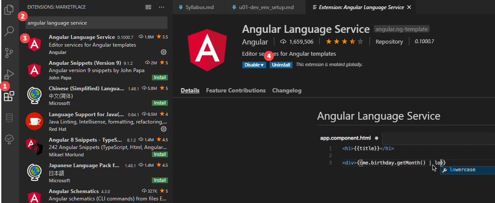
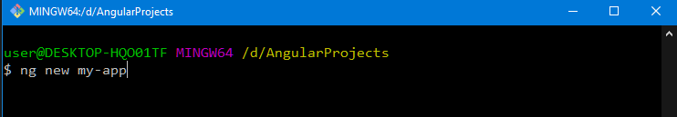
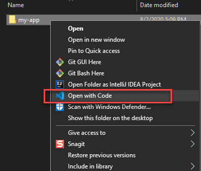
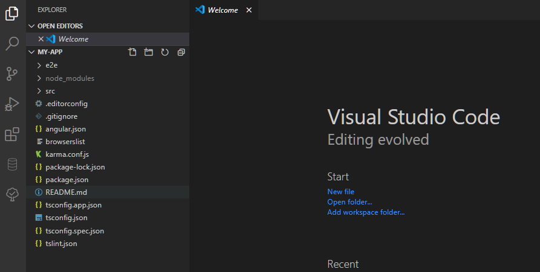

[](https://hackmd.io/7Y4ny10iQIaDl8TLCMmK5g)
###### tags: 'Angular 教學'

# Unit 01 Angular 開發環境設置

本單元內容主要參考 [Angular 正體中文版線上說明](https://angular.tw/)。

## 安裝 Node, npm, 及 angular 

要想在你的本地系統中安裝 Angular，需要如下步驟:


1. 安裝 Node.js 的當前版、活躍 LTS 版或維護期 LTS版。

2. 安裝 npm 套件管理器

3. 安裝 Angular CLI

使用 npm 命令安裝 CLI. 請開啟終端/控制檯視窗，輸入如下命令：

```
npm install -g @angular/cli
```

## 安裝 IDE

接續安裝 IDE. 我們使用 Microsoft VS Code 編輯器.

1. 下載並安裝 Microsoft VS Code 編輯器. [Download Visual Studio Code - Mac, Linux, Windows](https://code.visualstudio.com/download)

2. 安裝 Angular Language Service plugin 至 VS Code 編輯器



Ref: [Angular JavaScript Tutorial in Visual Studio Code](https://code.visualstudio.com/docs/nodejs/angular-tutorial)


## 使用 angular CLI 建立第一個專案, 並使用 VS Code 開啟

建立你的工作空間, 開啟 terminal, 切換目錄到你的工作空間.

輸入以下指令
```
ng new my-app
```



Angular CLI 會建立 my-app 目錄, 內有 Angular 專案.

滑鼠右鍵點選 my-app 目錄, 選擇 `Open with Code`.





更多 CLI 指令, 參考 [CLI 概覽與命令參考手冊](https://angular.tw/cli#cli-overview-and-command-reference)
