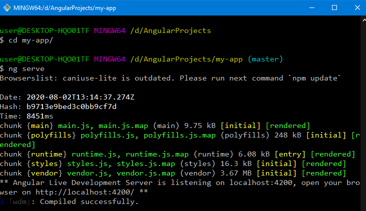
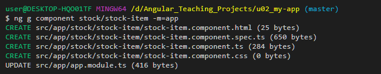
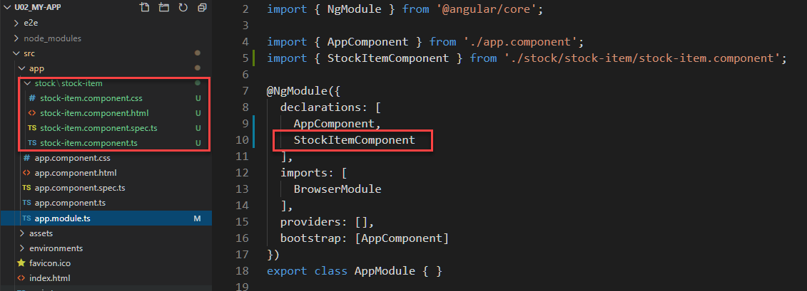
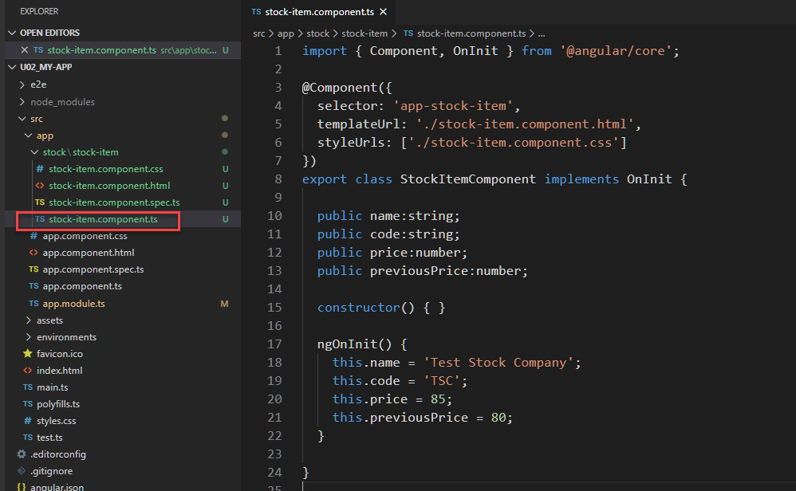
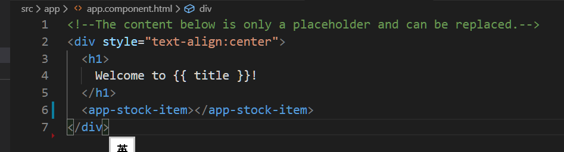
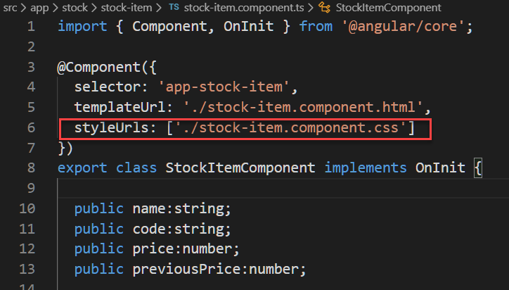
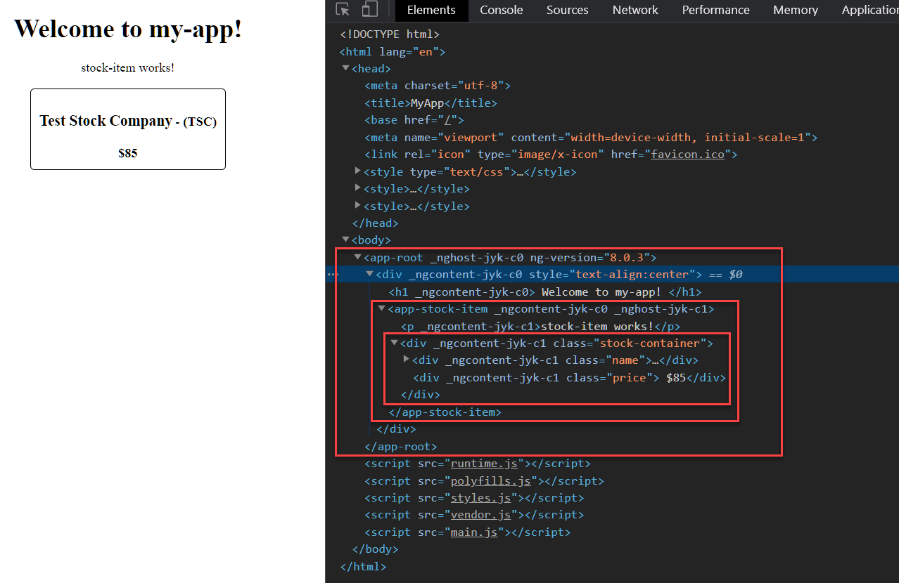

###### tags: `Angular 教學`

# Unit 02 使用 CLI 建立第一個 Angular 專案
                                 

## 編譯及打包專案

開啓命令視窗。可以使用 Windows PowerShell 或者 Linux like 的命令視窗，如: Git Bash、或者 [Cygwin](https://www.cygwin.com/) 。

切換到專案目錄，輸入 `ng serve --open` 指令:




接著, `ng serve --open` 指令啓動 build 程序, Angular CLI 就會幫我們處理以下這幾件事情：

- 啟動本地端的 Web-Server，令我們能夠在 localhost:4200 上看到我們的頁面。
- 將我們目前所開發的程式碼（已儲存的）編譯、打包後，讓 localhost:4200 載入. 
  - 編譯 TypeScrip 成爲 JavaScript.
  - 打包工具來幫我們把我們原本所撰寫的程式碼，處理、包裝成瀏覽器看得懂的 js 檔、css 檔與 html 檔
- 當我們儲存我們的程式碼之後，會自動重複 2. 所敘述之事項，並自動令瀏覽器重新載入，不用我們自己手動刷新。
- `--open` 參數用來自動開啓瀏覽器.

Ref: [[Angular 深入淺出三十天] Day 11 - Angular CLI 常用指令說明（二） - iT 邦幫忙::一起幫忙解決難題，拯救 IT 人的一天](https://ithelp.ithome.com.tw/articles/10205699)


## 專案結構


Figure Src: Ref: [Angular Tutorial (Part 3) : Project Structure -](https://helpmecoder.com/2019/05/12/angular-project-structure/)


### src/ 目錄

三個重要的檔案:
- `main.ts`: Angular 程式進入點, 決定要載入那個主要元件。
- `index.html`: Angular 程式的主要頁面。Angular 程式屬於 Single Page Application. Angular 修改 `index.html` 的 DOM 模型, 以呈現不同的頁面內容。
- `style.css`: Global CSS stylesheet which can be used by all your pages and components. 全域 CSS 樣式表，所有頁面和組件都可以使用。
  - 在元件中所定義的 CSS 只限於該元件使用。

三個重要的目錄

**src/app/**

- Contain modules and components. 包含模組和元件
- Every Angular application comes up with at-least one module and component. 每個 Angular App 至少有一個模組, 模組内至少有一個元件。
- 每個元件會定義元件的 
  - View: Browser 可以 render 出來的樣版
  - Class: 用來儲存資料及商業邏輯
- Angular 程式, 模組, 及元件間的關係
  - Angular 程式由一個或多個 Modular 組成
  - 每個 Modular 中可有多個元件
  - 元件可以包含其它元件


**src/asset/**

Store’s all the static files like Images and icons etc. used within your application. 存儲應用程序中使用的所有靜態文件，例如圖片和 Icon 等。


**src/environments/**

- Contain 2 files each for different environments
  - 開發環境與正式環境的設定
  - They are used to store configuration information like database credential, server address, or some property that differs across those environments. 它們用於存儲不同環境下的設定資訊，例如數據庫憑證，服務器地址或在這些環境之間不同的某些屬性。


Ref: [Angular Tutorial (Part 3) : Project Structure -](https://helpmecoder.com/2019/05/12/angular-project-structure/)
Source Code directory.

### 專案目根目錄下其它重要的檔案

`angular.json`

Angular 專案的設定檔

- Provides workspace-wide and project-specific configuration defaults for build and development tools provided by the Angular CLI. 為Angular CLI 提供的特定的 workspace 層級及專案層級的設置預設值, 用以設定構建和開發工具。
  - 例如: 存放靜態資源的目錄、Build 時所要使用的環境檔。

  
`package.json`

Build Angular 專案所需要使用的相依 package 和版本.

**`tsconfig.json`**

TypeScrip 轉譯器的設定檔

**`tslint.json`**

TSLint 是可擴展的靜態分析工具，用於檢查 TypeScript 代碼的可讀性，可維護性和功能性錯誤。`tslint.json` 為其設定檔。

## Angular 的執行過程

The Angular takes the following steps to load our first view.

1. `index.html` loads
2. Angular, Third-party libraries & Application loads
3. `main.ts` the application entry point which specifies the root module.
4. Root Module loads. The bootstrap component (or root component) is specified in the Root module.
5. Root Component class loads.
6. Root Component Template loads (You see the rendered page) into `index.html` 

Ref: [Bootstrapping in Angular: How It Works Internally - TekTutorialsHub](https://www.tektutorialshub.com/angular/angular-bootstrapping-application/)

## 建構元件
建構一個元件並加入到 App module 中

```
ng generate component stock/stock-item --module=app
```
或者
```
ng g c stock/stock-item -m=app
```


產生元件的 CLI 指令參考: [ng generate](https://angular.tw/cli/generate#ng-generate)

語法:
```
ng generate component <name> [options]
ng g component <name> [options]
```

執行結果:




## 為元件增加特性(property)

Property 為元件可以儲存值的地方.

開啟 `src\app\stock\stock-item\stock-item.component.ts`. 

為 `stock-item` 元件增加以下的特性及特性的資料型別:

- name:string 股票名稱
- code:string 股票代碼
- price:number 價格
- previousPrice:number 前次價格

在元件被載入時, 初始化前述的特性. 在 `ngOnInit()` 中輸入以下的程式:

```
this.name = 'Test Stock Company';
this.code = 'TSC';
this.price = 85;
this.previousPrice = 80;
```

最後結果:



## 將元件特性顯示在元件樣版上: 使用 data binding `{{}}` 符號

開啟 `src\app\stock\stock-item\stock-item.component.css`

輸入以下的程式碼:
```
<div class="stock-container">
    <div class="name">
        <h3>{{name}}</h3> - <h4> ({{code}}) </h4>
    </div>
    <div class="price"> ${{price}}</div>
</div>
```

**插值(Interpolation) {{...}}**

[插值(Interpolation) {{...}}](https://angular.tw/guide/template-syntax#interpolation-) 是元件與樣板見 data binding 的方法之一. 

所謂 "插值" 是指將表示式嵌入到標記文字中, 通常用來顯示元件的特性到其樣板中.


## 將元件的樣本顯示在 AppComponent 的樣板中

開啓 `src\app\app.component.html`, 加入 `app-stock-item` tag

```
<div style="text-align:center">
  <h1>
    Welcome to {{ title }}!
  </h1>
  <app-stock-item></app-stock-item>
</div>
```




## 設定元件樣版的 CSS 樣式

在元件的 `@Component` 註記中可以找出元件使用的 css 檔案:



開啟 `src\app\stock\stock-item\stock-item.component.css`, 新增元件樣版中使用的樣式: `stock-container`, `name`, 及 `price`:


執行 
```
ng serve --open
```
觀看結果.

index.html 最終的 render 的結果:



## 總結

本單元中:
1. 使用 Angular Cli 建立新專案
2. 說明 Angular 應用程式啟動的過程 (bootstrapping process)
3. 使用 Angular Cli 建立新元件並加入 App Module 中
4. 為元件新增一個特性, 並使用 `{{}}` 插值方法, 將元件的特性顯示在樣版中
5. 設定元件的樣版的樣式

## References:

- [工作區和專案檔案結構 @ Angular ](https://angular.tw/guide/file-structure)

- [Bootstrapping in Angular: How It Works Internally - TekTutorialsHub](https://www.tektutorialshub.com/angular/angular-bootstrapping-application/)

