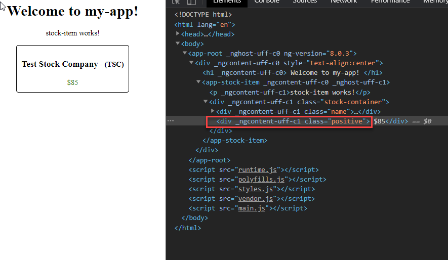

# Unit 03 對 DOM 元素的特性(property)及事件(event)進行資料連結

將説明如何將樣板中的 DOM 元素特性(property)與元件的特性(property)連結在一起, 讓我們可以動態的控制 DOM 元素的屬性值。改變元件的特性值, 就改變 HTML 元素特性值。

另外, 也將説明如何連結 DOM 元素的事件及元件的方法(method), 使得觸發事件(例如 click event)時, 執行元件的方法.

延續 Unit02 使用的專案進行練習。


## DOM 元素的特性的 data binding

**需求**

如果新的價格比前次的高, 價格套用 `positive` 樣式, 以綠色字顯示。否則, 價格套用 `negative` 樣式, 以紅色字顯示。

                 

### 加入所需要的 CSS 樣式

在 `src\app\stock\stock-item\stock-item.component.css` 加入以下的 CSS class:

```
.positive {
    color: green;
}

.negative {
    color: red;
}
```

### 在元件中加入特性

新增元件特性 `public positiveChange: boolean`. 
此特性的資料型態為 boolean 值。


在 `ngOnInit()` 中初始化特性值
```js
this.positiveChange = this.price >= this.previousPrice;
```


### 進行 DOM 元素特性(property)的 Data binding: 使用 Property binding `[property]`

對 DOM 元素中具有 set 能力的特性, 使用中括號 `[]` 標示目標特性(target property), Angular 會將指派符號(=)右手的元件的特性值指派到目標特性。

`[]` 可以連結元件特性到任何的可指派值的 DOM 元素的特性。

語法為:
```
[target]="expression"
```

- 指派符號右方的值成為[「範本表示式(Template Expressions)」](https://angular.tw/guide/template-syntax#interpolation-and-template-expressions)。Angular 會評算範本表示式中的運算式, 結果會指派到 DOM 元素的 property.
- 運算的方向為: 單向的右到左, 由元件的特性流入到 DOM 的特性, 此稱為 [「單向輸入」(One-Way In)](https://angular.tw/guide/template-syntax#one-way-in)。
- 執行範本表示式時, 表示式的[變數範圍(Expression Context)](https://angular.tw/guide/template-syntax#expression-context)只限於該元件的特性，不能使用其它元件的特性。


#### HTML 元素的屬性(Attribute)與 DOM 元素的特性(Property)

- Attribute，是由HTML來定義的(這裡指的是HTML標籤內的屬性)，一般來說它的值應該都為字串。
- Property，是由 DOM (Document Object Model)所定義的，通常都使用JavaScript來控制它。

- 瀏覽器會剖析Html，每個 HTML Element Attribute 會建立對應的 DOM Element Property。
  - 大部分的情況會是 Attribute 和 Property名稱是相互對應且相同的.
  - 但仍有許多的特例, 例如 `<td>` 的 `colspan` 屬性, 對應到 DOM 中的 property 名稱為 `colSpan`, S 要大寫。參考 [Attribute binding @ angular.io](https://angular.io/guide/attribute-binding#attribute-binding)
  - 某些屬性是沒有 DOM 特性的, 例如用於無障礙網頁 ARIA 的屬性 `aria-label`:


Src: https://livebook.manning.com/book/jquery-in-action-third-edition/chapter-4/19

如果我們連結的 attribute 沒有對應的 property, 會出現以下的錯誤訊息:


此時, 修正的方式, 要連結到 DOM 元素的 `attr` 特性, 並取得 `aria-label` 屬性, 再進行設定.
```
<!-- create and set an aria attribute for assistive technology -->
<button [attr.aria-label]="actionName">{{actionName}} with Aria</button>
```

`[attr.aria-label]` 相當於以下的 console 指令:

```
document.getElementsByTagName('button')[0].setAttribute('aria-label', 'actionName');
```


Ref: 
- [[Angular學習紀錄] Template binding property or attribute?](https://lawrencetech.blogspot.com/2017/05/angular-template-binding-property-or.html)


#### Class binding (樣式類別綁定)

我們時常要動態控制元素的樣式, Class binding 可以幫助我們。

在 HTML 元素的 `class` 屬性套用中括號`[]`, 語法為：
```
[class]="templat_expression"
```

例如, 連結元素的 `class` 特性至元件的特性:

```
<div class="price" 
    [class] = "this.positiveChange? 'positive':'negative'"> 
    ${{price}}
</div>
```

`<div>` 元素的 `class` 被中括號標示, 指派符號右方的值成為[「範本表示式(Template Expressions)」](https://angular.tw/guide/template-syntax#interpolation-and-template-expressions)。

Angular 會評算範本表示式中的運算式, 此例的運算式回傳結果為 `'positive'` 或者 `'negative'` 字串, 分別對應到先前定義的樣式名稱。
回傳的結果會指派到 `<div>` 元素的 `class` 特性。樣版被 render 出來的 HTML 為:




執行範本表示式時, 表示式的[變數範圍(Expression Context)](https://angular.tw/guide/template-syntax#expression-context)只限於該元件的特性，不能使用其它元件的特性。

把前述範例的程式碼加入 `src\app\stock\stock-item\stock-item.component.html`中。


~~注意, 使用 `[class]` 連結元素的 class 特性時, 會覆寫目前的特性值。例如, 使用套用的 `price` CSS class 已被覆寫. ~~

~~若要避免未連結的 class 被覆寫, 可改寫成:~~

##### 「單類別繫結(Single class binding)」

一次設定一個 CSS Class 的名稱。語法為：
```
[class.your_class_name]="true|false"
```
若範本表示式的評算結果為 `true`, 則加入 `your_class_name` ；反之，移除此 class name。

例如
```html
<div class="price" 
    [class.positive] = "this.positiveChange"
    [class.negative] = "!this.positiveChange"
    > ${{price}}</div>
```

此種方式稱為 [「單類別繫結(Single class binding)」](https://angular.tw/guide/template-syntax#class-binding)。

前述的寫法, 當為運算式結果為真時, 相當於以下的 DOM 操作

```js
document.getElementsByClassName('price')[0].classList.add("positive");
```

##### 「多類別連結 (Multi-class binding)」

「多類別連結 (Multi-class binding)」可以一次對元素套用多個樣式名稱。
在範本表示式提供 `{key:value [, key:value] }` 的集合。`key` 欄位表示 CSS Class 名稱，`value` 欄位為 template expression, 回傳 ture/false。 若 `value` 欄位的值為 `true`, 則相對應的 `key` 欄位的 CSS Class 會被加入，反之，則被移除。

前一個例子如果使用 `[class]`  可以改寫成:

```html
<div [class]="{positive: this.positiveChange, 
               negative: !this.positiveChange}"> 
    ${{price}}
</div>
```

注意，若是 Angular 8 之前的版本，要使用 `ngClass` 指令：

```html
<div [ngClass]="{price: true, positive: this.positiveChange, negative: !this.positiveChange}"> 
    ${{price}}
</div>
```

`ngClass` 指令為一種 Angular [屬性型指令 Attribute Directive](https://angular.tw/guide/attribute-directives) 用於 HTML 元素的屬性上, 用來更改 DOM 元素的外觀或行為。

官方文件，參考： [attribute、class 和 style 繫結 @ Angular](https://angular.tw/guide/template-syntax#attribute-class-and-style-bindings)

## DOM 元件的事件的 Data Binding: 使用事件繫結(Event Binding) 

### 需求


有一按鈕 "Toggle the price color" 按下去之後能夠交替改變價格目前的顏色。

### 事件繫結(Event Binding) 

事件繫結允許你監聽 DOM 元素上發生的事件, 如 keystrokes, mouse movements, clicks, and touches.

語法為:
```
(target_event_name)="template_expression"
```

- 使用小括號 `()` 標示目標事件名稱, `=` 右方為樣版運算式, 通常是元件的方法, 或者執行某個運算，例如指派值到某個元件特性
- 執行的方向為由左至右, 事件發生後執行樣版運算式, 也就是 One-Way Out.


## 建立元件特性及方法

開啟 `src\app\stock\stock-item\stock-item.component.ts`, 為 `stock-item` 元件新增 `clickCount:number` 特性, 並初始化為 0。

之後, 再新增 `toggleColor()`:

```
toggleColor() {
    this.positiveChange = !this.positiveChange;
}
```

完成後如下:


## 繫結 DOM 事件與元件方法

開啟 `src\app\stock\stock-item\stock-item.component.html`, 加入以下的 codes:

```html
<div class="toggleButton">
    <button 
    <!-- #1 -->
        (click) = "toggleColor(); this.clickCount = this.clickCount + 1;" >Toggle the price color 
    </button>
    <div class="clickCount">
       {{this.clickCount}}
    </div>
</div>
```

注意 #1 的地方, 當點擊事件發生時, 會:
1. 執行 `toggleColor()` 
2. 執行 `this.clickCount = this.clickCount + 1;` 運算

完成後如下:


執行結果:


## 總結

1. 使用 `[target_property]="template_expression"` 對 DOM 元素的特性進行資料繫結, 運算方向為由右至左, One-Way In.
2. 使用 `[target_event_name]="template_expression"` 對 DOM 元素的event 進行資料繫結, 運算方向為由左至右, One-Way Out.
