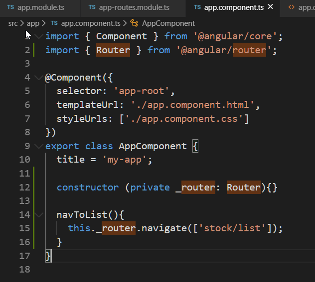

# Unit 04 導向(navigate)到不同的元件

## 簡介
在單頁面應用中，我們透過顯示或隱藏特定元件的樣版來改變使用者能看到的內容。


Figure source: [[1]](#r1)

Angular 使用 `AppRoutingModule` 模組進行元件的路徑(route)設定及導向。

使用步驟:
1. 匯入 `AppRoutingModule` 導向模組
2. 設定各元件的路徑
3. 啟用 `RouterModule` 類別, 並提供各元件的路徑做為模組載入參數
4. 在要導向結果的元件樣版處, 加入 `<router-outlet>` 做為導向的出口。
5. 使用 HTML 元素導向或者程式導向。

## 功能需求

製作一個導覽列，有以下項目：
- `Home` 連結: 一個 link (`<a>`), 點擊後顯示 `stock/stock-list.component` 元件的 html
- `Stock List` 連結 : 一個 link (`<a>`), 點擊後顯示 `stock/stock-list.component` 元件的 html
- `Stock List` 按鈕: 一個按鈕 `<button>`, 點擊後使用程式導向到 `stock/stock-list.component` 元件， 顯示其元件的 html
- `Create` 連結 : 一個 link (`<a>`), 點擊後顯示 `stock/stock-create.component` 元件的 html。
  
 

## 實作
### 建立不同的元件

建立以下兩個元件:
```
ng g c stock/stock-list
ng g c stock/stock-create
```

`stock-lisk` 顯示股票清單; `create-stock` 建立股票資料


### 建立導向模組

新增一個模組到應用程式中：
```
ng g module app-routes --flat --module=app
```

參數說明:
- `--flag` : 在目前專案根目錄的頂層建立新文件。
- `--module=app`: 將 `app-routes` 模組加入 `app` 模組中. 即, 在 `app` 模組中匯入 `app-routes` 模組。

新增的 `app-routes` 模組:


在 `App` 模組中匯入`app-routes` 模組:


現在應用程式中有兩個 Modules, 一個為 `app.module`, 另一個為 `app-route.module`。 `app.module` 是程式第一個啟動的模組，該模組使用 `app-route.module` 中的類別(class)進行導向，所以 `app.module` 必須 import `app-route.module`。

`@NgModule` 註記中的 `imports` 是模組清單，清單中的模組所公開(export)出來的類別會被此模組中的元件樣板所使用. (Other modules whose exported classes are needed by component templates declared in this NgModule.)

Ref: [NgModule metadata | Angular](https://angular.tw/guide/architecture-modules#ngmodule-metadata)


### 設定各元件的路徑

`app-routes` 模組是我們新增的模組。我們會在此模組中匯入  `@angular/router` 套件中的 `RouteModule` 及 `Routes` 類別，使用這兩個類別進行導向。

<!-- Angular 的導向模組 `RouterModule` 將被匯入到此並進行被始化設定。 -->

各元件的路徑規劃如下:
- `/`: 預設為顯示 stock list
- `stock/list`: 顯示 stock list
- `stock/create`: 顯示 stock 建立表單


#### 匯入 `RouterModule` 類別及 `Routes` 類別及設定元件導向路徑

開啟 `src\app\app-routes.module.ts`, 從 `@angular/router` 套件匯入 `RouterModule` 類別及 `Routes` 類別:

```js
import {RouterModule, Routes} from '@angular/router';
```


同樣在 `src\app\app-routes.module.ts` 輸入以下程式碼, 定義一個 `appRoutes` 的常數，資料型態為 `Routes`:

```js
const appRoutes: Routes = [
  {path: 'stock/list', component: StockListComponent},
  {path: 'stock/create', component: StockCreateComponent},
  {path: '', redirectTo: 'stock/stock-list', pathMatch:'full'}]
```


輸入過程中 VSCode 會自動匯入參考到的元件:


[路徑的順序很重要](https://angular.tw/guide/router#route-order)，因為 Router 在匹配路由時使用“先到先得”策略，所以應該在不那麼具體的路由前面放置更具體的路由。首先列出靜態路徑，然後放置空路徑(empty path)以對應到預設路徑(default route)。萬用字元路徑放置最後一個只有當其它路由都沒有匹配時，Router 才會選擇它。


`Routes` 為各元件的路徑設定, 是一個 `Route` 物件陣列, 每個 `Route`物件定義每個元件的路徑。

[`Route`物件的介面](https://angular.tw/api/router/Route#route)具有以下的欄位:

```js
interface Route {
  path?: string
  pathMatch?: string
  matcher?: UrlMatcher
  component?: Type<any>
  redirectTo?: string
  outlet?: string
  canActivate?: any[]
  canActivateChild?: any[]
  canDeactivate?: any[]
  canLoad?: any[]
  data?: Data
  resolve?: ResolveData
  children?: Routes
  loadChildren?: LoadChildren
  runGuardsAndResolvers?: RunGuardsAndResolvers
}
```

這裡使用到的幾個欄位的說明:
- `path?`: The path to match against. A URL string that uses router matching notation. Default is "/" (the root path).
- `pathMatch?`: The path-matching strategy, one of 'prefix' or 'full'. Default is 'prefix'.
  -  prefix match example: '/team/11/user' matches 'team/:id'.
- `redirectTo?`: A URL to redirect to when the path matches.
- `component?`: The component to instantiate when the path matches.

加入問號的屬性名稱表示為選項的屬性。

進一步參考: https://angular.tw/api/router/Route#route


### 啟用 `RouterModule` 模組, 並提供各元件的路徑做為模組載入參數


在 `src\app\app-routes.module.ts` 中：
- Line #18: 在 `app-routes` 模組中匯入 `RouterModule`, 並提供先前定義的 `appRoutes` 路徑配置做為啟動的選項。
- Line #21 從`app-routes` 模組中匯出 `RouterModule` 模組, 供其它的元件使用先前定義路徑配置。


### 在要導向結果的元件樣版處, 加入 `<router-outlet>` 做為導向的出口。

開啟 `app` 元件的樣版 `src\app\app.component.html`, 放置 `<router-outlet>` 路由器出口標籤:


### 使用靜態導向

在路由出口的上方, 加入以下的程式碼:
```html
<!-- Static Navigation -->
<nav>
  <a routerLink="/" routerLinkActive="active">Home | </a>
  <a routerLink="/stock/list" routerLinkActive="active-link">Stock List | </a>
  <a routerLink="/stock/create" routerLinkActive="active-link">Create</a>
</nav>
```


`routerLink` 是一個 Attribute Directive, 用來告知 `RouterModule` 要導向的路徑.

`routerLinkActive` 的用途: 當此連結指向的路由啟用時，該指令就會往宿主元素上新增一個 CSS 類別。

開啟 `src\app\app.component.css`, 新增以下 CSS class:

```css
.active-link {
    font-weight: bold;
}
```

執行結果如下:


### 使用程式導向


使用 [`Router` service](https://angular.tw/api/router/Router#router) 在程式中進行導向。

在建構子中注入 `Router` service:



建構子中的參數列宣告參數, 會自動成為該類別的成員變數。`private` 修飾子限制該成員變數為私有範圍, 不供其它元件存取。

新增一個方法 `navToList()`:

```js
navToList(){
    this._router.navigate(['stock/list']);
}
```

使用 [`navigate()` 方法](https://angular.tw/api/router/Router#navigate)進行導向。其第一個參數為 `commands:any[]` 命令陣列, 陣列內可以是任何的資料型態, 陣列內的值會被組合成導向的路徑。例如:

```
router.navigate(['team', 33, 'user', 11]);
```

的導向路徑為: `team/33/user/11`.

完成導向方法的建立後, 加入 `<button>` 至 `app` 元件的樣版 `src\app\app.component.html` 中:

```html
 <button (click)="this.navToList()">Stock List | </button>
```

實作的結果如下:

 

## 回顧
- 在應用程式中，增加第二個模組，負責導向功能。
  - 第二個模組要匯入主要模組中，主要模組才能使用第二個模組中定義的類別。
- 使用 `@angular/route` 套件中的 `RouteModule`， `Routes` 及 `Route` 類別進行導向
- 使用 `RouteModule` 的步驟：
  1. 建立一個 `Routes` 物件，是一個 `Route` 物件的集合。`Route` 物件的內容為元件的導向路徑及對應的元件名稱。
  2. 初始化 `RouteModule` 物件，需提供 `Routes` 物件。`RouteModule` 物件才能依路徑，導向到不同的元件。
  3. 在導向出口的元件樣板，加入 `<router-outlet>`, 導向目的元件的樣板會顯示在此。
- 導向的方式可使用靜態或程式導向。
- 靜態導向在`<a>` 元素中使用 `routerLink` 屬性；使用 `routerLinkActive` 設定點選時的樣式。
- 動態導向要注入 `Router` service, 使用 `router.navigate()` 方法進行導向。

## References

<span id="r1"> 1. </span>
[The Three Pillars of Angular Routing. Angular Router Series Introduction.](https://medium.com/angular-in-depth/the-three-pillars-of-angular-routing-angular-router-series-introduction-fb34e4e8758e) 

