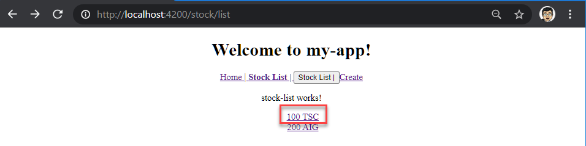
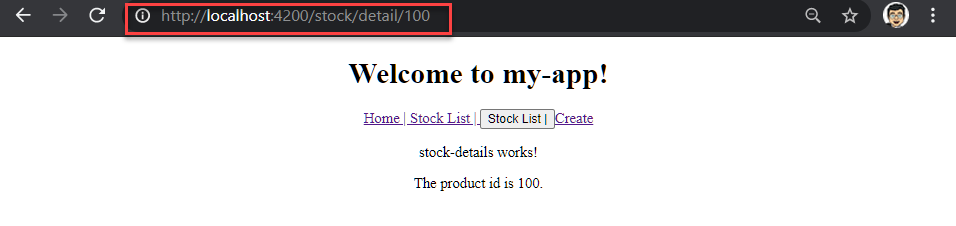
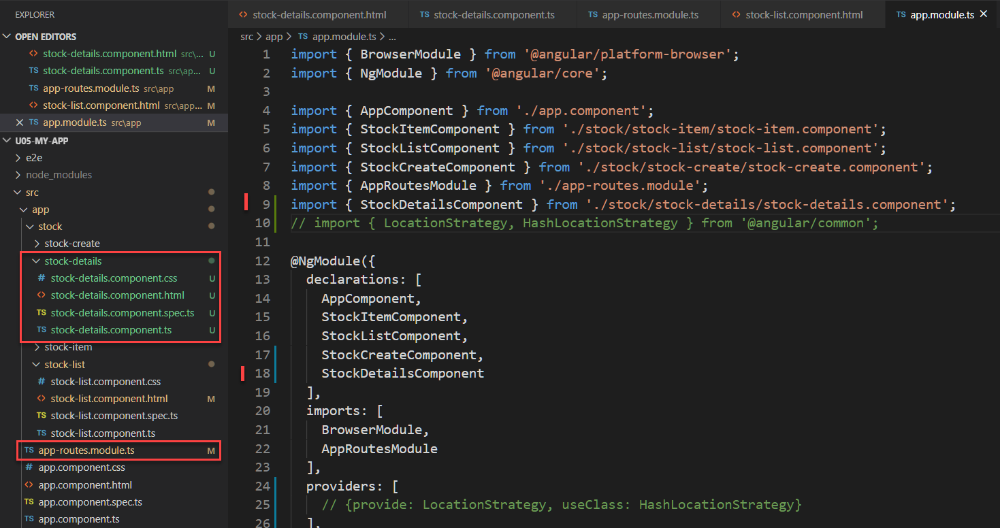
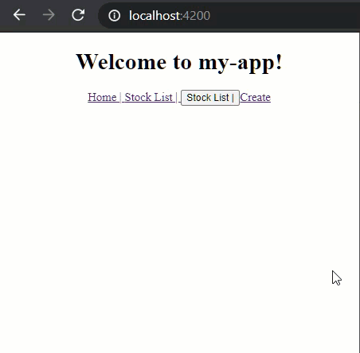

# Unit 05 導向時傳遞參數

## 簡介

當從某個元件的 View 導向到另一個元件的 View 時, 會傳遞參數。

例如, 在「股票清單元件」中, 點選任一個股票, 接著導向到「股票詳細元件」查看該股票的細節。

URL `http://host:8080/#/stock-detail/100` 的 100 為此傳送到 `stock-detail` 元件的參數。




## Upgrading to Angular 9 (Optional)

Update Globally
```
npm uninstall --global angular-cli
npm cache verify
npm install -g @angular/cli@9
ng v
```

Update the project

- Make sure you are using Node 10.13 or later.
- Run ng update @angular/core@8 @angular/cli@8 in your workspace directory to update to the latest 8.x version of @angular/core and @angular/cli and commit these changes.
- Run ng update @angular/core@9 @angular/cli@9 which should bring you to version 9 of Angular.

Ref: https://update.angular.io/#8.0:9.1


## 功能需求

在 stock-list 元件顯示股票名稱連結, 點擊後, 導向至 stock-details 元件顯示方才點擊的股票名稱詳細資料。

## 實作

### 延續 `u04-myapp` 的成果

可以在 `u04-myapp`的成果上繼續實作。

若要建立一個新的專案，執行以下步驟：

建立新專案:
```
ng new u05-myapp
```

將 `04-myapp` 的 `src/` 複製到 `u05-myapp` 的目錄下。

提交異動

```
cd u05-myapp
git commit -a -m 'u05 baseline'
```

### 建立新元件: 顯示股票細節

建立元件 `stock/stock-details` 用以顯示股票細節。

在專案目錄下, 輸入指令:
```
ng g c stock/stock-details --module=app
```

此指令將產生`stock/stock-details`並加入到 `app` 模組中:




### 在 `stock-details` 樣板中顯示 `productId`

修改`stock/stock-details`的樣版(template). 

開啟 `src\app\stock\stock-details\stock-details.component.html`, 加入:

```html
The product id is {{this.productId}}.
```

新增一元件特性 `productId` 到 `stock-details` 元件中:

```typescript
export class StockDetailsComponent implements OnInit {
  
  public productId: string;

  constructor(){... }

  ngOnInit(): void { ... }
```


### 在元件中注入(Inject) ActivatedRoute 物件

#### ActivatedRoute 物件的 snapshot 屬性

點擊連結產生導向的資訊可從 `ActivatedRoute` 物件取得。[`ActivatedRoute`](https://v9.angular.io/api/router/ActivatedRoute)提供導向到目的元件的路徑資訊。

`ActivatedRoute` 物件的[`snapshot:ActivatedRouteSnapshot`](https://angular.tw/api/router/ActivatedRouteSnapshot#activatedroutesnapshot) 及 `paramMap: Observable<ParamMap>` 特性可以讓我們取得傳遞參數。

在此只介紹 `snapshot` 屬性。

Angular 對導向到此元件的路徑組成進行快照， 並放在 `ActivatedRoute` 物件的 `snapshot` 屬性中。 
- 快照內容說明導向到此畫面的路徑和元件間的對應關係。(Ref: [Angular Router: Understanding Router State](https://vsavkin.com/angular-router-understanding-router-state-7b5b95a12eab))。 
- 例如: 路徑 `http://localhost:4200/stock/detail/100` 導向到 `stock-details` 元件, 該元件的路徑節段(segment)為 `stock/detail`(自行設定的路徑節段)對應到 `stock-details` 元件, `/100` 為傳遞給此元件的查詢參數。而路徑 `/` 則對應到 `app` 元件。

此快照是不可改變的資料結構(immutable structure), 導向到此元件後, 就無法修改快照內的資料, 此也稱為靜態的路由器(Static Router State)狀態。

只有當路徑中的元件的組成結構改變時, Angular 才會對 Route 的進行另一次的快照。但是, 只改變傳遞參數並不會改變路徑結構, 因此也不會更新顯示。前述為路徑快照的重要特性，之後會針對此特性加以說明。

#### 取得路徑參數的步驟

要從 `snapshot:ActivatedRouteSnapshot` 中取得參數, 步驟如下:
1. 注入 `ActivatedRoute` 物件到元件中，出入點為元件的建構子的參數位置。
2. 在元件被載入時，取得`ActivatedRoute` 物件的 `snapshot` 屬性，並從中取得查詢參數, 接著將查詢參數儲存到元件特性中供後續使用。

`StockDetailsComponent` 元件完整的程式碼:
```typescript
import { Component, OnInit } from '@angular/core';
import { ActivatedRoute } from '@angular/router';

@Component({
  selector: 'app-stock-details',
  templateUrl: './stock-details.component.html',
  styleUrls: ['./stock-details.component.css']
})
export class StockDetailsComponent implements OnInit {
  
  public productId: string;
  //  注入 `ActivatedRoute` 物件到元件中
  // 在建構子的參數位置注入
  constructor(private activatedRoute: ActivatedRoute) { }

  ngOnInit(): void {
     // Get the query parameter from the activatedRoute
     // 在元件被載入時，取得`ActivatedRoute` 物件的查詢參數
     this.productId = this.activatedRoute.snapshot.paramMap.get('id');
     console.log(this.activatedRoute.snapshot);
  }
}
```
### 增加 Stock-Details 元件的導向路徑到 `app-routes` 模組中

開啟 `src\app\app-routes.module.ts`，將 `Stock-Details` 元件的導向路徑 `stock/detail/:id` 加入到 `appRoutes` 常數中。路徑中的參數名稱前使用冒號`:`標示。

```typescript
const appRoutes: Routes = [
  {path: 'stock/list', component: StockListComponent},
  {path: 'stock/create', component: StockCreateComponent},
  // Stock-Details 元件的導向路徑
  {path: 'stock/detail/:id', component: StockDetailsComponent},
  {path: '', redirectTo: 'stock/stock-list', pathMatch:'full'}]
```

完成後的成果:




## 回顧

- 使用 `ActivatedRouted` 取得導向時的路徑及參數資訊。
- 使用時，將 `ActivatedRouted` 物件注入元件中，注入點在類別的建構子(constructor)
- `ActivatedRouted` 物件的 `snapshot` 特性儲存導向的快照。`snapshot.paramMap` 儲存路徑上的參數
- 導向路徑的結構為： `http://host/path_to_component/:parameter[/:parameter]`.


