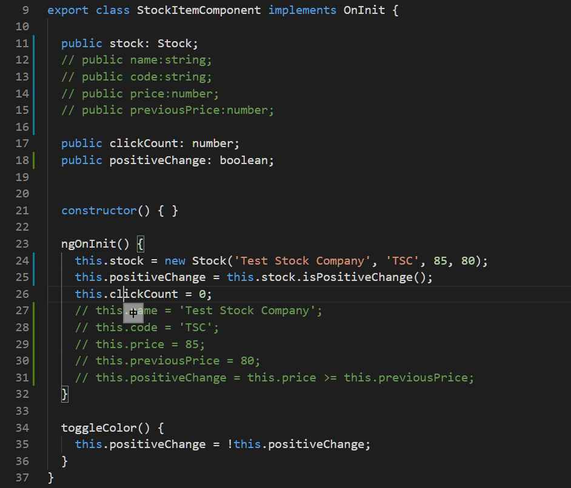

# Unit 06 Angular MVC 模式: 建立 model

## 最佳實務
開發時將 UI 處理邏輯、商業邏輯、及要持久儲存的資料分開, 放在不同的類別。

UI 處理邏輯放在元件(Component); 商業邏輯放在服務(Service) 中; 持久儲存的資料放在 Class 中, 此 Class 也稱為 Entity Class.


Ref: Adam Freeman, Pro Angular 6, 3rd Ed, 2018

# 需求

`StockItemComponent` 內的特性及方法改使用 `Stock` entity class  (domain class) 來描述。


# 實作

## 產生 `model/stock` entity class
[Generate domain class](https://angular.tw/cli/generate#class-command)

```
ng g class model/stock
```

Outputs:
```
$ ng g class model/stock
CREATE src/app/model/stock.spec.ts (150 bytes)
CREATE src/app/model/stock.ts (23 bytes)
```


## 建立 Entity Class 的特性及狀態方法

此 Entity 具有以下特性：
- name:string - 股票名稱
- code:string - 股票代碼
- price:number - 股票價格(目前價格)
- previousPrice - 前次價格

此外還具有 `isPositiveChange()` 方法, 得知股票的漲或跌的狀態。

注意, TypeScript 會為建構子參數建立相對應的類別成員變數, 我們無需在手動新增相對應的類別成員變數:

```typescript
export class Stock {
    constructor(
        public name: string,
        public code: string,
        public price: number,
        public previousPrice: number
    ){}

    /**
     * Entity Status Method
     */
    isPositiveChange(): boolean {
        return this.price >= this.previousPrice;
    }
}
```

Ref: [Stop Manually Assigning TypeScript Constructor Parameters &#8211; Steve Fenton](https://www.stevefenton.co.uk/2013/04/stop-manually-assigning-typescript-constructor-parameters/)

## 重構(refactor) `StockItem` 元件 

使用 `Stock` entity class 重構 `StockItem` 元件:

開啟 `src\app\stock\stock-item\stock-item.component.ts`, 

註解掉原先的 `name`, `code`, `price`, `previousPrice` 等特性，及這些特性的初始化程式碼. 此外, `this.positiveChange` 的值該由 `Stock` entity  的 `isPositiveChange()` 方法取得結果: 




修改元件的樣版。開啟 `src\app\stock\stock-item\stock-item.component.html`, 使用 `Stock` 的特性取代先前元件的股票相關特性:


## 新增 `StockItem` 元件的導向路徑

開啟 `src\app\app-routes.module.ts`.
修改後的 `appRoutes`:

```typescript
const appRoutes: Routes = [
  {path: 'stock/list', component: StockListComponent},
  {path: 'stock/create', component: StockCreateComponent},
  {path: 'stock/detail/:id', component: StockDetailsComponent},
  // Route for the StockItemComponent
  {path: 'stock/item', component: StockItemComponent},
  {path: '', redirectTo: 'stock/stock-list', pathMatch:'full'}]
```

## 新增`StockItem` 元件的樣版連結

開啟 `src\app\app.component.html`,

修改後的內容:

```html
<nav>
  <a routerLink="/" routerLinkActive="active">Home | </a>
  <a routerLink="/stock/list" routerLinkActive="active-link">Stock List | </a>
  <button (click)="this.navToList()">Stock List | </button>
  <a routerLink="/stock/create" routerLinkActive="active-link">Create | </a>
  <!-- Anchor for the StockItem Component -->
  <a routerLink="/stock/item" routerLinkActive="active-link">Stock Item</a>
</nav>
```

## 執行後的結果


# 回顧
- 使用 ng 建立 Entity class (或者 domain class)
- Entity class 的成員變數會由其建構子參數中自動產生


# 補充

[TypeScript play ground](https://www.typescriptlang.org/)
