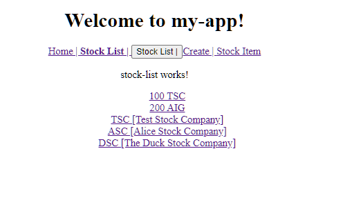

# Unit 07 服務(Service)與依賴注入(Dependency Injection)

## 服務(Service)與服務注入器(Injector)

### 服務(Service)

服務用來封裝商業邏輯(Business Logic)或者資料存取邏輯(Data Access Logic).

Angular 使用依賴注入(Dependency Injection)的方式, 提供服務物件給需要的元件(Component)或其它服務(Service)


例如: 使用 [Router Service](https://angular.io/api/router) 導向到不同的元件; 使用 [HTTP Service](https://angular.io/guide/http) 向後端伺服器存取資料。

### 注入器(Injector)及其階層性

Angular 的注入器(Injector)負責服務注入的工作。注入器由 Angular 管理, Developer 不需要介入 Injector 的產生或執行。

Developer 只需告知 Injector 那些服務需要被注入。Developer 不用管理被注入服務的物件和其相依性，Injector 會負責管理。

**注入器的階層性(Hierarchy)** 

Angular 的注入器有兩個層級: Module 及 Element level. 

Module Level 的注入器為 [ModuleInjector](https://angular.tw/guide/hierarchical-dependency-injection#moduleinjector), 每一個模組擁有一個 ModuleInjector。 

Element Level 的注入器為 [ElementInjector](https://angular.tw/guide/hierarchical-dependency-injection#two-injector-hierarchies), Angular 會為每個 DOM 元素自動建立 ElementInjector。


階層式的注入器可依元件的需求注入更明確的服務。

[應用的場景: Specialized Providers (特定的服務提供者)](https://angular.tw/guide/hierarchical-dependency-injection#scenario-specialized-providers)

考慮一個依賴於一系列服務的 Car 元件。 


假設在根注入器(代號 A)中配置了通用的服務提供者(provider): `CarService`, `EngineService` 和 `TiresService`.

現在用先前三個通用服務建立了一個車輛元件 A。

然後，在元件 A 中再建立一個子元件 B，它為 `CarService`,  和 `EngineService` 定義了自己特有的提供者: `CarService2` 及 `EngineService2`，它們具有適用於元件 B 的特有能力。

元件 B 是另一個元件 C 的父元件，而元件 C 又定義了自己的，更特殊的 CarService 提供者 `CarService3`。

所以, 在最深層的元件 C 時, 使用了 `CarService 3` 服務, `EngineService2` 服務及 `TireService` 服務，這些服務分別來自於: 元件 C 的 Injector, 元件 B 的 Injector, 及元件 A 的 Injector.


### 向注入器註冊服務

每個服務必須指定要使用的注入器, 所以在服務需向注入器注冊。

以下說明 `ModuleInjector` 及 `ElementInjector` 的註冊方法:

#### ModuleInjector (模組注入器)

**方法 1: 在可注入服務中指定特定模組的注入器**

Service 類別會使用 [`@Injectable` 裝飾器(Decorator)](https://angular.tw/api/core/Injectablehttps://angular.tw/api/core/Injectable) 設定類別。使用 `providedIn` 裝飾器特性指定注入器。

```typescript
import { Injectable } from '@angular/core';

@Injectable({
  providedIn: 'root'  // <--provides this service in the root ModuleInjector
})
export class ItemService {
  name = 'telephone';
}
```

當 `providedIn` 設定為 `root`, 表示該服務使用應用程式的啟動模組 (Bootstrap Module) 的注入器。屬於此模組下的元件在注入此服務實體時, 皆會使用 `AppModule` 的注入器。

可以在 Angular 專案的 `main.ts` 中找到啟動模組, 名稱通常為 `AppModule`。

或者, 想要此服務使用特定模組的注入器, 如 `UserModule` 的注入器(`UserModule` 為自訂的模組名稱)，則:

```typescript
import { Injectable } from '@angular/core';
import { UserModule } from './user.module';

@Injectable({
  providedIn: 'UserModule'  // <--provides this service in your UserModule ModuleInjector
})
export class ItemService {
  name = 'telephone';
}
```
來源: [providedIn and NgModules @ Angular](https://angular.io/guide/providers#providedin-and-ngmodules)


如此, 只有在 `UserModule` 模組內才可使用此服務。


**方法 2: 在特定模組中提供可注入服務的名稱**

若不在 Service 類別的 `@Injectable` 註記指定 `ModuleInjector`, 也可以在模組中指定要使用的服務。

在模組的 `@NgModule` 裝飾子的 `providers` 特性指定此模組注入器要注入的多個服務實體。

若 `ItemService` 服務沒有使用 `providedIn`特性:

```typescript
import { Injectable } from '@angular/core';
import { UserModule } from './user.module';

@Injectable({})
export class ItemService {
  name = 'telephone';
}
```

那麼, 可以在 `AppModule` 中使用 `providers` 特性:
```typescript
import {ItemService} from 'services/ItemService.ts'

// @NgModule decorator with its metadata
@NgModule({
  declarations: [AppComponent],
  imports: [BrowserModule],
  providers: [ItemService],
  bootstrap: [AppComponent]
})
export class AppModule {}
```

#### ElementInjector (元素注入器)

在特定元件中提供可注入服務的名稱。使用元件的 [`@Component` 的 `providers` 特性](https://angular.io/api/core/Component#description)來指定可注入的服務類別。該元件的注入器會依此注入服務實體(Service Instance)供元件使用。

例如, 在 `StockListComponent` 元件中注入 `ItemService` 服務。

```typescript
import { Component, OnInit } from '@angular/core';
import {ItemService} from 'services/ItemService.ts'

@Component({
  selector: 'app-stock-list',
  templateUrl: './stock-list.component.html',
  styleUrls: ['./stock-list.component.css'],
  providers: [ItemService]
})
export class StockListComponent implements OnInit {
  // 服務的注入點
  constructor(itemService: ItemService) { }

  ngOnInit() {
  }

}
```

### 服務實體的注入點

服務實體的注入點位於元件的建構子的參數。

如前例 `StockListComponent` 的 `constructor()`。


## 實作需求

由 `StockService` 提供股票的資料。在 `StockService` 中建立 3 筆股票資料。 `StockList` 元件顯示的資料來自於 `StockService`。


## 實作


###  建立 `Stock` Service:

建立 `Stock` Service:
```
ng g service services/stock
```

產生的程式, 服務的注入器預設使用 `AppModule`:
```typescript
import { Injectable } from '@angular/core';

@Injectable({
  providedIn: 'root'
})
export class StockService {

  constructor() { }
}
```

新增私有成員變數 `stocks: Stock[]`, 並提供其 get 方法:

```typescript
...
export class StockService {
  private stocks: Stock[];

  constructor() { }

  public getStocks(): Stock[] {
    return this.stocks;
  }
}
```

在 `constructor()` 初始化私有成員變數 `stocks`。完成的程式碼:
```typescript
import { Stock } from './../model/stock';
import { Injectable } from '@angular/core';

@Injectable({
  providedIn: 'root'
})
export class StockService {
  private stocks: Stock[];

  constructor() {
    this.stocks = [
      new Stock('Test Stock Company', 'TSC', 85, 80),
      new Stock('Alice Stock Company', 'ASC', 50, 70),
      new Stock('The Duck Stock Company', 'DSC', 876, 765)
    ];
  }

  public getStocks(): Stock[] {
    return this.stocks;
  }
}
```

### 在 StockList 元件中注入 StockService 服務

開啟 `src\app\stock\stock-list\stock-list.component.ts`。

在建構子中注入 `StockService` 服務:

```typescript
constructor(private stockService: StockService) { }
```

`StockList` 屬於 `AppModule`, 所以使用 `AppModule` 的注入器。


新增 `getStocks()` 回傳 `StockService` 服務提供的股票資料:

```typescript
getStocks(): Stock[]{
    return this.stockService.getStocks();
}
```

完成的 `StockList` 元件程式碼:

```typescript
import { StockService } from './../../services/stock.service';
import { Component, OnInit } from '@angular/core';
import { Stock } from '../../model/stock';

@Component({
  selector: 'app-stock-list',
  templateUrl: './stock-list.component.html',
  styleUrls: ['./stock-list.component.css']
})
export class StockListComponent implements OnInit {

  
  constructor(private stockService: StockService) { }

  ngOnInit() {

  }

  getStocks(): Stock[]{
    return this.stockService.getStocks();
  }
}
```

### 修改 StockList 元件的樣版, 以顯示`StockService` 服務提供的股票資料

開啟 `src\app\stock\stock-list\stock-list.component.html`。

使用 [`*ngFor` 產生重覆的 HTML 結構](https://angular.tw/guide/template-syntax#ngfor):

```html
<li *ngFor="let stock of getStocks()">
    <a [routerLink] = "['/stock/detail', stock.name]"> 
    {{stock.code}} [{{stock.name}}]  
    </a>
</li>
```

`*ngFor` 指令使用迴圈來遍歷陣列中的資料。我們使用 `*ngFor` 指令顯示 `Stock[]` 內的內容。

在 `*ngFor` 雙引號表示式中使用[微語法(microsyntax)](https://angular.tw/guide/template-syntax#microsyntax)設定`*ngFor` 的輸入值。

```
let stock of getStocks()
```

let 關鍵字宣告範本輸入變數(template input variable), 可以在範本中參考它。我們可以把範本輸入變數視為`*ngFor`的區域變數, 因為這些變數只能此 `*ngFor` 指令的範圍內使用。

例如 `stock` 是 `*ngFor`的區域變數, 代表目前拜訪到的 Stock 類別實體。

`of` 關鍵字指定要遍歷的陣列。`getStocks()` 回傳 `Stock[]`。

有關 `*ngFor` 的進一步說明參考: [結構型指令](https://angular.tw/guide/structural-directives#inside-ngfor)。

完成的程式碼:

```html
<p>stock-list works!</p>
<ul style="list-style-type: none;">
    <li><a routerLink="/stock/detail/100">100 TSC</a></li>
    <li> <a [routerLink]="['/stock/detail', 200]">200 AIG</a> </li>

    <li *ngFor="let stock of getStocks()">
        <a [routerLink]="['/stock/detail', stock.name]"> 
        {{stock.code}} [{{stock.name}}] 
        </a>
    </li>
</ul>
```

### 執行結果



## 回顧

- 服務用來封裝商業邏輯(Business Logic)或者資料存取邏輯(Data Access Logic).
- Angular 使用依賴注入(Dependency Injection)的方式, 提供服務物件給需要的元件(Component)或其它服務(Service)
- Angular 的注入器有兩個層級: Module 及 Element level.
- 每個服務必須指定要使用的注入器, 可向 Module 或者 Component 的注入器註冊。
- 服務向注入器註冊的方法:
  - 方法 1: 在可注入服務(injectable service)中指定特定模組的注入器, 使用裝飾器的 `providedIn` 屬性
  - 方法 2: 在特定模組中提供可注入服務的名稱, 使用裝飾器的 `provider` 屬性。
- 在樣板中使用 `*ngFor` 指令(directive)產生重覆的 HTML 結構: