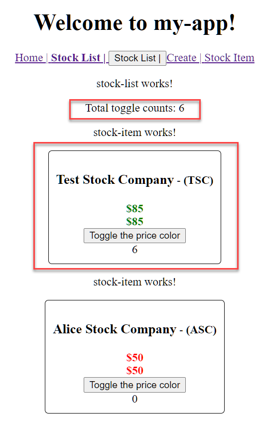
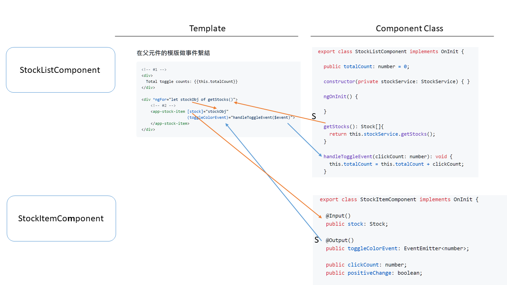

# Unit 08 在元件內使用其它元件顯示資料: 父、子元件的溝通

## UI 開發元件化

將 UI 分割成不同的元件, 可以各別進行開發並重覆使用:


Src: Yakov Fain and Anton Moiseev, Angular Development with Typescript, 2nd Edition, Manning

元件樹(Component Tree)

Src: https://v2.angular.io/docs/ts/latest/guide/architecture.html

父、子元件間的溝通: 
- 可從父元件輸入資料到子元件
- 子元件可以輸出事件, 在父元件中處理

## 需求

Stock List 中原本顯示股票清單, 現要改成顯示  Stock Item。 另外, 點擊 "Toggle the price color" 按鈕時, 會累計總次數。




<!--  -->


## 父元件與子元件間的事件及資料流: 概覽



## 由父元件輸入資料到子元件

元件的類別欄位(class field)加上[@input 修飾器](https://angular.io/api/core/Input)後, 便可成為輸入特性(input property) , [透過資料繫結(data binding)把資料從父元件傳到子元件](https://angular.tw/guide/component-interaction#pass-data-from-parent-to-child-with-input-binding)

`StockItemComponent` 中為 `stock` 欄位加上 `@Input `修飾器:
```typescript
export class StockItemComponent implements OnInit {
  ...

  @Input() 
  public stock: Stock;
  ...
```

在 `StockList` 元件的模版中使用 `StockItem` 的元件，`StockList` 為 `StockItem` 的父元件。
`<app-stock-item [stock]="stockObj">` 中的 `[stock]` 是指 `StockItem` 內的 `stock` 輸入特性; `stockObj`是父元件模版中的區域變數。


```html
<!-- Template for the StockList component -->
<p>stock-list works!</p>
...

<div *ngFor="let stockObj of getStocks()">
  <!-- Child component template of the StockList component -->
    <app-stock-item [stock]="stockObj">
    </app-stock-item>
</div>

```


## 子元件輸出事件, 由父元件處理

子元件輸出事件, 讓[父元件監聽子元件的事件](https://angular.tw/guide/component-interaction#parent-listens-for-child-event)。

開發程序如下:
**子元件**
1. 子元件公開一個 EventEmitter 類別的欄位, 使其成為輸出特性(output property)。
2. 子元件的方法利用輸出特性的 `emit()`抛出事件(此類事件為自訂事件)。

**父元件**

3. 父元件在樣版(template)中透過事件繫結(event binding)將其方法連結到子元件輸出特性。
4. 當子元件抛出事件, 與子元件輸出變數有事件繫結的父元件方法會被呼叫。

### 元件的輸出特性(Output Property)

在元件的新增一個具 [EventEmitter 類別](https://angular.tw/api/core/EventEmitter#eventemitter) 的欄位。之後，再對此欄位加上 [@output 修飾器](https://angular.io/api/core/Output)。

`EventEmitter` 類別具有泛型參數，用來指定包覆在 `EventEmitter`內的 payload 的資料型態。在這裡, payload 的資料型態為 `number`.

完成元件的輸出特性的宣告後, 在 `constructor()` 內初始化此輸出特性, 使之指向一個 `EventEmitter<number>` 類別實體。

```typescript
export class StockItemComponent implements OnInit {

  ...

  @Output()
  public toggleColorEvent: EventEmitter<number>;

  constructor() {
    this.toggleColorEvent = new EventEmitter<number>();
   }
  ...
```

### 子元件抛出事件

子元件利用其輸出特性抛出事件, 此類事件稱為自訂事件, 和 DOM 事件不同。

輸出特性的類別為 `EventEmitter<T>`, 呼叫 `EventEmitter` 物件實體的 `emit(value?: T)` 方法抛出事件, 其中 `T` 為泛型參數，用來指定包覆在 `EventEmitter`內的 payload 的資料型態。

在 `StockItem` 元件中加入一個方法, 用以抛出事件:

```typescript
export class StockItemComponent implements OnInit {

  ...

  @Output()
  public toggleColorEvent: EventEmitter<number>;

  constructor() {
    this.toggleColorEvent = new EventEmitter<number>();
   }
  ...

  addCount(): void {
    // 抛出事件
    this.toggleColorEvent.emit(1);
  }
```

### 父元件的事件處理方法

父元件透過事件繫結(event binding)將其方法連結到子元件輸出特性。

在 `StockList` 元件的模版中，使用 `StockItem` 元件的模版 `<app-stock-item>` 並進行事件繫結:
```html
<!-- Template for the StockList component -->
<div *ngFor="let stockObj of getStocks()">
    <!-- Child component template of the StockList component -->
    <!-- stockObj 為父元件樣版內的區域變數 -->
    <!-- handleToggleEvent() 為父元件的方法 -->
    <app-stock-item [stock]="stockObj"
                    (toggleColorEvent)="handleToggleEvent($event)">
    </app-stock-item>
</div>
```

`<app-stock-item>` 中的 `toggleColorEvent` 是`StockItem` 元件的輸出特性, 使用事件繫結符號`()`將事件繫結到`StockList` 元件的 `handleToggleEvent(clickCount: number): void` 方法。

事件繫結中的 `$event` 為 DOM event object, Angular 會自動將其轉型成 `handleToggleEvent()` 所需要的輸入參數型別, 在此例中為 `number`.

## 實作

### 為 StockItem 元件新增輸出特性

開啟 `src\app\stock\stock-item\stock-item.component.ts`,
修改編號 #1 ~ #2 的地方:

```typescript
...
export class StockItemComponent implements OnInit {
  // #1
  @Input() 
  public stock: Stock;
  ...

  ngOnInit() {
    // #2
    this.stock = this.stock ||  new Stock('Test Stock Company', 'TSC', 85, 80);
   ...
  
  }
}

```

### 在父元件 data binding 子元件特性

開啟 `src\app\stock\stock-list\stock-list.component.html`, 新增以下的程式碼:
```html
<div *ngFor="let stockObj of getStocks()">
    <app-stock-item [stock]="stockObj">
    </app-stock-item>
</div>
```

執行你的程式:


### 在子元件中加入輸出特性及抛出事作的程式碼

開啟 `src\app\stock\stock-item\stock-item.component.ts`,

加入以下的類別欄位及其修飾器:
```typescript
@Output()
  public toggleColorEvent: EventEmitter<number>;
```

在建構子中初始化 `toggleColorEvent` 類別欄位:
```typescript
constructor() {
    this.toggleColorEvent = new EventEmitter<number>();
}
```

新增 `addCount()` 方法, 抛出事件:

```typescript
addCount(): void {
    this.clickCount ++;
    this.toggleColorEvent.emit(1);
}
```

在 `toggleColor()` 方法中呼叫 `addCount()`:

```typescript
toggleColor() {
    this.positiveChange = !this.positiveChange;
    // Call addCount when toggling the color.
    this.addCount();
  }
```

完成的 `StockItem` 元件程式碼:

```typescript
import { Component, OnInit, Input, Output, EventEmitter } from '@angular/core';
import { Stock } from 'src/app/model/stock';


@Component({
  selector: 'app-stock-item',
  templateUrl: './stock-item.component.html',
  styleUrls: ['./stock-item.component.css']
})
export class StockItemComponent implements OnInit {

  @Input() 
  public stock: Stock;
  
  @Output()
  public toggleColorEvent: EventEmitter<number>;

  public clickCount: number;
  public positiveChange: boolean;
  

  constructor() {
    this.toggleColorEvent = new EventEmitter<number>();
   }

  ngOnInit() {
    this.stock = this.stock ||  new Stock('Test Stock Company', 'TSC', 85, 80);
    this.positiveChange = this.stock.isPositiveChange();
    this.clickCount = 0;
  }

  toggleColor() {
    this.positiveChange = !this.positiveChange;
    this.addCount();
  }

  addCount(): void {
    this.clickCount ++;
    this.toggleColorEvent.emit(1);
  }
}

```

### 在父元件新增事件處理方法

開啟 `src\app\stock\stock-list\stock-list.component.ts`。

新增欄位 `totalCount` 以計數變更顏色的總次數。

另外, 增新 `handleToggleEvent(clickCount: number): void` 方法, 處理 `StockItem` 元件抛出的 `toggleColorEvent` 事件:

完成的程式碼:

```typescript
import { StockService } from './../../services/stock.service';
import { Component, OnInit } from '@angular/core';
import { Stock } from '../../model/stock';

@Component({
  selector: 'app-stock-list',
  templateUrl: './stock-list.component.html',
  styleUrls: ['./stock-list.component.css']
})
export class StockListComponent implements OnInit {

  public totalCount: number = 0;
  
  constructor(private stockService: StockService) { }

  ngOnInit() {

  }

  getStocks(): Stock[]{
    return this.stockService.getStocks();
  }

  handleToggleEvent(clickCount: number): void {
    this.totalCount = this.totalCount + clickCount;
  }

}
```

### 在父元件的模版做事件繫結

```html
<!-- #1 -->
<div>
  Total toggle counts: {{this.totalCount}}
</div>

<div *ngFor="let stockObj of getStocks()">
    <!-- #2 -->
    <app-stock-item [stock]="stockObj"
                    (toggleColorEvent)="handleToggleEvent($event)">
    </app-stock-item>
</div>
```

執行程式:


## 回顧

1. 將 UI 分割成不同的元件, 可以各別進行開發並重覆使用
2. UI 元間之間的關係形成階層式關係 (樹狀結構)
3. 父、子元件間可以溝通。
   - 將父元件的值傳入子元件供其使用
   - 子元件可抛出事件, 給父元件處理

