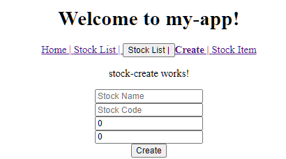
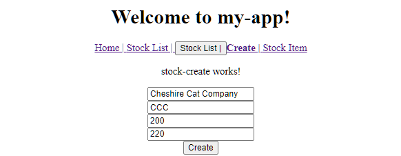
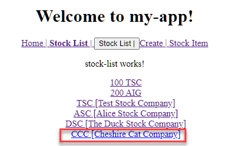
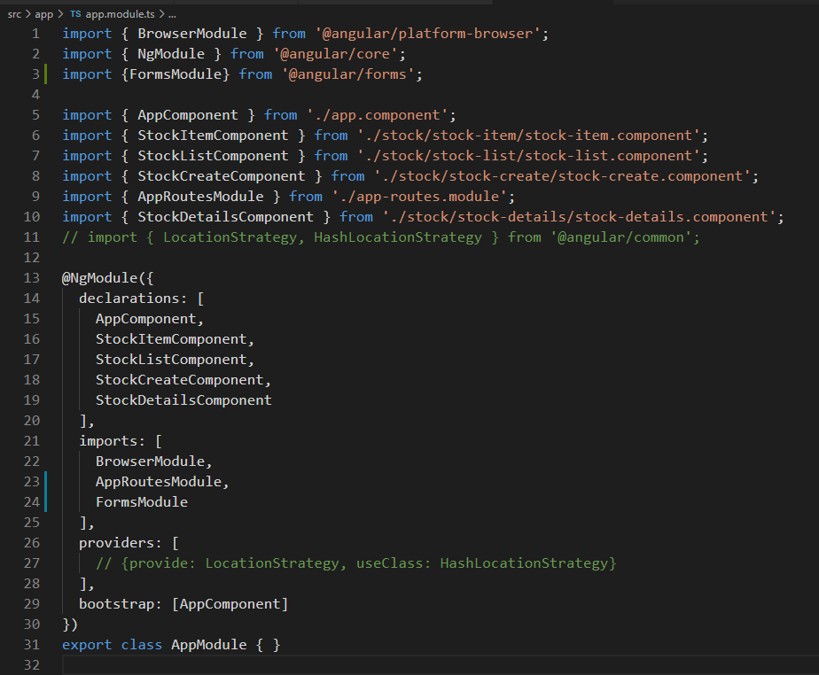

# Unit 09 範本驅動式表單(template driven form)

## 匯入 `FormsModule` 到專案中

## 表單的結構

Angular 的表單由以下的[表單基礎類別](https://angular.tw/guide/forms-overview#common-form-foundation-classes)所組成:

- FormControl 實例用於追蹤單個表單控制元件的值和驗證狀態。(FormControl tracks the value and validation status of an individual form control.)

- FormGroup 用於追蹤一組表單控制元件的值和狀態。(FormGroup tracks the same values and status for a collection of form controls.) 當表單控制項(form control) 間有相關性必須一起控制時, 使用 FormGroup 將這些控制項分在同一群。
  - FormGroup 把每個子 FormControl 的值聚合進一個物件，它的 key 是每個控制元件的名字。 它透過歸集其子控制元件的狀態值來計算出自己的狀態。 比如，如果組中的任何一個控制元件是無效的，那麼整個組就是無效的。
  
- FormArray 用於追蹤表單控制元件陣列的值和狀態。(FormArray tracks the same values and status for an array of form controls.)。
  - 控制元件可以是 FormControl、FormGroup 或 FormArray 的實例。
  - FormArray 也可用來[建立動態表單](https://angular.tw/guide/reactive-forms#creating-dynamic-forms)。

- ControlValueAccessor 用於在 Angular 的 FormControl 實例和原生 DOM 元素之間建立一個橋樑。(ControlValueAccessor creates a bridge between Angular FormControl instances and native DOM elements.)


Ref: [[Angular] Reactive Forms (Model-driven) | karatejb.blogspot.com ](https://karatejb.blogspot.com/2017/03/angular2-reactive-forms-model-driven.html)

## 模板驅動式表單

**`ngModel` 指令**
- 模板驅動式表單中, 使用 `ngModel` 指令將 DOM 元素的 `value` 特性與元件特性繫結在一起。
- Angular 會自動同步 DOM 元素的 `value` 特性與其繫結的元件特性值。
  
- `ngModel` 指令會為對應的 DOM 元素自動建立一個 `FormControl`, 但我們無法直接以程式的方式存取表單上的 `FormControl`.

- `ngModel` 指令(directive)是屬於「屬性型指令」, 需要在元件樣版中使用。該指令會將表單控制項值設定到元件的特性; 或者將元件的特性值設定表單控制項的 `value` 特性(同步表單控制項及元件特性兩邊的值)。

**為表單控制項命名**
- 使用時, 必須對控制元件命名。亦即, 設定控制元件的 `name` 屬性。如此,  `ngModel` 產生的 `FormControl` 實體才能註冊到 `FromGroup` 中(參考 [Naming control elements](https://angular.tw/guide/forms#naming-control-elements))。
- 若沒有設定, 將無法自動同步。

以下為一個表單的例子:
```typescript
import { Component } from '@angular/core';

@Component({
  selector: 'app-template-favorite-color',
  template: `
    Favorite Color: <input 
      type="text" 
      // form control name
      name="favoriteColor"
      // bind to a component property 
      [(ngModel)]="favoriteColor">
  `
})
export class FavoriteColorComponent {
  favoriteColor = '';
}
```

**Data flow: View to Model**

上前述例子為例, 若使用者在表單上的 `Favorite Color` 欄位輸入 `Blue`, 由 View 到 Model 的資料流向如下:


Src: [建立範本驅動表單 | angular.tw](https://angular.tw/guide/forms-overview#setup-in-template-driven-forms)

過程中, `ngModel` 指令會將使用者在表單控制項輸入的值指派到對應的 `FormControl` 實體。之後，`FormControl` 實體內的值再被指派到元件的特性。

這個過程的資料流為: View to Model。


**Data flow: Model to View**

若程式修改元件的 `favoriteColor` 特性值為 `red`, 則資料的流向如下:

Data flow: View to Model


Src: [建立範本驅動表單 | angular.tw](https://angular.tw/guide/forms-overview#setup-in-template-driven-forms)

## 提交表單資料

**NgForm 及 NgGroup 指令**

Angular 為 `<form>` 元素附自動加上一個 [`NgForm` 指令](https://angular.io/api/forms/NgForm)，此指令會建立一個 `FormGroup` 實體來描述表單內控制項的結構, 並追縱表單的狀態, 以利進行表單驗證。

`NgForm`指令會抛出 `ngSubmit` 事件, 當按下 Submit 按鈕時。監聽此一事件, 進行表單處理。

例如, 有以下新增股票表單，按下 `Create` 按鈕後希望能夠新增一支股票到儲存庫中。

元件的樣版如下:
```html 
<form (ngSubmit)="createStock()">
    <div>
        <input type="text" placeholder="Stock Name" 
            name="stockName" [(ngModel)]="this.stock.name" />
    </div>
    <div>
        <input type="text" placeholder="Stock Code" 
        name="stockCode" [(ngModel)]="this.stock.code" />
    </div>
    <div>
        <input type="number" placeholder="Stock Price" 
        name="stockPrice" [(ngModel)]="this.stock.price" />
    </div>
    <div>
        <input type="number" placeholder="Previous Price" 
        name="previousPrice" [(ngModel)]="this.stock.previousPrice" />
    </div>
    <div>
        <button type="submit">Create</button>
    </div>
</form>
```

元件的類別如下:
```typescript
import { Stock } from 'src/app/model/stock';
import { Component, OnInit } from '@angular/core';

@Component({
  selector: 'app-stock-create',
  templateUrl: './stock-create.component.html',
  styleUrls: ['./stock-create.component.css']
})
export class StockCreateComponent implements OnInit {

  public stock: Stock;

  constructor() { }

  ngOnInit() {
    this.stock = new Stock('', '', 0, 0);
  }

  /**
   * Create a new stock using this.stock
   */
  createStock(){
    console.log('Put the stock: ', this.stock , 'into the StockService' );
  }
}
```

## 實作

### 需求 

建立一個 Create Stock 的表單, 建立新 Stock:


輸入資料號, 點選 (B)Create, 建立新的 Stock:


在 Stock List 中顯示剛才加入的 Stock:


### 在專案中加入 FormsModule

開啟 `src\app\app.module.ts`




### 為 `StockService` 服務新增建立股票的方法

按下 表單(B)Create 後, 新的 `Stock` 物件存放到 `StockService` 服務的 `stocks: Stock[]`中。

開啟 `src\app\services\stock.service.ts`

```typescript
...

@Injectable({
  providedIn: 'root'
})
export class StockService {
  private stocks: Stock[];

...
  // 新加入的 method
  public create(stock: Stock): void {
    this.stocks.push(stock);
  }
}
```

### 在 `StockCreate` 元件新增特性以儲存表單值, 及建立提交時的處理方法


開啟 `src\app\stock\stock-create\stock-create.component.ts`

```typescript
import { Stock } from 'src/app/model/stock';
import { Component, OnInit } from '@angular/core';
import { StockService } from 'src/app/services/stock.service';

@Component({
  selector: 'app-stock-create',
  templateUrl: './stock-create.component.html',
  styleUrls: ['./stock-create.component.css']
})
export class StockCreateComponent implements OnInit {
  // 儲存表單值的欄位
  public stock: Stock;

  constructor(private stockService: StockService) { }

  ngOnInit() {
    // 初始化欄位
    this.stock = new Stock('Cheshire Cat Company', 'CCC', 200, 220);
  }

  /** 表單 Submit 事件發生時呼叫
   * Create a new stock using this.stock
   */
  createStock(): void {
    console.log('Put the stock: ', this.stock , 'into the StockService' );
    // 呼叫 StockService 服務的 create() 將 stock 放到儲存庫中
    this.stockService.create(this.stock);
    // 重新初始化儲存表單值的欄位
    this.stock = new Stock('', '', 0, 0);
  }
}
```

### 在 StockCreate 元件的模版中建立表單

```html
<p>stock-create works!</p>

<form (ngSubmit)="createStock()">
    <div>
        <input type="text" placeholder="Stock Name" 
                name="stockName" [(ngModel)]="this.stock.name" />
    </div>
    <div>
        <input type="text" placeholder="Stock Code" 
                name="stockCode" [(ngModel)]="this.stock.code"/>
    </div>
    <div>
        <input type="number" placeholder="Stock Price" 
            name="stockPrice" [(ngModel)]="this.stock.price" />
    </div>
    <div>
        <input type="number" placeholder="Previous Price" 
            name="previousPrice" [(ngModel)]="this.stock.previousPrice" />
    </div>
    <div>
        <button type="submit">Create</button>
    </div>
</form>
```

執行程式查看結果

## 回顧

- 組成 Angular 的表單的[表單基礎類別]:
  - FormControl 實例用於追蹤單個表單控制元件的值和驗證狀態。
  - FormGroup 用於追蹤一組表單控制元件的值和狀態。
  - FormArray 用於追蹤表單控制元件陣列的值和狀態。控制元件可以是 FormControl、FormGroup 或 FormArray 的實例。

- 模板驅動式表單使用 `ngModel` 指令將 DOM 元素的 `value` 特性與元件特性繫結在一起(同步化)。

- 必須對控制元件命名, 設定控制元件的 `name` 屬性。如此, `ngModel` 自動產生的 `FormControl` 實體才能註冊到 `FormGroup` 中。
