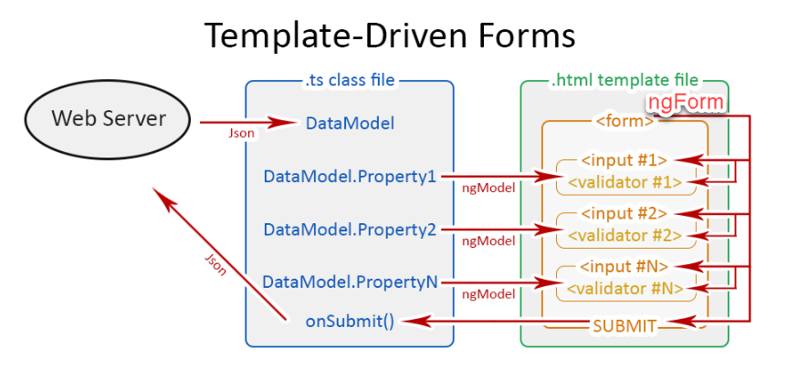
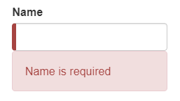
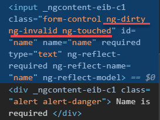
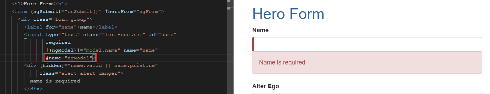
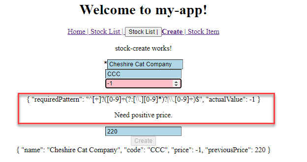
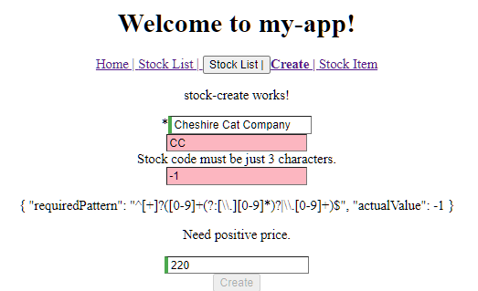
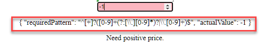

# Unit 10 範本驅動式表單驗證

## 表單驗證

在使用者輸入資料時, 驗證表單上的資料, 確保資料的品質。

若驗證錯誤, 在表單上顯示訊息, 提示錯誤訊息, 並阻止使用者提交表單.


## Angular 表單驗證

Angular 擴充 HTML 的原生表單驗證規則, 參考 [Constraint validation](https://developer.mozilla.org/en-US/docs/Web/Guide/HTML/HTML5/Constraint_validation)

例如, 加上 `required` 屬性成為必要輸入欄位

```html
 <input type="text" class="form-control" id="name"
               required />
```

Angular 為表單 `<form>` 及其內部的控制項 `<input>` 建立相對應的指令(directive), 以進行:
1. 表單資料與元件特性間的自動同步
2. 表單控制項狀態控制、取得驗證錯誤訊息及使用自訂驗證器
3. 表單狀態控制及取得驗證錯誤訊息


## 範本驅動式表單驗證的三個重要指令(directive)

這些指令定義於 `FormsModule`, 使用前要匯入專案中。

指令包括: `NgForm`，`NgModel` 及 `NgGroup`


[NgForm directive](https://angular.io/api/forms/NgForm)
- 此指令會建立一個頂層的 [`FormGroup` 實體](https://angular.io/api/forms/FormGroup), 並將其繫結到 `<form>` 元素, 用以追踪表單值和驗證狀態。
- 只要匯入 `FormsModule` 模組後, `NgForm` 指令會預設自動地為每個`<form>` 元素啟用。


[NgModel directive](https://angular.io/api/forms/NgModel)
- 為每個表單控制項繫結一個 [`FormControl` 實體](https://angular.io/api/forms/FormControl)
- 此指令用來同步表單資料與元件的特性質(資料模型)。
- 也可提供個別控制項的狀態及驗證錯誤訊息


NgModelGroup directive
- 建立 FormGroup 實例並將其綁定到某個 DOM 元素。
- 方便將表單內的控制項再分群



Src: https://www.ryadel.com/en/angular-forms-template-driven-model-driven-reactive-pros-cons-tutorial-guide/

## 控制項的狀態及 CSS 樣式

- Angular 會依控制項的狀態自動套用預定樣式的名稱
- 開發者只需設定這些預定樣式名稱下的 CSS 

控制項狀態 | true 時套用 CSS 類別 | false 時套用的類別|
--|--|--
Visited | ng-touched | ng-untouched
Changed | ng-dirty | ng-pristine
Valid | ng-valid | ng-invalid

Render 出來的 html 元件如下:
```html
<input ... class="form-control ng-untouched ng-pristine ng-valid" ...>
```




## 取得個別控制項的狀態及驗證錯誤類型


### 取得個別控制項的狀態
在樣版中使用模板參考變數(template reference variable)取得控制項的 `NgModel` 實體:



模板參考變數只限在現有模板中使用, 不能在其它模板使用。

`NgModel` 實體提供控制項狀態相關的屬性:

```
value: any

valid: boolean | null
invalid: boolean | null

pristine: boolean | null
dirty: boolean | null

touched: boolean | null
untouched: boolean | null

pending: boolean | null

disabled: boolean | null
enabled: boolean | null

status: string | null

```
Ref: https://angular.io/api/forms/NgModel#inherited-from-abstractcontroldirective

使用範本表示式(template expression) 配合 `NgModel` 實體的特性, 用來顯示提示訊息:

```html
<div class="form-group">
    <label for="name">Name</label>
    <input type="text" class="form-control" id="name"
               required
               [(ngModel)]="model.name" name="name"
               #name="ngModel">
    <!-- 顯示錯誤訊息 -->
    <div [hidden]="name.valid || name.pristine"
        class="alert alert-danger">
         Name is required
        </div>
```

### 取得驗證錯誤類型

控制項可以同時套用多個驗證規則, 例如: required, maxlength.

如何知道是那個驗證規則產生錯誤?

`NgModel` 實體中的 `errors: ValidationErrors | null` 可以告知驗證錯誤型態。

`ValidationErrors` 是一個 map 資料結構, 提供驗證規則名稱做為 key 值, 以取得詳細錯誤內容:

使用 `pattern` 驗證規則:
```html
<div class="stock-price">
        <input type="number" placeholder="Stock Price"
            name="stockPrice" [(ngModel)]="this.stock.price"
            min="0" pattern="^[+]?([0-9]+(?:[\.][0-9]*)?|\.[0-9]+)$"
               #price="ngModel" />
            <div *ngIf="price.errors?.pattern">
            <!-- 顯示詳細錯誤內容 -->
            <p> {{price.errors.pattern | json}} </p>
            <!-- 顯示一般錯誤訊息 -->
            <p>Need positive price.</p>
        </div>
    </div>
```



Angular 內建的驗證規則, 參考 https://angular.io/api/forms/Validators

## 取得表單整體狀態

使用模版參考變數取得 `<form>` 元素上附加的 `NgForm` 實體:

```html
<form #stockCreateForm="ngForm">
...
</form>
```

在模版內使用 `stockCreateForm` 取得表單的狀態及驗證錯誤訊息.

`NgForm` 及 `NgModel` 指令皆有繼承 [`AbstractControlDirective` 指令](https://angular.io/api/forms/NgForm#inherited-from-abstractcontroldirective), 提供不同的特性, 説明控制項的狀態.

例如, 當表單驗證至少有一項錯誤時, 阻止使用者提交表單, 我們可以這樣寫:

```html
<div >
  <button [disabled]="stockCreateForm.invalid" type="submit">Create</button>
</div>
```

NgForm 的參考變數也可以傳入元件的方法内在元件端處理，讓我們在處理 submit event 時取得表單的狀態及內容，參考 https://angular.io/api/forms/NgForm#listening-for-form-submission

## 實作

### 需求



欄位 | 驗證規則 | 錯誤訊息
--|--|--
Stock Name | 必要輸入 | Stock Name is Mandatory.
Stock Code | 長度必須為 3 碼 | Stock code must be just 3 characters.
Price | 大於 0 的數字; Regex Pattern 檢查 | Need Positive price.
Previous price | 大於 0 的數字; Regex Pattern 檢查 | Need Positive price.
 

### 設定 CSS 樣式

開啓 `src\app\stock\stock-create\stock-create.component.css`

建立以下的樣式:
```css
.createStockForm .ng-valid {
  border-left: 5px solid #42A948; /* green */
}

.createStockForm .ng-invalid {
  background-color: lightpink;
}
```

### 建立 Stock Name 表單控制項

開啓 `src\app\stock\stock-create\stock-create.component.html`

```html
<!-- #1 -->
<form (ngSubmit)="createStock()"        
    class="createStockForm" 
    #stockCreateForm="ngForm">
    <div class="stock-name">
    <!-- #2 -->
        *<input type="text" placeholder="Stock Name"
                name="stockName" 
                [(ngModel)]="this.stock.name"
                required 
                #name="ngModel" />
        <!-- #3 -->
        <div *ngIf="name.errors?.required">
           Stock Name is Mandatory.
        </div>
    </div>
</form>
```

1. `<form>` 中使用參考變數 `stockCreateForm` 繫結到 `NgForm` 實體
2. `<input>` 元素
   - 將元素命名為 `stockName`
   - 使用 `[()]` 將 `name` 為 `stockName` 的 input 的 value 繫結到元件的 `stock.name` 特性. 
   - 套用 required 驗證規則
   - 用參考變數 `name` 繫結到該元素對應的 `NgModel` 實體
3. `<div>` 元素
   - 使用 [`*ngIf` 結構型指令(structural directives)](https://angular.tw/guide/structural-directives) 判斷何時顯示該元素.
   - 當 Stock Name 的錯誤型態為 required 時顯示該 `<div>` 元素.

### 建立 Stock Code 表單控制項

接續在下方輸入 Stock Code 表單控制項:
```html
<!-- #1 -->
<div class="stock-code">
        <input type="text" placeholder="Stock Code"
                name="stockCode" 
                [(ngModel)]="this.stock.code"
                maxlength="3" 
                minlength="3" 
                #code="ngModel"/>
<!-- #2 -->
        <div *ngIf="code.errors?.minlength">
           Stock code must be just 3 characters.
        </div>
    </div>
```

1. `<input>` 元素
   - 套用 `maxlength` 及 `minlength` 驗證規則, 兩者皆設定為 3.
   - 使用參考變數 `code` 參考到此元素的 `NgModel` 實體
2. 當 `code` 有錯誤且以 `minlength` 為 key 值可取得錯誤資訊時, 顯示此 `<div>` 元素.

### 建立 Price 及 Previous Price 的表單控制項:


接續在下方輸入:
```html
<div class="stock-price">
<!-- #1 -->
        <input type="number" placeholder="Stock Price"
            name="stockPrice" 
            [(ngModel)]="this.stock.price"
            min="0" 
            pattern="^[+]?([0-9]+(?:[\.][0-9]*)?|\.[0-9]+)$"
            #price="ngModel" />
<!--      Ref: https://stackoverflow.com/questions/53956477/validation-error-in-angular-inputtype-number -->
<!--      min and max validator are only supported in the Reactive Form -->
            <div *ngIf="price.errors?.pattern">
<!-- #2 -->
                <p> {{price.errors.pattern | json}} </p>
                <p>Need positive price.</p>
        </div>
    </div>
    <div class="stock-price">
        <input type="number" placeholder="Previous Price"
            name="previousPrice" 
            [(ngModel)]="this.stock.previousPrice"
            min="0" 
            pattern="^[+]?([0-9]+(?:[\.][0-9]*)?|\.[0-9]+)$"
            #previousPrice="ngModel"/>
      <div *ngIf="previousPrice.errors?.pattern">
        Need positive price.
      </div>
    </div>
```

1. `<input>`
   - pattern 驗證規則, 使用 regexp. 
     - match: 0, +0, 1., 1.5, .5666
     - not match: ., 1..5, 1.2.3, -1 
   - min 驗證規則, 但無法阻止使用者輸入負值, 所以才使用 RegExp 進行驗證, 確保輸入大於 0 的數值. 
2. `<p> {{price.errors.pattern | json}} </p>`
   - `price` 為模板參考變數, 為 `stockPrice` 控制項的 `NgModel` 實體, 所以他的 `errors` 特性, 以 `pattern` 為鍵值, 取得驗證錯誤時的回饋資訊, 回饋資訊以 json 格式顯示.


### 建立按鈕, 並依表單狀態進行啟用控制


```html
<div >
    <button 
        [disabled]="stockCreateForm.invalid"    
        type="submit">
        Create
    </button>
</div>
```

- 將 `<button>` DOM 元素的 `disabled` 特性與 `stockCreateForm` 模板參考變數的 `invalid` 特性繫結在一起. 
- 只要表單中有任何一個控制項的狀態 invalid, 則整個表單的狀態將成為 invalid.
- 當 表單 invalid 時, disable `<button>` DOM 元素.