# Unit 11 Reactive Programming: RxJS library 簡介

## 什麼是 Reactive Programming

Reactive Programming (回應式程式設計) , 是以非同步資料串流(asynchronous data stream)為形式的程式設計思維. 觀察者(Observer)透過訂閱可觀察的(Observable)物件, 成為該物件的訂閱者(Subscriber). 可觀察的物件產生的資料會主動推向訂閱者, 訂閱者便可以即時的反應資料的變化. Ref:Ref: [Reactive programming - Wikipedia](https://en.wikipedia.org/wiki/Reactive_programming)


Figure Source: [Reactive Programming in JavaScript with RxJS.](https://dev.to/sagar/reactive-programming-in-javascript-with-rxjs-4jom)


考慮底下的例子:
```
let a1 = 2;
let a2 = 4;
let b = a1 + a2; // b = 6
let a1 = 3  // b = ?
```

b 的值, 在命令式編程(imperative programming)的思維下, 為 6. 命令式編程指示函數何時啟用, 在 `b = a1 + a2` 時, 將運算的結果指派給 b.

當 a1 的值改變為 3 時, b 的值會是多少呢? 在命令式編程下, b 的值並不會改變, 因為 a1 的值改變後, 我們並沒有再次呼叫 `b = a1 + a2` 重新計算 b 的值.

回應式程式設計思維用不同的角度看 `b = a1 + a2`. `a1 + a2` 可視為一個可觀察的物件, 當有異動時, 運算的結果會自動送出(emit). `b` 是一個觀察者, 對 `a1 + a2` 運算結果有興趣. `=` 是訂閱動作, 將觀察者和可觀察物件繫結在一起, 讓觀查者變成訂閱者. 所以, 當 `a1` 的值變成為 3 時, `b` 的值自動變成 `7`, 我們不用再次呼叫 `b = a1 + a2` 進行計算.

Reactive Programming 可以讓應用程式具備非同步處理的能力, 或者事件導向式處理能力, 事件串流被主動推送到訂閱者處理事件.

應用舉例: 
- GUI 的 MVC 模型, 當 Model 的資料有異動時, View 會自動的更新. 
- 另一個最常見的例子是對後端提出 http request。Http Response 的等待時間受到眾多因素影響。
在 Reactive Programming 的思維下, 提出 Http Request 之後, 我們可以訂閱 Response 的結果。
Response 回來後, Response 的內容會直接推送給訂閱者。 在等待資料推送的過程中, 程式執行緒並不會被卡住, 可以執行其它程式。
換句話說, 程式不會因網路速度慢而造成 UI 的凍結。


## RxJS 術語(terminology)與舉例

Observable: 隨時間推送資料的資料串流
Observer: 資料串流的消費者(consumer), 對取得的資料做處理, 例如印出資料
Subscription: 表示 Observable 與 Observer 間的訂閱關係。
Operator: 串流資料轉換的函數

底下例子, 每隔 1 秒鐘印出計數的數字 0, 1, 2, 3..., 到第 5 秒的時候停止。

Reactive Programming 的思維下,

- Observable: 有個物件能夠每隔一秒產生一個數字
- Observer: 對 Observable 進行訂閱, 印出得到的數字
- Subscription: 描述 Observable 及 Observable 間的關係, 提供 unsubscribe() 取消訂閱, 結束關係。

Demo [u11-ex1 | StackBlitz](https://stackblitz.com/edit/u11-ex1?file=index.ts)

```typescript
import { interval, Observer, Subscription } from "rxjs";

// Observable 可觀察串流
const source$ = interval(1000);

// Observer 觀察者. 
// <T> 指定可處理的資料型態
let myObserver: Observer<number> = {
  // 取得下個數字後的處理方法
  next: value => console.log(value),
  // 發生錯誤時的處理方法
  error: err => console.log(err),
  // 串流推送完畢的處理方法
  complete: ()=> console.log('')
};

// 建立訂閱關係
const subscription: Subscription = source$.subscribe(myObserver);

// 5 秒後, 結束訂閱關係
setTimeout(() => {
  console.log("Unsubscribe");
  subscription.unsubscribe();
}, 5000);
```

Observable 物件提供 `subscribe()` 以訂閱該可觀察物件, 該方法的簽名如下:

```
subscribe(observer?: PartialObserver<T>): Subscription
```
Src: [Observable.subscribe() | RxJS](https://rxjs-dev.firebaseapp.com/api/index/class/Observable#subscribe-)

此方法的另一個多載可以直接傳入 `next`, `error`, `complete`三方法的個函數:

```
subscribe(next: null, error: null, complete: () => void): Subscription
```
Src: [Observable.subscribe() | RxJS](https://rxjs-dev.firebaseapp.com/api/index/class/Observable#subscribe-)
 

## RxJS Play Ground

[StackBlitz](https://stackblitz.com/) 提供線上撰寫 RxJS 的編輯器

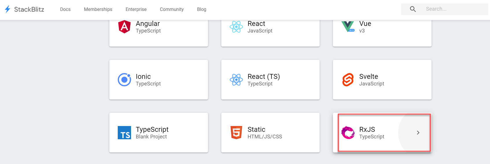
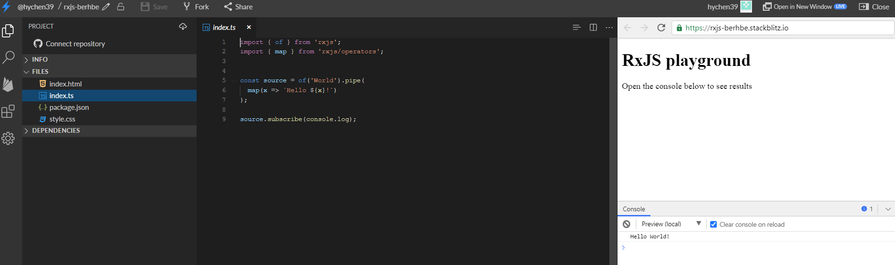

## 訂閱 Observable: Observer 的建立


Observer (觀察者) 只是具有三個回呼方法(callbacks)的物件，每一個回呼方法對應到 Observable 可能傳遞的通知類型: 
- `next`: Observable 將串流中的下一個元素推向 Observer, Observer 提供方法進行處理
- `error`: 將錯誤訊息推向 Observer, Observer 提供方法進行處理
- `complete`: 通知 Observer 串流資料全部輸出完成, Observer 提供方法進行處理。

以下是 `Observer` 的介面定義:

```typescript
interface Observer<T> {
  closed?: boolean
  next: (value: T) => void
  error: (err: any) => void
  complete: () => void
}
```

參考: [Observer Interface | rxjs-dev](https://rxjs-dev.firebaseapp.com/api/index/interface/Observer)

再看另外一個例子。

這個例子將陣列資料轉成非同步的資料 `Observable<string>`。
此外, 在訂閱時, 可以傳入具有名稱的 Observer: `myObserver` 或者不具名的 Observer 物件。

Demo code [u11-ex2 | StackBlitz](https://stackblitz.com/edit/u11-ex2?file=index.ts)
```typescript
import { from, Observer, of, Subscription, Observable } from "rxjs";
import { map } from "rxjs/operators";

const disneyFriends = ['米老鼠', '高飛', '唐老鴨', '布魯托'];

// 建立 Observer
let myObserver: Observer<string> = {
  next: (friend) => console.log(friend),
  error: err => console.log(err),
  complete: () => console.log('所有的朋友都來了!!')
};

// 使用 from 運算子將陣例轉成 Observable 資料
// 向 Observable 進行訂閱, 訂閱時傳入有名稱的 Observer
from(disneyFriends).subscribe(myObserver);

// 使用不具名的 Observer 物件
from(disneyFriends).subscribe( {
  next: friend => console.log(friend, ' bye bye'),
  error: err => console.log(err),
  complete: () => console.log('所有朋友都離開了!!')
});
```


## Observable 的建立

有數種方式可以將一般的資料建立成 Observable Stream Data。

### `of()` RxJS function

使用 `of()` 將一連串的數字轉成串流:

ux11-ex3
```typescript
import { interval, Observer, of, Subscription } from "rxjs";
import { map } from "rxjs/operators";

// 建立 Observable Stream
const source$ = of(1, 2, 3, 5, 9, 10, 11);

let myObserver: Observer<number> = {
  next: value => console.log(value),
  error: err => console.log(err),
  complete: ()=> console.log('串流推送完成')
};

const subscription: Subscription = source$.subscribe(myObserver);
```

### `from()` RxJS function

使用 [`from(myArray)`](https://rxjs-dev.firebaseapp.com/api/index/function/from) 將陣列或者 collection 變成串流:

[ux-ex4 | StackBlitz](https://stackblitz.com/edit/u11-ex4?file=index.ts)
```js
import { from, Observer, Subscription } from "rxjs";

const myArray = ['A', 'B', 'C', 'D', 'E'];
// const source = of(1, 2, 3, 5, 9, 10, 11);
 const source = from(myArray);

let myObserver: Observer<string> = {
  next: value => console.log(value),
  error: err => console.log(err),
  complete: ()=> console.log('串流推送完成')
};

const subscription: Subscription = source.subscribe(myObserver);
```


### `interval()` RxJS function

固定間隔一段時間產生
Creates an Observable that emits sequential numbers every specified interval of time, on a specified SchedulerLike.


底下的例子取出前 5 個數字後即停止:

[u11-ex5 | StackBlitz](https://stackblitz.com/edit/u11-ex5?file=index.ts)
```typescript
import { from, Observer, of, Subscription, Observable, interval } from "rxjs";

import { take } from "rxjs/operators";

//#1
const take5Elements = interval(500).pipe(take(5));

//#2
take5Elements.subscribe( x => console.log(x));
```

1. [take pipe 運算子](https://rxjs-dev.firebaseapp.com/api/operators/take) 讓我們指定要取幾個元素
2. 我們使用 subscribe() 的另一種簽名, 可以直接傳入 `next`, `error`, `complete`三方法的個函數:

```typescript
subscribe(next: null, error: null, complete: () => void): Subscription
```
Src: [Observable.subscribe() | RxJS](https://rxjs-dev.firebaseapp.com/api/index/class/Observable#subscribe-)
 

輸出結果:


### new Observable() 方法

使用 `Observable` 的建構子建立 `Observable` 物件。

建立時, 要傳入方法, 該方法的參數為具 `Observer` 介面的物件。
此方法會呼叫傳入的 `Observer` 物件的 `next()`, `error()`, 及 `complete()` 方法。

Demo Code [u11-ex3 | StackBlitz](https://stackblitz.com/edit/u11-ex3?file=index.ts)
```typescript
import { from, Observer, of, Subscription, Observable } from "rxjs";
import { map } from "rxjs/operators";

// const subscription: Subscription = source.subscribe(myObserver);


// 建立
const myObservable = new Observable( function subscribe(subscriber){
  // subscriber is a observer
  const myArray = ['A1', 'B1', 'C1', 'D1', 'E1'];
  myArray.forEach( (element) => {
    // 呼叫 observable.next() 處理陣列中的元素
    subscriber.next(element);
  })
  // 完成後, 呼叫 observable.complete()
  subscriber.complete();
});

// 建立 Observer 物件提供 next, error, complete 等事件發生時的處理
let myObserver: Observer<number> = {
  next: value => console.log(value),
  error: err => console.log(err),
  complete: ()=> console.log('串流推送完成')
};


myObservable.subscribe(myObserver);
```

輸出結果

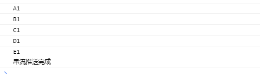

## Pipeable Operators (可串接運算子)

Reactive Programming 中的可串接運算子為函數, 將輸入依據規則轉換成輸出。

可串接運算子是一個函數, 接受一個 Observable 作輸入, 之後輸出另一個Observable, 亦即將一個 Observable 轉換成另一個。 這是一個單純操作(pure operation)：來源的 Observable 保持不變。


Ref: [RxJS Operators Explained with Example (2020) | TechGeekNext >>](https://www.techgeeknext.com/angular/angular-rxjs-operators)

上述圖形的 RxJS 程式碼:
```typescript
import { Observer, of } from 'rxjs'; 
import { filter, map } from 'rxjs/operators';

// Convert one observable to another observable
const source$ = of(1,2,3).pipe(
  map( x => x*2),
  filter( x => x <5)
);

// subscribe the observable

source$.subscribe(
  (x) => console.log(x),
  (error) => console.log(error),
  ()=>console.log('Complete')
);
```

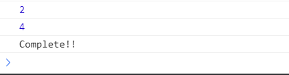

### Pipeable Operator 的類型

使用 [`pipe()`](https://rxjs-dev.firebaseapp.com/api/index/function/pipe) 為 Observable 建立元素轉換的管道。

在 `pipe()` 的輸入參數內可放入多個 Pipeable Operator, 依序轉換 Observable 的元素。

例如:
```typescript
const source$ = of(1,2,3).pipe(
  map( x => x*2),
  filter( x => x <5)
);
```

**Pipeable Operator 的類型**

Pipeable operator 的類型為: creation (建立), transformation(轉換), filtering(過濾), joining(串接), multicasting(群播), error handling(錯誤處理), utility(工具), etc.

完整的類型請參考: [Categories of operators 小節 | RxJS](https://rxjs-dev.firebaseapp.com/guide/operators)

**marble diagram (彈珠圖)**

marble diagram (彈珠圖)常用來圖示 Pipeable operator 的元素操作。
[RxMarbles: Interactive diagrams of Rx Observables](https://rxmarbles.com/#map) 提供各類 operators 的 marble diagram (彈珠圖)。


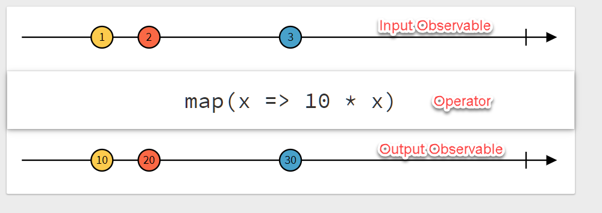

Marble Diagram 的閱讀方式:
- Input Observable: 輸入的 Observable (內容不受 Operator 的影響, 因為是 pure operation)
- Operator: 對 Observable 元素作用的運算子
- Output Observable: 運算後輸出的 Observable

#### FILTERING OPERATORS (過濾運算子)

##### Filter Operator

[`filter`](https://rxjs-dev.firebaseapp.com/api/operators/filter)

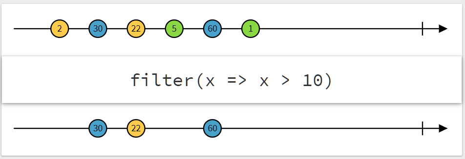

`filter` 的簽名為:
```typescript
filter<T>(predicate: (value: T, index: number) => boolean, thisArg?: any): MonoTypeOperatorFunction<T>
```

傳入一個 `predicate` 方法判斷元素為 true or false. 該方法接受二個參數的輸入:
- value: T - 元素值, 型態為 T
- index: number - 表示為第幾個元素

運算子執行完成為得到一個 `MonoTypeOperatorFunction<T>` 的 Observable.

[Example for the Filter operator | StackBlitz.com](https://stackblitz.com/edit/u11-filter-operator?file=index.ts)
```typescript
import { interval, Observable,  Observer, of, timer } from 'rxjs'; 
import { filter, map, take } from 'rxjs/operators';


// Create an observable
// 每隔 1 秒產生一個介於 0 到 99 間的亂數
const source$ = new Observable( function subscribe(subscriber){
  setInterval( ()=>{
    const rn: number = Math.round(Math.random() * 100);
    subscriber.next(rn);
  } , 1000)
});

const myObserver: Observer<number> = {
  next: (value) => console.log(value, 'index: '),
  error: err => console.log(err),
  complete: () => console.log('Complete!!')
}

const sourceFiltered$ = source$.pipe(
  filter( (value, idx) => value > 10 && idx < 5),
);

sourceFiltered$.subscribe(myObserver);

```

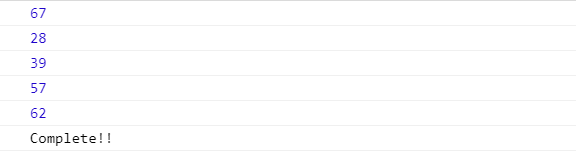


##### Take Operator

[Take Operator](https://rxjs-dev.firebaseapp.com/api/operators/take)

```typescript
take<T>(count: number): MonoTypeOperatorFunction<T>
```

取得前面數個元素, 例如前 5 個。

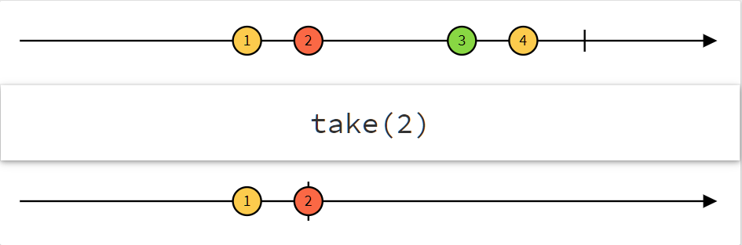

Example of the Take Operator
```typescript
import { of, interval, Observer } from 'rxjs'; 
import { map, take, filter, reduce } from 'rxjs/operators';


const source$ = of(1,2,3,4).pipe(take(2));

const myObserver: Observer<number> = {
  next: value => console.log(value),
  error: err => console.log(err),
  complete: () => console.log('Complete!!')
}

source$.subscribe(myObserver);
```

#### Mathematical and Aggregate Operators (數學與聚合運算字)

[`reduce()`](https://rxjs-dev.firebaseapp.com/api/operators/reduce) 運算子對元素進行聚合運算, 如 sum, 把多個元素值, 聚合成單一個值。

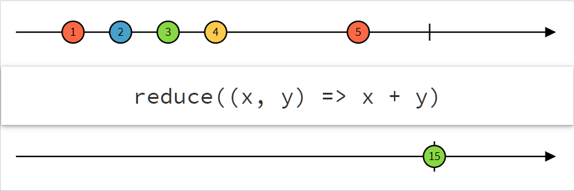

此運算子可傳入以下的規格的 accumulator 方法:

```
accumulator: (acc: T | R, value: T, index?: number) => T | R
```
方法的輸入參數:
- `acc: T` - 聚合值, 第 1 個參數, 資料型態為 Observable 中原本的資料型態 `T` 或者聚合值轉換成另一種資料型態 `R`.
- `value: T` - Observable 的發送值, 第 2 個參數, 資料型態為 Observable 中原本的資料型態 `T`。
- `index?: number`: 目前發送值的序號(即, 第幾個發送值)

方法的輸出資料型態:
`T | R`: Observable 中原本的資料型態 `T` 或者聚合值轉換成另一種資料型態 `R`.

Example for the Reduced operator
計算前 5 個發送值的總合:
```typescript
import { of, interval, Observer } from 'rxjs'; 
import { map, take, filter, reduce } from 'rxjs/operators';


const source$ = interval(500).pipe(
  filter (x => x > 0), 
  take(5),
  reduce( (acc, x) => acc + x)
  );

const myObserver: Observer<number> = {
  next: value => console.log(value),
  error: err => console.log(err),
  complete: () => console.log('Complete!!')
}

source$.subscribe(myObserver);
```

#### TRANSFORMATION OPERATORS (轉換運算子)


[`map()`](https://rxjs-dev.firebaseapp.com/api/operators/map) 用來將 Observable 中的元素投射(project)到另一個值域。

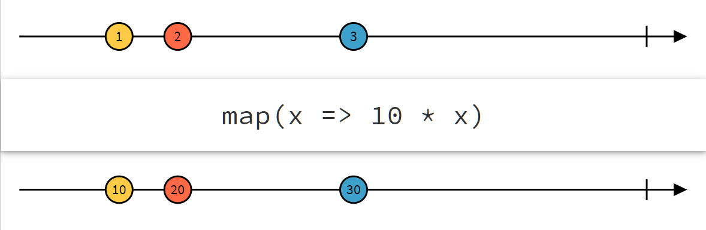


`map()` 可傳入以下簽名的 `project` 函數:

```typescript
project: (value: T, index: number) => R
```
輸入參數:
- `value: T` - Observable 的發送值, 第 1 個參數, 資料型態為 Observable 中原本的資料型態 `T`。
- `index: number`: 目前發送值的序號(即, 第幾個發送值)

輸出資料型態:
`R`: 投射後資料的資料型態 `R`

Example for the Map operator
取前 3 個 大於 10 的值, 將其值放大 10 倍:
```typescript
import { of, interval, Observer } from 'rxjs'; 
import { map, take, filter } from 'rxjs/operators';


const source$ = interval(500).pipe(
  filter (x => x > 10), 
  take(3), 
  map(x => 10 * x ));

const myObserver: Observer<number> = {
  next: value => console.log(value),
  error: err => console.log(err),
  complete: () => console.log('Complete!!')
}

source$.subscribe(myObserver);
```

Example: 將 number 投射到 string 資料型態

```typescript
import { of, interval, Observer, from } from 'rxjs'; 
import { map, take, filter } from 'rxjs/operators';


const grades = [100, 90, 80, 70, 60, 50, 60, 70];

// 訂義 coding 投射函數
let coding  = function(x: number): string {
  if ( x > 90 ) return 'A'
   else if (x > 80 ) return 'B'
   else if (x > 70) return 'C'
   else if (x > 60) return 'D'
   else return 'F';
};

// 將 coding 投射函數傳入到 map() 中
from(grades).pipe(map(coding)).subscribe(console.log);
```

上述的程式可以改採用匿名函數的寫法:

```typescript
import { of, interval, Observer, from } from 'rxjs'; 
import { map, take, filter } from 'rxjs/operators';


const grades = [100, 90, 80, 70, 60, 50, 60, 70];

// 傳入一個匿名投射函數給 map()
from(grades).pipe(
  //#1
  map<number, string>((x) => {if ( x > 90 ) return 'A'
   else if (x > 80 ) return 'B'
   else if (x > 70) return 'C'
   else if (x > 60) return 'D'
   else return 'F';}
  )
  ).subscribe(console.log);
```
在 `map()`指定轉換前、後的資料型態, 使 TypeScript 能正確推論資料型態。

前述所推論出的 `pipe()` 的輸入與輸出資料型態分別為 `number` 及 `string`。

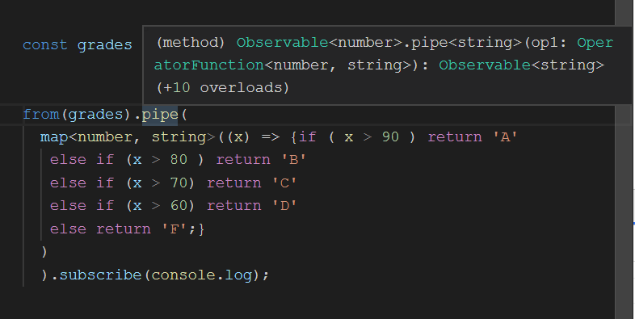

若不指定 `<number, string>`, 則輸入與輸出資料型態分別為:
- 輸入: `number`
- 輸出: `"A" | "B" | "C" | "D" | "F"`

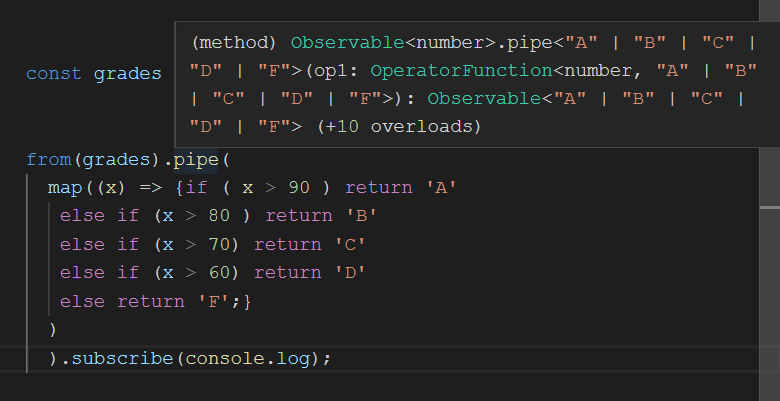


## 總結

1. 需要非同步操作時, 使用 `Observable`。例如與後端做 HTTP 通訊, 或者監聽 UI 事件。
2. `Observable` 會主動推播資料到訂閱該 `Observable` 的觀察者(Observer), 觀察者便可以即時的反應資料的變化。
3. 訂閱 `Observable` 時, 觀查者要定義 3 個方法: next, error, 及 complete。
4. 可使用 `of()`, `from()`, `interval()`, `new Observable()` 等方法, 建立自己的 Observable.
5. `Observable` 的資料在送達 Observer 之前可以進行處理。利用 `pipe()` 可各式各樣的 pipeable operators 可對資料做: creation (建立), transformation(轉換), filtering(過濾), joining(串接), multicasting(群播), error handling(錯誤處理) 等動作。
6. typescript 中的函數型態(function type)的語法為:
```typescript
function_name:([[parameter: type],...]) => return_type
```

例如, `filter()` 的可接受的函數型態為:

```typescript
predicate: (value: T, index: number) => boolean
```

Ref: [Writing the function type | Handbook - Functions | www.typescriptlang.org ](https://www.typescriptlang.org/docs/handbook/functions.html#writing-the-function-type)
