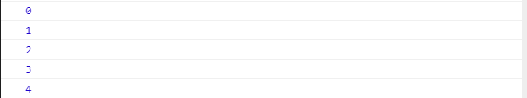

# Unit 11 Reactive Programming: RxJS library 簡介

## 什麼是 Reactive Programming

Reactive Programming (回應式程式設計) , 是以非同步資料串流(asynchronous data stream)為形式的程式設計思維. 觀察者(Observer)透過訂閱者(Subscriber)訂閱一個可觀察的(Observable)物件, 可觀察的物件產生的資料會主動推向觀察者, 觀察者便可以即時的反應資料的變化. Ref:Ref: [Reactive programming - Wikipedia](https://en.wikipedia.org/wiki/Reactive_programming)


Figure Source: [Reactive Programming in JavaScript with RxJS.](https://dev.to/sagar/reactive-programming-in-javascript-with-rxjs-4jom)

考慮底下的例子:
```
let a1 = 2;
let a2 = 4;
let b = a1 + a2; // b = 6
let a1 = 3  // b = ?
```

b 的值, 在命令式編程(imperative programming)的思維下, 為 6. 命令式編程指示函數何時啟用, 在 `b = a1 + a2` 時, 將運算的結果指派給 b.

當 a1 的值改變為 3 時, b 的值會是多少呢? 在命令式編程下, b 的值並不會改變, 因為 a1 的值改變後, 我們並沒有再次呼叫 `b = a1 + a2` 重新計算 b 的值.

回應式程式設計思維用不同的角度看 `b = a1 + a2`. `a1 + a2` 可視為一個可觀察的物件, 當有異動時, 運算的結果會自動送出(emit). `b` 是一個觀察者, 對 `a1 + a2` 運算結果有興趣. `=` 是訂閱者, 將觀察者和可觀察物件繫結在一起. 所以, 當 `a1` 的值變成為 3 時, `b` 的值自動變成 `7`, 我們不用再次呼叫 `b = a1 + a2` 進行計算.

Reactive Programming 可以讓應用程式具備事件導向式處理能力, 在其中事件串流被主動推送到訂閱者, 由其觀察並處理事件.

應用舉例: GUI 的 MVC 模型, 當 Model 的資料有異動時, View 會自動的更新. 


## RxJS 術語(terminology)與舉例

Observable: 隨時間推送資料的資料串流
Observer: 資料串流的消費者(consumer), 對取得的資料做處理, 例如印出資料
Subscription: 表示 Observable 與 Observer 間的訂閱關係。
Operator: 串流資料轉換的函數

底下例子, 每隔 1 秒鐘印出計數的數字 0, 1, 2, 3..., 到第 5 秒的時候停止。

Reactive Programming 的思維下,

- Observable: 有個物件能夠每隔一秒產生一個數字
- Observer: 對 Observable 進行訂閱, 印出得到的數字
- Subscription: 描述 Observable 及 Observable 間的關係, 提供 unsubscribe() 取消訂閱, 結束關係。

```typescript
import { interval, Observer, of, Subscription } from "rxjs";
import { map } from "rxjs/operators";

// Observable 可觀察串流
const source = interval(1000);

// Observer 觀察者
let myObserver: Observer<number> = {
    // 取得下個數字後的處理方法
  next: value => console.log(value),
  // 發生錯誤時的處理方法
  error: err => console.log(err),
  // 串流推送完畢的處理方法
  complete: ()=> console.log('')
};

// 建立訂閱關係
const subscription: Subscription = source.subscribe(myObserver);

// 5 秒後, 結束訂閱關係
setTimeout(() => {
  console.log("Unsubscribe");
  subscription.unsubscribe();
}, 5000);
```

## RxJS Play Ground

StackBlitz


## 訂閱 Observable: Observer 的建立


觀察者只是具有三個回呼方法(callbacks)的物件，每一個回呼方法對應到 Observable 可能傳遞的通知類型: 
- next: Observable 將串流中的下一個元素推向 Observer, Observer 提供方法進行處理
- error: 將錯誤訊息推向 Observer, Observer 提供方法進行處理
- complete: 通知 Observer 串流資料全部輸出完成, Observer 提供方法進行處理。

```typescript
interface Observer<T> {
  closed?: boolean
  next: (value: T) => void
  error: (err: any) => void
  complete: () => void
}
```

參考: [Observer Interface](https://rxjs-dev.firebaseapp.com/api/index/interface/Observer)


```typescript
import { from, Observer, of, Subscription, Observable } from "rxjs";
import { map } from "rxjs/operators";

const disneyFriends = ['米老鼠', '高飛', '唐老鴨', '布魯托'];

// 建立 Observer
let myObserver: Observer<string> = {
  next: (friend) => console.log(friend),
  error: err => console.log(err),
  complete: () => console.log('所有的朋友都來了!!')
};

// 向 Observable 進行訂閱, 訂閱時傳入 Observer
from(disneyFriends).subscribe(myObserver);

// 使用 implicit object
from(disneyFriends).subscribe( {
  next: friend => console.log(friend, ' bye bye'),
  error: err => console.log(err),
  complete: () => console.log('所有朋友都離開了!!')
});
```


## Observable 的建立

有數種方式可以建立 Observable stream。

### `of()` RxJS function
使用 `of()` 將一連串的數字轉成串流:

```typescript
import { interval, Observer, of, Subscription } from "rxjs";
import { map } from "rxjs/operators";

// 建立 Observable Stream
const source = of(1, 2, 3, 5, 9, 10, 11);

let myObserver: Observer<number> = {
  next: value => console.log(value),
  error: err => console.log(err),
  complete: ()=> console.log('串流推送完成')
};

const subscription: Subscription = source.subscribe(myObserver);
```

### `from()` RxJS function

使用 [`from(myArray)`](https://rxjs-dev.firebaseapp.com/api/index/function/from) 將陣列或者 collection 變成串流:

```js
import { from, Observer, Subscription } from "rxjs";

const myArray = ['A', 'B', 'C', 'D', 'E'];
// const source = of(1, 2, 3, 5, 9, 10, 11);
 const source = from(myArray);

let myObserver: Observer<number> = {
  next: value => console.log(value),
  error: err => console.log(err),
  complete: ()=> console.log('串流推送完成')
};

const subscription: Subscription = source.subscribe(myObserver);
```


### `interval()` RxJS function

Creates an Observable that emits sequential numbers every specified interval of time, on a specified SchedulerLike.


```typescript
import { from, Observer, of, Subscription, Observable, interval } from "rxjs";

import { take } from "rxjs/operators";

const take5Elements = interval(500).pipe(take(5));

take5Elements.subscribe( x => console.log(x));
```

[take pipe 運算子](https://rxjs-dev.firebaseapp.com/api/operators/take)

輸出結果:



### new Observable() 方法

使用 `Observable` 的建構子建立 `Observable` 物件。

建立時, 要傳入 `Observer` 物件, `Observable` 物件會呼叫 `Observer` 物件的 `next()`, `error()`, 及 `complete()` 方法。

```typescript
import { from, Observer, of, Subscription, Observable } from "rxjs";
import { map } from "rxjs/operators";

// const subscription: Subscription = source.subscribe(myObserver);


// 建立
const myObservable = new Observable( function subscribe(subscriber){
  // subscriber is a observer
  const myArray = ['A1', 'B1', 'C1', 'D1', 'E1'];
  myArray.forEach( (element) => {
    subscriber.next(element);
  })
  subscriber.complete();
});

// 建立 Observer 物件提供 next, error, complete 等事件發生時的處理
let myObserver: Observer<number> = {
  next: value => console.log(value),
  error: err => console.log(err),
  complete: ()=> console.log('串流推送完成')
};


myObservable.subscribe(myObserver);
```

輸出結果


## Pipeable Operators (可串接運算子)

Reactive Programming 中的運算子為函數, 將輸入依據規則轉換成輸出。


A Pipeable Operator is a function that takes an Observable as its input and returns another Observable. It is a pure operation: the previous Observable stays unmodified.
可串接運算子是一個函數, 將一個 Observable 作為其輸入並輸出另一個Observable。 這是一個單純操作：來源的 Observable 保持不變。


Ref: [RxJS Operators Explained with Example (2020) | TechGeekNext >>](https://www.techgeeknext.com/angular/angular-rxjs-operators)

上述圖形的程式碼:
```typescript
import { Observer, of } from 'rxjs'; 
import { filter, map } from 'rxjs/operators';


const source$ = of(1,2,3).pipe(
  map(x => x*2),
  filter(x => x < 5)
);

const myObserver: Observer<number> = {
  next: value => console.log(value),
  error: err => console.log(err),
  complete: () => console.log('Complete!!')
}

source$.subscribe(myObserver);
```


### Pipeable Operator 的類型

[RxMarbles: Interactive diagrams of Rx Observables](https://rxmarbles.com/#map) 提供各類 operators 的 marble diagram (彈珠圖)。

完整的類型請參考: [Operators | RxJS](https://rxjs-dev.firebaseapp.com/guide/operators)


Marble Diagram 的閱讀方式:
- Input Observable: 輸入的 Observable (內容不受 Operator 的影響)
- Operator: 對 Observable 元素作用的運算子
- Output Observable: 運算後輸出的 Observable

#### FILTERING OPERATORS (過濾運算子)

##### Filter Operator
[filter](https://rxjs-dev.firebaseapp.com/api/operators/filter)


```
filter<T>(predicate: (value: T, index: number) => boolean, thisArg?: any): MonoTypeOperatorFunction<T>
```

Example for the Filter operator:
```typescript
import { interval, Observable,  Observer, of, timer } from 'rxjs'; 
import { filter, map, take } from 'rxjs/operators';


const source$ = new Observable( function subscribe(subscriber){
  setInterval( ()=>{
    const rn: number = Math.round(Math.random() * 100);
    subscriber.next(rn);
  } , 1000)
});

const myObserver: Observer<number> = {
  next: value => console.log(value),
  error: err => console.log(err),
  complete: () => console.log('Complete!!')
}

const sourceFiltered$ = source$.pipe(take(5));

 sourceFiltered$.subscribe(myObserver);

```


##### Take Operator


#### Mathematical and Aggregate Operators (數學與聚合運算字)

reduce


#### TRANSFORMATION OPERATORS (轉換運算子)

map


