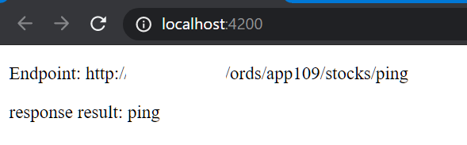

# Unit 12 使用 HTTP 與 Server 互動  

## 簡介

本章介紹使用 Restful Web Service 與後端 Server 互動所需要的基本 API 觀念及操作, 包括:
- JSON 字串解析
- 物件的 JSON 字串化
- Angular HttpClient Service 
- 設定 HttpRequest Header
- 提出 Get 及 Post Request

## JSON 的字串解析(parsing)及物件的字串化

JSON parsing (字串解析): JSON 字串轉成 JSON 物件。

JSON serialization (物件字串化/序列化): JSON 物件轉成字串表示式。

ECMAScript 5 提供 `JSON` 類別處理 JSON.
- `JSON.parsing()`: JSON 字串轉成 JSON 物件
- `JSON.stringify()`: JSON 物件轉成字串表示式

Json parsing 及 serializing 範例: 
[Source Codes | Stackblitz](https://stackblitz.com/edit/json-parsing-serialization?file=index.ts)
```typescript
// Import stylesheets
import "./style.css";

// Write TypeScript code!
const appDiv: HTMLElement = document.getElementById("app");
appDiv.innerHTML = `<h1>TypeScript Starter</h1>`;

let book = {
  title: "professional JavaScript",
  authors: ["Nicholas C. Zakas", "Matt Frisbie"],
  edition: 4,
  year: 2017
};

// Json serialization

let bookJsonStr = JSON.stringify(book);

appDiv.innerHTML = "<p>" + bookJsonStr + "</p>";

// JSON parsing

let bookCopy = JSON.parse(bookJsonStr);
console.log(bookCopy);
// print out the bookCopy object
let result = "";
for (let prop in bookCopy) {
  result += "bookCopy" + "." + prop + " = " + bookCopy[prop] + "<br/>";
}

appDiv.innerHTML += "<p>" + result + "</p>";
```

輸出

```
{"title":"professional JavaScript","authors":["Nicholas C. Zakas","Matt Frisbie"],"edition":4,"year":2017}

bookCopy.title = professional JavaScript
bookCopy.authors = Nicholas C. Zakas,Matt Frisbie
bookCopy.edition = 4
bookCopy.year = 2017
```


## HTTPClient Service

`HTTPClient` Service 
- 負責非同步 HTTP 請求
- 在 `HTTPClientModule` 定義
- 交易結果皆為 RxJS `Observables` 為非同部結果


## Setup for server communication

1. 將 HTTPClientModule 加入專案
2. 注入 HttpClient service 到需要的元件或服務
3. 在需要處, 匯入 rxjs 及 rxjs/operators 模組中的類別

[實作 1](#實作-1-在專案中設定-http-client)


## 設定 Http Request Headers

請求標頭包含有關要獲取的(遠端)資源或客戶端(client)本身的更多信息。

[HTTP Headers 清單](https://developer.mozilla.org/en-US/docs/Web/HTTP/Headers)

### Client 和 Server 間的內容協商(Content negotiation) 相關的 Header:

- Accept: Informs the server about the types of data that can be sent back.
- Accept-Charset: Which character encodings the client understands.
- Accept-Encoding: The encoding algorithm, usually a compression algorithm, that can be used on the resource sent back.

Ref: https://developer.mozilla.org/en-US/docs/Web/HTTP/Headers


### 和資源內容有關的 Headers

- [Content-Type](https://developer.mozilla.org/en-US/docs/Web/HTTP/Headers/Content-Type): 指定資源的媒體型態。
  - 在請求時, client 告訴 Server 要傳送的資料型態
  - 在請求回覆(response)時, Server 告訴 Server 回傳的內容的資料型態
  - 允許的[媒體型態清單](https://www.iana.org/assignments/media-types/media-types.xhtml)
  - 如 `application/json`

Ref: https://developer.mozilla.org/en-US/docs/Web/HTTP/Headers

### HTTPHeaders 類別

`@angular/common/http` 中的 [`HTTPHeaders`](https://angular.io/api/common/http/HttpHeaders) 用來表示 HTTP 通訊協定下的 Headers。


例如, 提出 Http Get Request 時指定可接受的內容:

```typescript
// Method 1
const httpHeaders:HttpHeaders = new HttpHeaders({"accept": "application/json"})
// Method 2
const httpHeaders_1: HttpHeaders = new HttpHeaders().set("accept", "application/json");
```

更多 HttpHeaders 類別的方法參考 https://angular.io/api/common/http/HttpHeaders。


## Make HTTP Get Request and Read Response

### Get Request Options
呼叫 HttpClient.get() 方法執行請求時可以提供 `options` 設定呼叫時的行為。

`options` 的定義如下:
```typescript
options: {
    headers?: HttpHeaders | {[header: string]: string | string[]},
    observe?: 'body' | 'events' | 'response',
    params?: HttpParams|{[param: string]: string | string[]},
    reportProgress?: boolean,
    responseType?: 'arraybuffer'|'blob'|'json'|'text',
    withCredentials?: boolean,
  }
```

`observe` 及 `responseType` 用來控制使用那一個 `httpClient.get` 函數簽名, 稍後詳細討論。

特別注意 `observe` 及 `responseType` 使用上的陷井。這兩個欄位的資料型態是**列舉值**中的一種, 不是 `string`。寫錯時, 會產生多載函數(Overloaded function)配對上的錯誤。

錯誤的寫法:
```typescript
let options = {
      headers: {'accept': "text/plain"},
      observe: 'body' ,
      responseType: 'text'
    };
```
`observe` 及 `responseType` 欄位的資料型態會被推斷成 `string`。

正確的寫法要加上 `as const`, 要求 TypeScript engine 不要將 `body` 或者 `text` 擴大推斷成為 `string`:

```typescript
let options = {
      headers: {'accept': "text/plain"},
      observe: 'body' as const ,
      responseType: 'text' as const
    };
```

進一步的討論參考:
- *OBSERVE AND RESPONSE TYPES* section in https://angular.io/guide/http#requesting-a-typed-response
- [Setting http option as &#x27;responseType: &#x27;text&#x27;&#x27; causes compile failure for a http post request with angular HttpClient | StackOverflow](https://stackoverflow.com/questions/62369090/setting-http-option-as-responsetype-text-causes-compile-failure-for-a-http)

### HttpClient.get() 方法


使用 `httpClient.get()` 提交請求的程式:

```typescript
public pingServer(): Observable<string> {
    
    let options = {
      headers: {'accept': "text/plain"},
      observe: 'body' as const ,
      responseType: 'text' as const
    };

    return this.httpClient.get(this.endpointPing, options);
  }
```

`httpClient.get()`的函數有兩個參數:
- url: string - 接受請求的 url
- options - 選項

回傳值則依照多載函數配對的結果有所不同。依此例來說, 配對到的 `httpClient.get()` 函數簽名為:

```typescript
get(url: string, 
    options: { 
      headers?: HttpHeaders | { [header: string]: string | string[]; }; 
      observe?: "body"; 
      params?: HttpParams | { [param: string]: string | string[]; }; 
      reportProgress?: boolean; 
      responseType: "text"; 
      withCredentials?: boolean; }
  ):Observable<string>
```

使用上特別注意, `options` 的 `observe` 及 `responseType` 會決定 `get()` 的簽名。

`observe` 預設值為 `body`; `responseType` 的預設值為 `json`。

若呼叫 `get()` 時沒有提供 `options`, 配對的簽名為:

```typescript
// Overload #14
// Constructs a GET request 
// that interprets the body as a JSON object and returns the response body as a JSON object.

get(url: string, 
  options?: { 
    headers?: HttpHeaders | { [header: string]: string | string[]; }; 
    observe?: "body"; 
    params?: HttpParams | { [param: string]: string | string[]; }; 
    reportProgress?: boolean; 
    responseType?: "json"; 
    withCredentials?: boolean; }
  ): Observable<Object>
```
將 Response Body 視為 JSON 物件並回傳 `Observable<Object>`

### `HttpClient.get<T>()` 方法


**具型別參數的 get()**

可以傳入要回傳的型別 `T` 做為型別參數, `get<T>()` 會自動將回傳的 `Object` 轉換成指定的型別。配對的函數簽名如下:

```typescript
// Overload #15
// Constructs a GET request 
// that interprets the body as a JSON object and returns the response body in a given type.

get<T>(
  url: string, 
  options?: { 
    headers?: HttpHeaders | { [header: string]: string | string[]; }; 
    observe?: "body";
    params?: HttpParams | { [param: string]: string | string[]; }; 
    reportProgress?: boolean; 
    responseType?: "json"; 
    withCredentials?: boolean; })
  : Observable<T>
```

Ref: [HttpClient#get | Angular](https://angular.io/api/common/http/HttpClient#get)


以下示範 `HttpClient.get<T>()` 的使用。

定義介面 `OracleRestResponse`, 用以表示後端回傳回來的 Response 的內容, 詳細格式參考 [實作2](#實作-2-取得-server-端的股票資料)。

在呼叫 `HttpClient.get<T>()` 時傳此介面作為型態參數, 所以 `get<OracleRestResponse>()` 回傳的資料型態為 `OracleRestResponse`。

底下程式碼 `findAllTyped()` 方法的規格中, 回傳資料型態為 `Stock[]`, 所以必須使用 `map()` 把 `OracleRestResponse` 轉換成 `Stock[]`.

```typescript
 /**
   * @param endpoint 
   */
  public findAllTyped(endpoint: string): Observable<Stock[]> {
    // 介面定義
    interface OracleRestResponse {
      items: StockJsonObj[];   // Server 回覆的 Stock 物件
      first: object;
    }
    // Make request to get all rows
    // 注意, 型態由 OracleRestResponse 轉換成 Stock[]
    return this.httpClient
      .get<OracleRestResponse>(endpoint, {headers: {accept: 'application/json'},
                                               observe: 'body' as const,
                                              responseType: 'json' as const})
      .pipe(map( (body: OracleRestResponse) => {
          // 針對 Array 中的每一個元素做轉換, 回傳的仍是 Array, 只是元素內容不同。
          // 回傳 Stock[]
          return body.items.map( (item:StockJsonObj) => Stock.create(item)); 
      }))
}
```

[實作 2](#實作-2-取得-server-端的股票資料)

## Make HTTP Post Request

使用 `httpClient.post():Observable` 執行 Http Post 操作. 此方法共有多載(overloading) 15 個簽名。

`httpClient.post<T>():Observable<T>` 為使用參數型態的簽名, 回傳值是同一參數型態的 `Observable`, 完整的規格:

```typescript
post<T>( url: string, 
         body: any, 
         options?: {  headers?: HttpHeaders | { [header: string]: string | string[]; }; 
                      observe?: "body"; 
                      params?: HttpParams | { [param: string]: string | string[]; }; 
                      reportProgress?: boolean; 
                      responseType?: "json"; 
                      withCredentials?: boolean; }
        ): Observable<T>
```

注意: `options` 中的 `observe` 及 `responseType` 會決定多載函數的簽名。

[實作 3](#實作-3-將資料-透過-http-post-方式-儲存到後端資料庫)

參考:
- [HttpClient.post() | Angular](https://angular.io/api/common/http/HttpClient#post)

## 實作

### 實作 1 在專案中設定 HTTP Client

建立一個新專案:
```
ng new u12-course-practice
```

#### app.module.ts

開啟 `src\app\app.module.ts`, 匯入 HttpClientModule


#### app.component.ts

開啟 `src\app\app.component.ts`。

`AppComponent` 需實作 `OnInit` 介面的 `ngOnInit(): void` 方法:

```typescript
export class AppComponent implements OnInit {
  ngOnInit(): void {
  }
}
```

在建構子注入 `HttpClient` 物件:
```typescript
constructor(private httpClient: HttpClient) {}
```

在 `AppComponent` 加入兩個成員欄位:
```
endpointPing = "http://hostname/ords/app109/stocks/ping";
responseMessage$: Observable<string>;
```

建立 `pingServer()` 方法:

```typescript
public pingServer(): Observable<string> {
    
    let options = {
      headers: {'accept': "text/plain"},
      observe: 'body' as const ,
      responseType: 'text' as const
    };
    return this.httpClient.get(this.endpointPing, options);
  }
```

在建構子中初始 `responseMessage$` 欄位值:

```typescript
this.responseMessage$ = this.pingServer();
```

#### app.component.html

接著要設定元件的樣版。

開啟 `src\app\app.component.html`。

加入以下的 codes:

```html

<p>Endpoint: {{this.endpointPing}}</p>
<p>response result: {{ this.responseMessage$ | async }}</p>  
```

[`async` pipe](https://angular.io/api/common/AsyncPipe) 自動訂閱 `Observable<string>` 內容並顯示結果。

#### 執行結果




### 實作 2 取得 Server 端的股票資料


向 Rest endpoint: `http://hostname/ords/app109/stocks/find` 提出請求。

回覆的 Response body 格式

```json
{
  "items": Object[],  // 回傳的內容
  "first": object     // 查詢的 url
}

```

```json
{
    "items": [
        {
            "id": 1,
            "name": "Test Stock Company",
            "code": "TSC",
            "price": 85,
            "pre_price": 80
        },
        {
            "id": 2,
            "name": "Alice Stock Company",
            "code": "ASC",
            "price": 50,
            "pre_price": 70
        },
        {
            "id": 3,
            "name": "The Dock Company",
            "code": "TDC",
            "price": 876,
            "pre_price": 765
        }
    ],
    "first": {
        "$ref": "http://hostname/ords/app109/stocks/find"
    }
}
```

使用 Talend API Tester (Chrome plugin) 測試 Restful endpoint.


#### 建立 `Stock` 類別及其欄位及靜態方法 ( `stock.ts` )

建立 Stock entity 做為資料模型:
```
ng g class model/Stock
```

開啟 `src\app\model\stock.ts`。


建立一個 `StockJsonObj` interface, 描述 Rest Response 中的 以 JSON 格式描述的股票物件:

```typescript
export interface StockJsonObj {
    id: number;
    name: string;
    code: string;
    price: number;
    pre_price: number;
}
```
介面中的欄位名稱要和 Rest Response 回覆的欄位名稱相同。


為 `Stock` 建立具參數的建構子(Constructor), 讓 Angular 為其自動建立成員欄位:

```typescript
export class Stock {
    constructor(
        public id: number,
        public name: string,
        public code: string,
        public price: number,
        public previousPrice: number
    ){}
}
```

加入靜態方法, 將符合 `StockJsonObj` 介面的 JSON Object 產生出真正的 `Stock` 物件:

```typescript
/**
     * Create a new Stock object from a Json Object.
     * @param jsonObject 
     */
    static create(jsonObject: Stock): Stock {
        let stock: Stock = new Stock(0, null, null, 0, 0);
        stock.id = jsonObject.id;
        stock.name = jsonObject.name;
        stock.previousPrice = jsonObject.pre_price;
        stock.price = jsonObject.price;
        return stock;
      }
```

觀念補充: [TypeScript: Structurally Typing](#structurally-typing)

完成的 `Stock` 類別:

```js
export interface StockJsonObj {
    id: number;
    name: string;
    code: string;
    price: number;
    pre_price: number;
}

export class Stock {
    constructor(
        public id: number,
        public name: string,
        public code: string,
        public price: number,
        public previousPrice: number
    ){}


    /**
     * Create a new Stock object from a Json Object.
     * @param jsonObject
     */
    static create(jsonObject: StockJsonObj): Stock {
        const stock: Stock = new Stock(0, null, null, 0, 0);
        stock.id = jsonObject.id;
        stock.code = jsonObject.code;
        stock.name = jsonObject.name;
        stock.previousPrice = jsonObject.pre_price;
        stock.price = jsonObject.price;
        return stock;
      }
}

```

#### 建立方法向後端查詢股票資料 (`app.component.ts` )

開啟 `src\app\app.component.ts`。

新增一個方法, 執行 Http Get 向後端伺服器取得所有的股票資料。
此方法使用非同步(asynchronous)操作, 結果傳回 `Observable<Stock[]>` 型態的資料。

```typescript
public findAll(endpoint: string): Observable<Stock[]> {
    // Interface
    interface OracleRestResponse {
      items: object[];
      first: object;
    }
    // Make request to get all rows
    return this.httpClient.get(endpoint, {headers: {accept: 'application/json'},
                                               observe: 'body' as const,
                                              responseType: 'json' as const})
      .pipe(map( (body: OracleRestResponse) => {
          return body.items.map( (item: StockJsonObj)  => Stock.create(item) );
      }));
  }
```

觀念補充: [TypeScript: Interface 為物件結構命名](#interface-為物件結構命名)


之後, 再建立:
- 一個類別成員欄位, 儲存 Rest endpoint
- 一個類別成員欄位, 儲存 REST 查詢回傳的結果
- 一個 Action method, 點擊樣版上的按鈕後要執行的方法

```typescript
@Component({
  selector: 'app-root',
  templateUrl: './app.component.html',
  styleUrls: ['./app.component.css']
})
export class AppComponent implements OnInit {

  endpointPing = 'http://hostname/ords/app109/stocks/ping';
  endpointFindAll = 'http://hostname/ords/app109/stocks/find';
  
  // ...

  // response - stock[]
  responseStocks$: Observable<Stock[]>;

  // ...

  public findAllAction(){
    this.responseStocks$ =  this.findAll(this.endpointFindAll);
  }
```

#### `app.component.html` 在樣版顯示 HTTP GET 回傳的資料


```html
<button (click)="this.findAllAction()">Find all stocks</button>
<table>
  <tr>
    <th>ID</th>
    <th>CODE</th>
    <th>Stock Name</th>
    <th>Price</th>
    <th>Previous Price</th>
  </tr>
  <tr *ngFor="let stock of this.responseStocks$ | async ">
    <td> {{stock.id}} </td>
    <td> {{stock.code}} </td>
    <td> {{stock.name}} </td>
    <td> {{stock.price}} </td>
    <td> {{stock.previousPrice}} </td>
  </tr>
</table>
```

`async` pipe 顯示非同步操作的結果。async pipe (非同步管道) 訂閱 Observable 物件並返回其發出的最新值。
Ref: [AsyncPipe | Angular](https://angular.io/api/common/AsyncPipe)

執行結果


### 實作 3: 將資料, 透過 HTTP Post 方式, 儲存到後端資料庫。

Post endpoint: http://hostname/ords/app109/stocks/create

testing data

```json
{
  "name" : "Test stock1",
  "code" : "TS1",
  "price": 100,
  "previousPrice": 150
}
```

Response Data
```json
{
  "stockId": number
}
```

執行前可使用 Talend API Tester 先測試。

#### 在 `app.component.ts` 加入新的方法

建立方法, 執行 HTTP Post, 將傳入的 Stock 物件儲存到後端資料庫中。

開啟 `src\app\app.component.ts`, 建立以下方法
```typescript
 /**
   * 將 Stock Object 存到遠端的資料庫。
   * 使用 Http Post 方法。
   *
   * @param stock Stock to be posted.
   * @param endpoint Rest endpoint for Http Post.
   * @return ID:number for the stock object in the DB Table.
   */
  public saveRemote(endPoint: string, stock: Stock): Observable< string | number> {
      //#1
      interface PostResponse {
        stockId: number;
      }
      //#2
      return this.httpClient.post<PostResponse>(this.endpointPost, stock,
        {headers: { 'Content-Type': 'application/json'}})
        //#3
        .pipe( map((response: PostResponse) => response.stockId ),
        //#4
          catchError( err => of('Caught: ${err}' )));
    }
}
```
說明:
1. 建立一個 interface `PostResponse`, 說明 Response 的 JSON 內容中有那些欄位。
2. 呼叫 `httpClient.post<T>()` 執行 POST Request。
   - 第一個參數為 rest endpoint
   - 第二個參數為要儲存的 Stock 物件
   - 第三個參數為執行時的選項，設定 Request Header 中的 `Content-Type` 為 `application/json`
3. `post()`方法回傳的結果為 `Observable<PostResponse>`.
   - 使用 `map()` 轉換內容, 取出 Stock 物件在資料庫中被儲存時使用的 ID.
   - Rxjs 的 `map()`說明參考 [map | operators | RxJS](https://rxjs-dev.firebaseapp.com/api/operators/map)
4. `catchError()` operator 可以在非同步處理發生錯誤時, 提供替代的 Observable, 用以顯示錯誤訊息或其它後續處理。Rxjs 的 `catchError()` 說明參考 [RxJs Error Handling: Complete Practical Guide](https://blog.angular-university.io/rxjs-error-handling/).

同樣在 AppComponent 建立一個方法, 使用者按下按鈕後執行該方法。此方法會呼叫 `saveRemote()` 將 Stock 物件存入到後端系統。回傳的非同部結果會更新 `AppComponent` 的 `postResponse$` 特性:

```typescript
public postAction(){
    const stock = new Stock(0, 'Stock01', 'S01', 100 , 150 );
    this.postResponse$ = this.saveRemote(this.endpointPost, stock);
}
```

#### 修改 `app.component.html`

開啟 `src\app\app.component.html`, 加入以下的程式碼:

```html
<!-- #1 -->
<button (click)="this.postAction()">Post a stock</button>
<p>
  <!-- 2 -->
  Response: {{this.postResponse$ | async}}
</p>
```
1. 點擊 `Post a stock` 按鈕會呼叫執行 `postAction()` 。
2. 執行的非同步結果使用 `async pipe` 來顯示。

執行結果如下:


## TypeScript 補充說明

### Structurally Typing

TypeScript 是一種 Structurally Typed 語言, 只要兩個物件的特性(property)相同, 不管物件的名稱, 這兩個都是相同的物件。
TypeScript 只在乎物件的結構, 不關心物件的名稱。

Example:
```typescript
// Codes inspired by codes in P25 in Boris Cherny, Programming TyypeScript, Oreilly, 2019.

// 建立一個 Person Class

class Person {
  constructor(public firstName, public lastName) {}
}

// 建立一個函數, 印出 Person 的姓和名

function whoAreYou(person: Person) {
  console.log("I am", person.firstName, " ", person.lastName);
}

// 建立一個 object, 但沒有名稱

let c = {
  firstName: "John",
  lastName: "Barrowman"
};
// 建立一個 Person object
let person = new Person("Jason", "Bourne");

// 判斷物件的型態
console.log(person instanceof Person); // true
console.log(c instanceof Person); // false

// 印出姓和名
whoAreYou(person); // I am Jason Bourne
whoAreYou(c); // I am John Barrowman
```

[Codes at StackBlitz](https://stackblitz.com/edit/typescript-gxqqhg?file=index.ts)

### Interface 為物件結構命名。

使用 `interface` 為物件的結構命名.
之後, 可以利用 `interface` 做物件結構的檢查。


```typescript
interface Person {
  firstName: string;
  lastName: string;
}

// 建立一個函數, 印出 Person 的姓和名

function whoAreYou(person: Person) {
  console.log("I am", person.firstName, " ", person.lastName);
}

// 建立一個 object, 但沒有名稱

let person = {
  firstName: "John",
  lastName: "Barrowman"
};

let robot = {
  serialID: "asd123",
  flyingFeature: true
};

// 印出姓和名
whoAreYou(person); // I am Jason Bourne

// TypeScript 找出參數型別錯誤
// Argument of type '{ serialID: string; flyingFeature: boolean; }' is not assignable to parameter of type 'Person'.
//   Type '{ serialID: string; flyingFeature: boolean; }' is missing the following properties from type 'Person': firstName, lastName(2345)
whoAreYou(robot);  // I am undefined undefined
```

### Observable 為非同步執行的結果

```typescript
import { Observable, of } from "rxjs";
import { reduce, delay } from "rxjs/operators";

let source$;
function sum(): Observable<number> {
  source$ = of(1, 2, 3, 4).pipe(
    delay(1000),
    reduce((x, y) => x + y)
  );
  // #1
  console.log("Executing sum()");
  return source$;
}

sum();

// #3
source$.subscribe(console.log);
// #2
console.log("Hello");
```

試問, 執行的結果為何呢? 為什麼加總的結果最後才被印出來呢?


