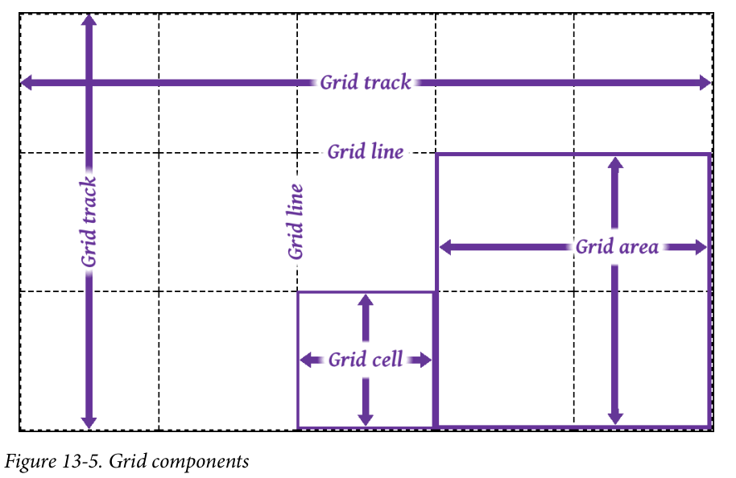
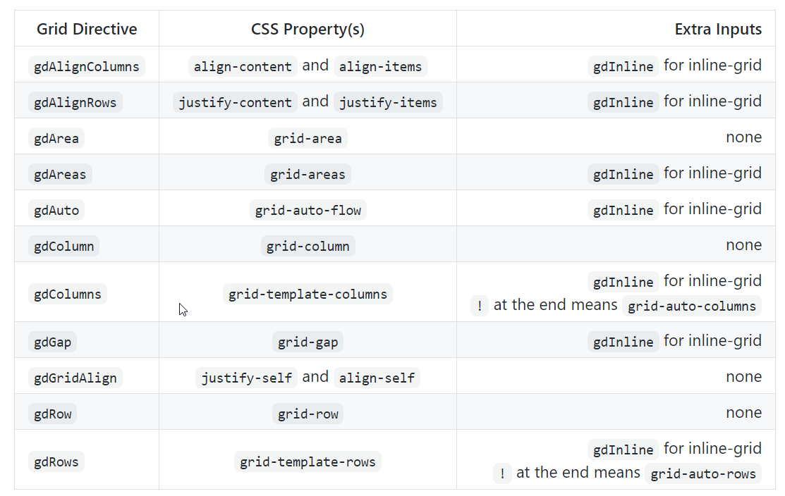
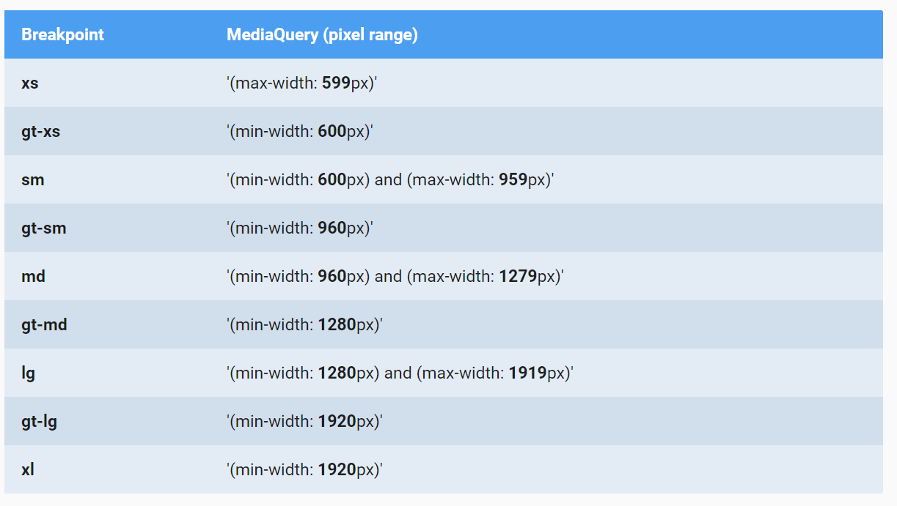
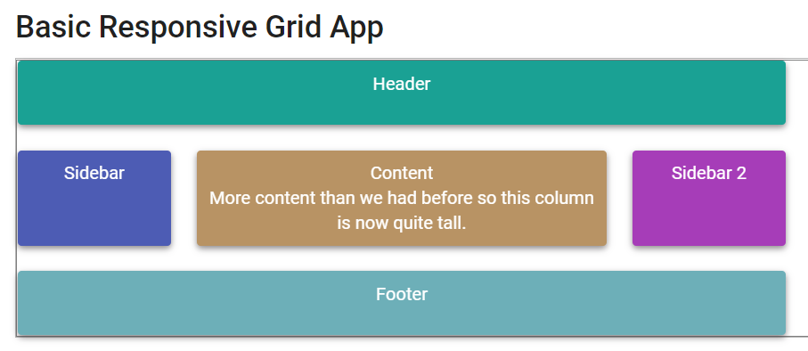
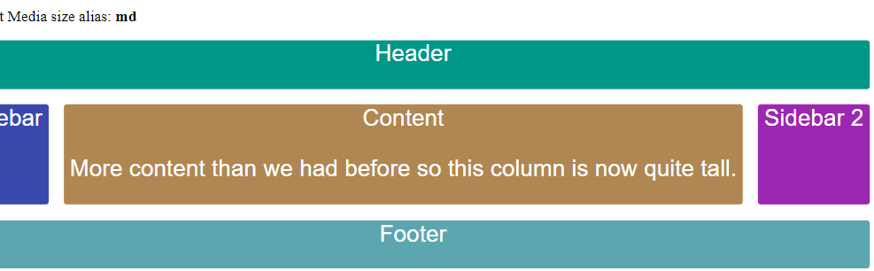
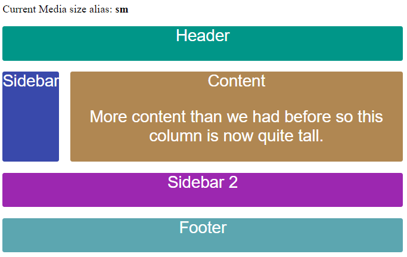
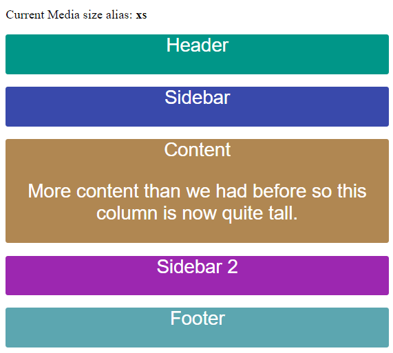

# Unit 13 使用 Angular Flex-Layout 製作 RWD 版面布局


@import "css/images.css"

## 簡介

## Grid Directives in Angular Flex-Layout

### CSS Grid Layout 快速入門
[CSS Grid Layout 入門](https://ballaediworkshop.blogspot.com/2019/10/css-grid-introduction-and-tutorial.html)


### CSS Grid Components

- Track
- Line
- Cell 
- Area



Source: F13-5 in "CSS The Definite Guide, 4th Edition"


### Grid Directive vs Grid Css property
Angular Flex-Layout 的 Grid Directive 與 Grid CSS Property 間的對應關係:


Source: [CSS Grid with Angular Layout | angular/flex-layout](https://github.com/angular/flex-layout/blob/master/guides/Grid.md)


### RWD Breakpoints in Angular Material

RWD Breakpoints and aliases from Angular Material:


The breakpoint aliases and the pixel ranges used by the Angular Material:



App 的頁面 layout 原則可參考: [UI regions | Material Design](https://material.io/design/layout/responsive-layout-grid.html#ui-regions)


### Grid Directive with RWD Breakpoints

Angular Flex-Layout directives can take a breakpoint alias as the syntax: `<directive>.<breakpoint alias>`. 

For example: 

```
gdColumn.gt-sm="20% auto 20%"
```


### 使用程式取得現在的螢幕寛度 `MediaObserver`

Example:

```js
...
import { MediaChange, MediaObserver } from '@angular/flex-layout';
...

export class GridLayoutComponent implements OnInit {
  public mediaAlias$: Observable<{mqAlias: string, mediaQuery: string}>;

  constructor(private mediaObserver: MediaObserver) {
    this.mediaAlias$ = mediaObserver.asObservable()
      .pipe(map((value: MediaChange[]) => {
        return {
          mqAlias: value[0].mqAlias,
          mediaQuery: value[0].mediaQuery
        }
      }));
  }  
...
}
```


Source: [JavaScript API (Imperative) | angular/flex-layout](https://github.com/angular/flex-layout/wiki/API-Documentation#javascript-api-imperative)

## Flex Layout

## 實作 1 使用 Grid Directive 製作 RWD 版面


### 實作目標


Source: [Angular Flex-Layout Demos](https://tburleson-layouts-demos.firebaseapp.com/#/grid)


<div class="imgs">







</div>

### 建立專案並使用 RouteModule

建立新專案

```
ng new u13-practice
```

Generate the routing module
```
ng generate module app-routing --flat --module=app
```

### 安裝 Angular Flex-Layout library 

Installing the Angular Flex-Layout library from npm
```
npm i -s @angular/flex-layout @angular/cdk
```

Import  top-level `FlexLayoutModule` to app module:
```
import { FlexLayoutModule } from '@angular/flex-layout';
```


完成的 `AppModule`:

```js
import { NgModule } from '@angular/core';

import { AppComponent } from './app.component';
import { AppRoutesModule } from './app-routes.module';
import { FlexLayoutModule } from '@angular/flex-layout';

@NgModule({
  declarations: [
    AppComponent,
    GridLayoutComponent
  ],
  imports: [
    BrowserModule,
    AppRoutesModule,
    FlexLayoutModule
  ],
  providers: [],
  bootstrap: [AppComponent]
})
export class AppModule  {}

```

### 建立 GridLayout 元件(第一個元件)

Generate the GridLayout component 並將元件加入 `AppModule`:
```
ng g component layout/grid-layout --module=app
```

開啟 `src\app\app-routes.module.ts`, 加入 `GridLayout` 元件的 routing path:

```js
const appRoutes: Routes = [
  {path: 'grid', component: GridLayoutComponent},
  {path: '', redirectTo: 'grid', pathMatch: 'full'}
];
```


利用 `appRoutes` 的路徑資料在 import 時初始化 `RouteModule`, 之後在匯出此模組給其他模組使用.

完成的 codes:

```js
import { NgModule } from '@angular/core';
import { CommonModule } from '@angular/common';
import {RouterModule, Route, Routes} from '@angular/router'
import { GridLayoutComponent } from './layout/grid-layout/grid-layout.component';

const appRoutes: Routes = [
  {path: 'grid', component: GridLayoutComponent},
  {path: '', redirectTo: 'grid', pathMatch: 'full'}
];

@NgModule({
  declarations: [],
  imports: [
    CommonModule,
    RouterModule.forRoot(appRoutes)
  ],
  exports: [
    RouterModule
  ]
})
export class AppRoutesModule { }
```

### 設定 `GridLayout` 元件需要的 CSS 樣式

```css
.blocks {
    font-family: Roboto,"Helvetica Neue",sans-serif;
    font-size: 1.5rem;
    min-width: 75px;
    min-height: 50px;
    border-radius: 3px;
    color: white;
    text-align: center;
}

.header {background-color: #009688;}

.sidebar {background-color: #3949ab;}

.content {background-color: #b08752;}

.sidebar1 {background-color: #9c27b0;}

.footer {background-color: #5ca6b0;}
```

### 加入 Non-RWD 的 Grid Layout

編輯 `src\app\layout\grid-layout\grid-layout.component.html`,


使用 `gdAreas` 設定各 grid area 所佔用的 track 個數.

`gdColumn` 指定各個 track 的寬度.

`gdGap` 指定各個 grid cell 之間的間隔寬度.

```html
<p>Non-RWD Layout</p>
<div id='gridContainer' gdAreas="header header header | sidebar content sidebar1 | footer footer footer"
    gdColumn="20% auto 20%" gdGap="1rem">

    <div class='blocks header' gdArea='header'>Header</div>
    <div class='blocks sidebar' gdArea='sidebar'>Sidebar (20% of width)</div>
    <div class='blocks content' gdArea='content'> Content (Auto width)
        <p>
            More content than we had before so this column is now quite tall.
        </p>
    </div>
    <div class='blocks sidebar1' gdArea='sidebar1'>Sidebar 2 (20% of width) </div>
    <div class='blocks footer' gdArea='footer'>Footer</div>
</div>
```

### 加入 螢幕寬度 md 以上時的版面佈局

版面欄位切割成為 3 tracks, 第 1, 3 tracks 的寬度為螢幕寬度的 20%, 第 2 個 track 的寬度使用剩下未使用的寬度.

`header` area 佔 3 tracks; sidebar, content, sidebar1 各佔一個 track; `header` area 佔 3 tracks.

```html
<div id='gridContainer' 
  gdAreas.gt-sm="header header header | sidebar content sidebar1 | footer footer footer"
  gdColumn.gt-sm="20% auto 20%" 
  gdGap="1rem">

    <div class='blocks header' gdArea='header'>Header</div>
    <div class='blocks sidebar' gdArea='sidebar'>Sidebar </div>
    <div class='blocks content' gdArea='content'> Content
        <p>
            More content than we had before so this column is now quite tall.
        </p>
    </div>
    <div class='blocks sidebar1' gdArea='sidebar1'>Sidebar 2 </div>
    <div class='blocks footer' gdArea='footer'>Footer</div>
</div>
```


###  加入 螢幕寬度為 sm 時的版面佈局

版面欄位切割成為 2 tracks, 所有 tracks 的寬度為螢幕寬度的 20%.

`header` area 佔 2 tracks; sidebar, content 各佔一個 track; `sidebar1` 及 `footer` area 各佔 2 tracks.

```html
gdAreas.sm="header header | sidebar content | sidebar1 sidebar1 | footer footer"
gdColumn.sm="20%" 
```


###  加入 螢幕寬度為 xs 時的版面佈局

各 area 佔 1 個 track.

```
gdAreas.xs="header  | sidebar | content | sidebar1 | footer"
```


完成的 codes

```html
<div id='gridContainer' 
    gdAreas.gt-sm="header header header | sidebar content sidebar1 | footer footer footer"
    gdColumn.gt-sm="20% auto 20%" 
    gdAreas.sm="header header | sidebar content | sidebar1 sidebar1 | footer footer"
    gdColumn.sm="20%" 
    gdAreas.xs="header  | sidebar | content | sidebar1 | footer" 
    gdGap="1rem">

    <div class='blocks header' gdArea='header'>Header</div>
    <div class='blocks sidebar' gdArea='sidebar'>Sidebar </div>
    <div class='blocks content' gdArea='content'> Content
        <p>
            More content than we had before so this column is now quite tall.
        </p>
    </div>
    <div class='blocks sidebar1' gdArea='sidebar1'>Sidebar 2 </div>
    <div class='blocks footer' gdArea='footer'>Footer</div>
</div>
```


## 參考資料

1. [angular/flex-layout | Github](https://github.com/angular/flex-layout)

2. [CSS Grid with Angular Layout | angular/flex-layout | Github ](https://github.com/angular/flex-layout/blob/master/guides/Grid.md)

3. [Angular Flex-Layout Demos | tburleson-layouts-demos.firbaseapp.com ](https://tburleson-layouts-demos.firebaseapp.com/#/docs)

4. [使用 Angular Flex-Layout 輔助版面布局 | blog.poychang.net](https://blog.poychang.net/use-angular-flex-layout-package/)


5. [Angular Flex-Layout: Flexbox and Grid Layout for Angular Component | medium.com ](https://medium.com/angular-in-depth/angular-flex-layout-flexbox-and-grid-layout-for-angular-component-6e7c24457b63)
