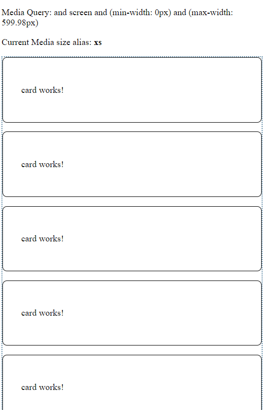

# Unit 13 使用 Angular Flex-Layout 製作 RWD 版面佈局


@import "css/images.css"
@import "css/header_numbering.css"

## 簡介

## Grid Directives in Angular Flex-Layout

### CSS Grid Layout 快速入門
[CSS Grid Layout 入門](https://ballaediworkshop.blogspot.com/2019/10/css-grid-introduction-and-tutorial.html)


### CSS Grid Components

- Track
- Line
- Cell 
- Area


Source: F13-5 in "CSS The Definite Guide, 4th Edition"


### Grid Directive vs Grid Css property
Angular Flex-Layout 的 Grid Directive 與 Grid CSS Property 間的對應關係:


Source: [CSS Grid with Angular Layout | angular/flex-layout](https://github.com/angular/flex-layout/blob/master/guides/Grid.md)


### RWD Breakpoints in Angular Material

RWD Breakpoints and aliases from Angular Material:


The breakpoint aliases and the pixel ranges used by the Angular Material:


App 的頁面 layout 原則可參考: [UI regions | Material Design](https://material.io/design/layout/responsive-layout-grid.html#ui-regions)


### Grid Directive with RWD Breakpoints

Angular Flex-Layout directives can take a breakpoint alias as the syntax: `<directive>.<breakpoint alias>`. 

For example: 

```
gdColumn.gt-sm="20% auto 20%"
```


[實作 1 使用 Grid Directive 製作 RWD 版面](#實作-1-使用-grid-directive-製作-rwd-版面)

### 使用程式取得現在的螢幕寛度 `MediaObserver`

Example:

```js
...
import { MediaChange, MediaObserver } from '@angular/flex-layout';
...

export class GridLayoutComponent implements OnInit {
  public mediaAlias$: Observable<{mqAlias: string, mediaQuery: string}>;

  constructor(private mediaObserver: MediaObserver) {
    this.mediaAlias$ = mediaObserver.asObservable()
      .pipe(map((value: MediaChange[]) => {
        return {
          mqAlias: value[0].mqAlias,
          mediaQuery: value[0].mediaQuery
        }
      }));
  }  
...
}
```


Source: [JavaScript API (Imperative) | angular/flex-layout](https://github.com/angular/flex-layout/wiki/API-Documentation#javascript-api-imperative)


[實作 2: 取得目前的螢幕度](#實作-2-取得目前的螢幕度)

## Flex Layout


Figure source: css-tricks.com

Flexbox 的介紹, 參考 [A Complete Guide to Flexbox | CSS-Tricks](https://css-tricks.com/snippets/css/a-guide-to-flexbox/)


FlexLayout Directives for the Flex Container

* fxLayout: Defines the flow order of child items within a flexbox container.
* fxLayoutGap: Defines if child items within a flexbox container should have a gap
* fxLayoutAlign: Defines how flexbox items are aligned according to both the main-axis and the cross-axis, within a flexbox container

FlexLayout Directives Child Elements within Containers:
- fxFlex 
- fxFlexOrder 
- fxFlexOffset 
- fxFlexAlign 
- fxFlexFill 

更多的 Flex-Layout directives 參考: [HTML API (Declarative) | angular/flex-layout](https://github.com/angular/flex-layout/wiki/API-Documentation#html-api-declarative)

[實作 3: 使用 Flex-Box Layout 製作 RWD 佈局](#實作-3-使用-flex-box-layout-製作-rwd-佈局)


## 實作 1 使用 Grid Directive 製作 RWD 版面


### 實作目標


Source: [Angular Flex-Layout Demos](https://tburleson-layouts-demos.firebaseapp.com/#/grid)


<div class="imgs">


</div>

### 建立專案並使用 RouteModule

建立新專案

```
ng new u13-practice
```

Generate the routing module
```
ng generate module app-routing --flat --module=app
```

### 安裝 Angular Flex-Layout library 

Installing the Angular Flex-Layout library from npm
```
npm i -s @angular/flex-layout @angular/cdk
```

Import  top-level `FlexLayoutModule` to app module:
```
import { FlexLayoutModule } from '@angular/flex-layout';
```


完成的 `AppModule`:

```js
import { NgModule } from '@angular/core';

import { AppComponent } from './app.component';
import { AppRoutesModule } from './app-routes.module';
import { FlexLayoutModule } from '@angular/flex-layout';

@NgModule({
  declarations: [
    AppComponent,
    GridLayoutComponent
  ],
  imports: [
    BrowserModule,
    AppRoutesModule,
    FlexLayoutModule
  ],
  providers: [],
  bootstrap: [AppComponent]
})
export class AppModule  {}

```

### 建立 GridLayout 元件(第一個元件)

Generate the GridLayout component 並將元件加入 `AppModule`:
```
ng g component layout/grid-layout --module=app
```

開啟 `src\app\app-routes.module.ts`, 加入 `GridLayout` 元件的 routing path:

```js
const appRoutes: Routes = [
  {path: 'grid', component: GridLayoutComponent},
  {path: '', redirectTo: 'grid', pathMatch: 'full'}
];
```


利用 `appRoutes` 的路徑資料在 import 時初始化 `RouteModule`, 之後在匯出此模組給其他模組使用.

完成的 codes:

```js
import { NgModule } from '@angular/core';
import { CommonModule } from '@angular/common';
import {RouterModule, Route, Routes} from '@angular/router'
import { GridLayoutComponent } from './layout/grid-layout/grid-layout.component';

const appRoutes: Routes = [
  {path: 'grid', component: GridLayoutComponent},
  {path: '', redirectTo: 'grid', pathMatch: 'full'}
];

@NgModule({
  declarations: [],
  imports: [
    CommonModule,
    RouterModule.forRoot(appRoutes)
  ],
  exports: [
    RouterModule
  ]
})
export class AppRoutesModule { }
```

### 設定 `GridLayout` 元件需要的 CSS 樣式

```css
.blocks {
    font-family: Roboto,"Helvetica Neue",sans-serif;
    font-size: 1.5rem;
    min-width: 75px;
    min-height: 50px;
    border-radius: 3px;
    color: white;
    text-align: center;
}

.header {background-color: #009688;}

.sidebar {background-color: #3949ab;}

.content {background-color: #b08752;}

.sidebar1 {background-color: #9c27b0;}

.footer {background-color: #5ca6b0;}
```

### 加入 Non-RWD 的 Grid Layout

編輯 `src\app\layout\grid-layout\grid-layout.component.html`,


使用 `gdAreas` 設定各 grid area 所佔用的 track 個數.

`gdColumn` 指定各個 track 的寬度.

`gdGap` 指定各個 grid cell 之間的間隔寬度.

```html
<p>Non-RWD Layout</p>
<div id='gridContainer' gdAreas="header header header | sidebar content sidebar1 | footer footer footer"
    gdColumn="20% auto 20%" gdGap="1rem">

    <div class='blocks header' gdArea='header'>Header</div>
    <div class='blocks sidebar' gdArea='sidebar'>Sidebar (20% of width)</div>
    <div class='blocks content' gdArea='content'> Content (Auto width)
        <p>
            More content than we had before so this column is now quite tall.
        </p>
    </div>
    <div class='blocks sidebar1' gdArea='sidebar1'>Sidebar 2 (20% of width) </div>
    <div class='blocks footer' gdArea='footer'>Footer</div>
</div>
```

### 加入 螢幕寬度 md 以上時的版面佈局

版面欄位切割成為 3 tracks, 第 1, 3 tracks 的寬度為螢幕寬度的 20%, 第 2 個 track 的寬度使用剩下未使用的寬度.

`header` area 佔 3 tracks; sidebar, content, sidebar1 各佔一個 track; `header` area 佔 3 tracks.

```html
<div id='gridContainer' 
  gdAreas.gt-sm="header header header | sidebar content sidebar1 | footer footer footer"
  gdColumn.gt-sm="20% auto 20%" 
  gdGap="1rem">

    <div class='blocks header' gdArea='header'>Header</div>
    <div class='blocks sidebar' gdArea='sidebar'>Sidebar </div>
    <div class='blocks content' gdArea='content'> Content
        <p>
            More content than we had before so this column is now quite tall.
        </p>
    </div>
    <div class='blocks sidebar1' gdArea='sidebar1'>Sidebar 2 </div>
    <div class='blocks footer' gdArea='footer'>Footer</div>
</div>
```


###  加入 螢幕寬度為 sm 時的版面佈局

版面欄位切割成為 2 tracks, 所有 tracks 的寬度為螢幕寬度的 20%.

`header` area 佔 2 tracks; sidebar, content 各佔一個 track; `sidebar1` 及 `footer` area 各佔 2 tracks.

```html
gdAreas.sm="header header | sidebar content | sidebar1 sidebar1 | footer footer"
gdColumn.sm="20%" 
```


###  加入 螢幕寬度為 xs 時的版面佈局

各 area 佔 1 個 track.

```
gdAreas.xs="header  | sidebar | content | sidebar1 | footer"
```


完成的 codes

```html
<div id='gridContainer' 
    gdAreas.gt-sm="header header header | sidebar content sidebar1 | footer footer footer"
    gdColumn.gt-sm="20% auto 20%" 
    gdAreas.sm="header header | sidebar content | sidebar1 sidebar1 | footer footer"
    gdColumn.sm="20%" 
    gdAreas.xs="header  | sidebar | content | sidebar1 | footer" 
    gdGap="1rem">

    <div class='blocks header' gdArea='header'>Header</div>
    <div class='blocks sidebar' gdArea='sidebar'>Sidebar </div>
    <div class='blocks content' gdArea='content'> Content
        <p>
            More content than we had before so this column is now quite tall.
        </p>
    </div>
    <div class='blocks sidebar1' gdArea='sidebar1'>Sidebar 2 </div>
    <div class='blocks footer' gdArea='footer'>Footer</div>
</div>
```

## 實作 2: 取得目前的螢幕度

### 在元件中使用 `MediaObserver` 

建立新元件 `view-port`

```
ng g c layout/view-port
```

匯入 `MediaObserver` 到元件中, 並從建構子參數中注入此服務:

```js
import { Component, OnInit } from '@angular/core';
import {MediaObserver} from '@angular/flex-layout'

/**
 * 顯示目前的裝置的寬度
 */
@Component({
  selector: 'app-view-port',
  templateUrl: './view-port.component.html',
  styleUrls: ['./view-port.component.css']
})
export class ViewPortComponent implements OnInit {

  constructor(private mediaObserver: MediaObserver) { }

  ngOnInit(): void {
  }

}

```

### 使用 `MediaObserver` 取得目前的螢幕寬度

新增類別欄位 `mediaAlias$`

```js
...
export class ViewPortComponent implements OnInit {

  public mediaAlias$: Observable<{ mqAlias: string, mediaQuery: string }>;

  constructor(private mediaObserver: MediaObserver) { }
  ...
```

`Observable` 內的資料型態為:
```js 
{ mqAlias: string, 
  mediaQuery: string }
```

在 `ngOnInit()` 中, 取得螢幕寬度的別名(alias)及 media query 的結果:

```js

ngOnInit(): void {
    this.mediaAlias$ = this.mediaObserver.asObservable()
    .pipe(map((value: MediaChange[]) => {
      return {
        mqAlias: value[0].mqAlias,
        mediaQuery: value[0].mediaQuery
      }
    }));
  }
```

從 `MediaObserver` 取得的 `Observable` 內的資料型態為 `MediaChange[]`, 其第 0 個元素是目前螢幕寬度的資訊. 因此, 
我們必須將 `MediaChange[0]` 轉成 :
```js 
{ mqAlias: string, 
  mediaQuery: string }
```

[MediaChange](https://github.com/angular/flex-layout/wiki/MediaObserver#mediachange-class) is an object that contains details about a `mediaQuery` event. It has the following properties:

- `matches` - whether the mediaQuery is currently activated, defaults to false
- `mediaQuery` - e.g. (min-width: 600px) and (max-width: 959px), defaults to 'all'
- `mqAlias` - e.g. gt-sm, md, gt-lg, defaults to ''
- `suffix` - e.g. GtSM, Md, GtLg, defaults to ''
  
Source: [angular/flex-layout](https://github.com/angular/flex-layout/wiki/MediaObserver#mediachange-class)

### 在樣版中顯示目前螢幕寛度

開啟 `src\app\layout\view-port\view-port.component.html`, 輸入以下程式碼:

```html
<div>
<p> Media Query: and {{(this.mediaAlias$ | async )?.mediaQuery }} </p>
<p> Current Media size alias: <b> {{(this.mediaAlias$ | async)?.mqAlias }}  </b></p>
</div>
```

### 在 `GridLayout` 樣板中使用 `ViewPort` 元件顯示螢幕寬度資訊

開啟 `src\app\layout\grid-layout\grid-layout.component.html`, 加入以下的 codes:


執行結果


## 實作 3: 使用 Flex-Box Layout 製作 RWD 佈局

### 實作目標

<div class="imgs">

  

  

</div>


<div class="imgs">
  
  
  
  

</div>

### 建立 `Card` 元件以卡片的方式顯示資訊

```
ng g component layout/card --module=app
```

設定元件的 CSS:

```css
:host {
    display: block;
    padding: 32px;
    border: 1px solid black;
    border-radius: 8px;
}
```

補充說明: `:host` 及 `:host-context` 虛擬類別選擇器
- [[Angular] Angular Component Host Style](https://blog.kevinyang.net/2018/10/14/angular-host-style/)
- [:host | Angular](https://angular.io/guide/component-styles#host)

### 建立 `CardList` 元件顯示多張卡片

```
ng g component layout/card-list --module=app
```

專案中現在有 4 個元件: 


設定元件的 routing path. 開啟 `src\app\app-routes.module.ts`, 增加 `flex` path 給 `CardList` 元件:

```js
const appRoutes: Routes = [
  {path: 'grid', component: GridLayoutComponent},
  // Added path
  {path: 'flex', component: CardListComponent },
  {path: '', redirectTo: 'grid', pathMatch: 'full'}
];
```

設定 `CarList` 元件的樣板. 開啟`src\app\layout\card-list\card-list.component.html`, 增加一個 `div` 標籤作為 `flex` 容器:

```html
<div id="card-list" 
    class="wrapper" 
    fxLayout="row wrap" fxLayout.lt-sm="column"
    fxLayoutGap="1rem"  fxLayoutAlign="flex-start">
</div>
```

接著加入底下的 code 到上述的 `div` 中:

```html
<ng-container *ngFor="let _ of [1,2,3,4,5,6]">
  <app-card fxFlex="0 1 calc(33.3% - 1rem)" 
      fxFlex.lt-md="0 1 calc(50% - 1rem)" 
      fxFlex.lt-sm="calc(100% - 1rem)"></app-card>
</ng-container>
```

[`ng-container`](https://angular.io/guide/structural-directives#group-sibling-elements-with-ng-container) 可將兄弟元素(sibling element)集合在一起, 而不需使用包覆元素. 與直接使用 `div` 作為包覆元素最大的不同, `ng-container` 標記並不會加入到 DOM 之中. 進一步的說明參考 [Group sibling elements with `<ng-container>` | Angular](https://angular.io/guide/structural-directives#ng-container-to-the-rescue).

使用 `fxFlex` 指令設定 `app-card` 在不同螢幕寬度下的元素寬度:
- 超過(含) md ( W >= 960px): 每個元素佔 1/3 的螢幕寬度
- 小於 md (  W < 959px ): 每個元素佔 1/2 的螢幕寬度
- 小於 sm ( W < 600px): 每個元素佔全部的螢幕寬度

完成的程式碼:

```html
<app-view-port>
</app-view-port>

<div id="card-list" class="wrapper" fxLayout="row wrap" fxLayout.lt-sm="column"
                    fxLayoutGap="1rem"
                    fxLayoutAlign="flex-start">

    <ng-container *ngFor="let _ of [1,2,3,4,5,6]">
        <app-card fxFlex="0 1 calc(33.3% - 1rem)" 
        fxFlex.lt-md="0 1 calc(50% - 1rem)" 
        fxFlex.lt-sm="calc(100% - 1rem)"></app-card>
    </ng-container>
</div>
```


## 補充: CSS tricks

不選擇最後 n 個元素

```css
#card-list > *:not(:nth-last-child(-n+3)) {
    margin-bottom: 0.5rem;
}
```
Ref: 
- [Useful :nth-child Recipes | CSS-Tricks](https://css-tricks.com/useful-nth-child-recipies/)

- [Select the last 3 child elements](https://stackoverflow.com/questions/14268156/select-the-last-3-child-elements)


## 參考資料

1. [angular/flex-layout | Github](https://github.com/angular/flex-layout)

2. [CSS Grid with Angular Layout | angular/flex-layout | Github ](https://github.com/angular/flex-layout/blob/master/guides/Grid.md)

3. [Angular Flex-Layout Demos | tburleson-layouts-demos.firbaseapp.com ](https://tburleson-layouts-demos.firebaseapp.com/#/docs)

4. [使用 Angular Flex-Layout 輔助版面布局 | blog.poychang.net](https://blog.poychang.net/use-angular-flex-layout-package/)


5. [Angular Flex-Layout: Flexbox and Grid Layout for Angular Component | medium.com ](https://medium.com/angular-in-depth/angular-flex-layout-flexbox-and-grid-layout-for-angular-component-6e7c24457b63)
