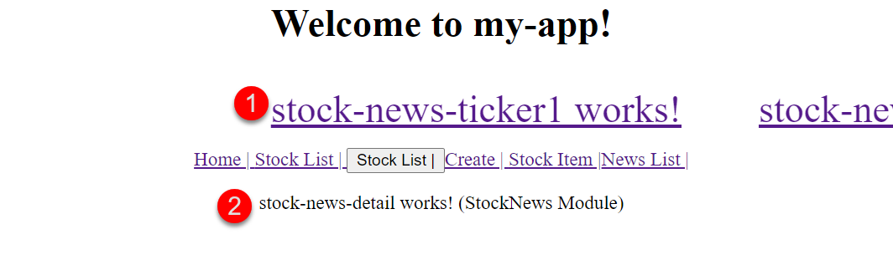
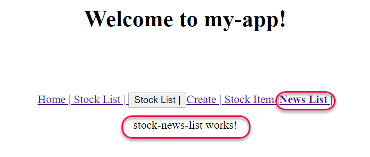
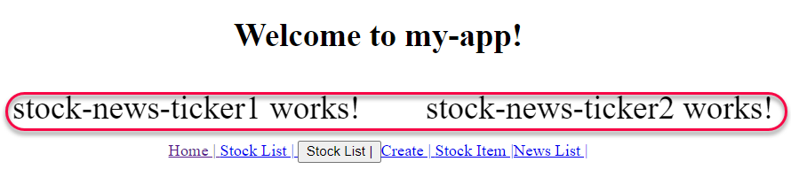
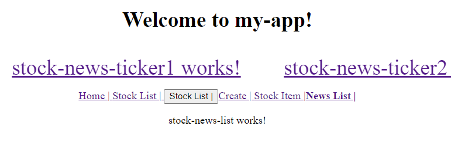

# Unit 14 特性模組 (Feature Modules)


@import "css/images.css"
@import "css/header_numbering.css"
@import "css/step_numbering.css"


## 和特性模組相關的 NgModule Metadata 的特性

`NgModule` 是一個使用 `@NgModule()` 裝飾的類別. `@NgModule()` 修飾子是一個能夠接受一個 metadata 物件的函數, 用以描述此模組。

與 Feature Module 特別相關的特性包括:

- `declarations` (宣告類別清單) : 宣告屬於此模組的 components, directives, and pipes 等類別(class).

- `exports` (匯出類別清單): 是 `declarations` 的子集合, 指定宣告清單中的那些元件是公開的, 可在其他模組的元件樣板(component template)中使用.

- `imports` (匯入模組清單) : 要匯入的其他多個模組, 其模組中的類別會在此模組中的元件樣板中使用. 換句話說, `imports` 列出的是此模組的相依模組清單(list of dependent modules). 匯入模組後, 在模組中就可以看到其他模組的公開類別(exported class). 

- `providers` (服務器清單): 列出在此模組中要建立的服務器實體(Service instance), 當在此某組的元件中要注入服務器時, Angular 會使用此服務器清單中的服務器實體。

```typescript
import { NgModule } from '@angular/core';
import { BrowserModule } from '@angular/platform-browser';
@NgModule({
  imports:      [ BrowserModule ],   // import the dependent modules
  providers:    [ Logger ],         // Services that can be injected in this module
  declarations: [ AppComponent ],   // Components that belong to this module
  exports:      [ AppComponent ],   // Public components that can be used in the component templates in the other modules.
})
export class YourFeatureModule { }
```
 

Ref: [NgModule Metadata @ Angular](https://angular.io/guide/architecture-modules#ngmodule-metadata)

## 模組與元件(Component)的關係

在 App 架構中, 模組作為元件的其元件提供了編譯環境(compilation context)。TypeScript 在編譯模組內的元件樣版時, 會在模組內尋找元件樣版使用的 directives。若在模組內沒有提供, 則產生編譯錯誤。Ref: [What is a Compilation Context in Angular?  @ Getting Title at 41:27](https://stackoverflow.com/a/50940824/7820390)

舉例來說, 在 Feature Module 的元件樣版中使用 `routerLink` directive 時, Feature Module 必須 import 自己的 `RouterModule`, 而不是使用 `app.module` 的 `routerModule`.

模組中的元件被載入的方式有兩種。第一種是直接使用元件的樣版, 如此, 該模組便會在程式啟動時一併載入。第二種方式是透過路徑導向器(router), 在導向時, 動態載入模組並顯示元件。Ref: [NgModules and components @ Angular](https://angular.io/guide/architecture-modules#ngmodules-and-components)
 
元件和其樣版組成一個 UI 中的一個可視區域, 或稱視域(view)。對於元件本身產生的 view, 將其稱之為 host view. 

一個元件的視域可以包含視域階層(View Hierarchy)結構用以表示整個 UI 頁面, 在視域階層中的元件可以來自於不同的模組。當我們要設計或修改 UI 頁面的可視區域時, 元件就成為可視區域組成的基本的單位。

以下圖為例，`CompA` 及 `A1`、`A2`、`A3` 是同屬一個模組; `B1`、`B2`、`B3` 是同屬另一個模組。 

`CompA` 元件的 View 中嵌入(embed) 了 `A1`、`A2` 及 `B3` 元件的 view; 而元件 `A1` 的 View 中又再嵌入了元件 `B1`, `B2`, 及 `A3` 的 View. 這樣的過程便產生了一個視域階層(View Hierarchy)結構。Ref: [NgModules and components @ Angular](https://angular.io/guide/architecture-modules#ngmodules-and-components)
 


## 特性模組的用途與分類

特性模組可用來組織 Angular 專案中的程式碼.

將邏輯上功能相關的元件放在特性模組, Angular 專案可被切割成數個小模組, 以利不同團隊維護。


特性模組的類別:
- [領域(Domain)模組](https://angular.io/guide/module-types#domain-ngmodules): 依照商業領域、系統特性或者使用者經驗組織程式碼所建立的模組。
- 路徑導向模組(Routed Module): 為了要增加 App 載入的速度, 把 component 獨立成一個模組, 待導向到此元件時, 才載入此模組. 這種模組稱為 Lazy loading module. 若想要進一步瞭解使用 feature module 切割專案, 參考 [Route-level code splitting in Angular](https://web.dev/route-level-code-splitting-in-angular/)。
- 路徑設置模模(Routing Module): 用來設定元向導向路徑的模組, 以為另一個模組提供路徑配置。通常會在此模組中初始化 `RouterModule`, 再將 `RouterModule` export, 讓其它模組可以使用路由器(Router)。
- 服務模組(Service Module)：專門提供[服務](https://angular.io/guide/architecture-services#introduction-to-services-and-dependency-injection)工具類別(service class)的模組。
- 小工具(widget)模組: 用來包裝單位 component, directive, 或 pipe 的模組, 可其它模組使用。許多第三方的 UI 元件庫都將單個元件包裝成一個 widget module. 
- 分享(shared)模組: 放置可以與其他模組共用的一組 component, directive, 或 pipe 的模組. 

更進一步的資訊, 參考:
- [特性模組 @ Angular](https://angular.tw/guide/feature-modules)
- [Summary of NgModule categories @ Angular](https://angular.io/guide/module-types)

### 建立特性模組的程序

使用以下 CLI 指令建立特性模組:

```
$ ng g module StockNews
CREATE src/app/stock-news/stock-news.module.ts (195 bytes)
```

Angular CLI 會為模組產生一個目錄。

如果要一併產生 routing module:
```
ng g module StockNews --routing 
```


特性模組建立後, 將其匯入到主模組(root module)中。在 `AppModule` 的 `import` meta-data property 中加入特性模組:

```js
@NgModule({
  declarations: [...],
  imports: [
    ...,
    // Add the feature module
    StockNewsModule
  ],
  providers: [...],
  bootstrap: [AppComponent]
})
export class AppModule { }
```

接續可以產生新元件到特性模組中。

在 `StockNews` 特性模組中建立 `StockNewsTicker` 元件, 使用以下的 CLI 指令:

```
$ ng g component stock-news/StockNewsTicker 
CREATE src/app/stock-news/stock-news-ticker/stock-news-ticker.component.html (32 bytes)
CREATE src/app/stock-news/stock-news-ticker/stock-news-ticker.component.spec.ts (693 bytes)
CREATE src/app/stock-news/stock-news-ticker/stock-news-ticker.component.ts (317 bytes)
CREATE src/app/stock-news/stock-news-ticker/stock-news-ticker.component.css (0 bytes)
UPDATE src/app/stock-news/stock-news.module.ts (311 bytes)
```

上述指令在特性模組所在的目錄建立元件, Angular CLI 會自動將元件加入到該特性模組中。


完成後, 我們在特性模組中匯出 `StockNewsTicker` 元件, 如此其它的模組便可使用`StockNewsTicker` 元件樣版。

```js
...
import { StockNewsTickerComponent } from './stock-news-ticker/stock-news-ticker.component';

@NgModule({
  declarations: [StockNewsTickerComponent, ...],
  imports: [   ...  ],
  // Export the components for other modules to use.
  exports: [
    // 匯出元件成為公開元件, 供其它模組使用
    StockNewsTickerComponent,
    ...
  ]
})
export class StockNewsModule { }

```

## 特性模組的路徑導向器

特性模組允許有自己的路徑導向器(router), 用以設定模組內各元件的導向路徑。藉由此特性, 特定模組就可獨立於其它模組。

在特性模組中, 我們在 import `RouterModule` 時使用 `.forChild()` 初始化匯入的 `RouterModule`. 匯入的 `RouterModule` 會包含所有的導向指令及路徑, 但不包含 `Router` Service. 

一個 Angular App 只能啟用一個 `Router` service, 當我們使用 `RouterModule.forRoot()` 時才會注入 `Router` service 到應用程式中。

匯入 `RouterModule` 後, 我們也必須將特性模組中的 `RouterModule`  匯出, 讓 `Router` Service 知道特性模組中定義的元件導向路徑。

```typescript
import ...
import ...

const routes: Routes = [
    {path: 'news/detail', component: ...},
    {path: 'news/list', component: ...}
];

@NgModule({
  //匯入並初始化
  imports: [RouterModule.forChild(routes)],
  // 匯出路徑
  exports: [RouterModule]
})
export class StockNewsRoutingModule { }
```

### 在特性模組內使用路徑

當匯出特性模組中使用的 `RouterModule` 之後, 就可以在特性模組內或其它模組使用這些定義於 `RouterModule` 內路徑。

在特性模組內的元件樣版使用路徑的例子。

假設我們想要能夠點選「股市快訊」中的訊息標題, 之後將訊息的內容顯示在選單下方的主要區域的 router outlet 中。我們可以為訊息標題加入 `routerLink` 指示:

```html
<div class="ticker-wrap">
    <div class="ticker">
        <div class="ticker__item">
            <a [routerLink]="['news/detail']">stock-news-ticker1 works! </a>

            <!-- stock-news-ticker1 works!  -->
        </div>
        <div class="ticker__item">
            <a [routerLink]="['news/detail']">stock-news-ticker2 works! </a>
            <!-- stock-news-ticker2 works! -->
        </div>
    </div>
</div>
```

如此, 在點擊訊息標題後, 在 router outlet 的區域就會顯示訊息詳細內容, 該內容由其它元件樣版負責顯示。



### 在其它模組使用特性模組內定義的路徑

在其它模組也可以直接使用特性模組中匯出的 `RouterModule` 內路徑。

例如, 在 `App` 元件中的 Menu bar 上提供 News List 的選單項目, 點擊後顯示所有的新聞快訊的標題, 此顯示的區域的內容由特性模組內的元件負責。`App` 元件不屬於 `StockNewModule` 中。


```html
<div style="text-align:center">
  <h1>
    Welcome to {{ title }}!
  </h1>
<app-stock-news-ticker></app-stock-news-ticker>
<!-- Navigation Bar -->
<nav>
  ...
  <!-- 路徑 news/list 定義於 StockNews 特性模組中 -->
  <a routerLink="/news/list" routerLinkActive="active-link">News List |</a>
</nav>
<!-- 路由出口 -->
<router-outlet></router-outlet>
</div>
```

在下圖中, News List 的選單項目的顯示區域是由 `StockNew` 特性模組中的 `StockNewsList` 元件負責顯示:



## 實作 1: 建立特性模組及其元件

### 實作目標

要在 Menu bar 的上方加入一個股市新聞快訊(News Ticker)區域:



我們將建立 `StockNewsTicker` 元件來顯示新聞快訊區域, 此元件將被放到一個特性模組 `StockNews` 中。

### 建立特性模組 `StockNews` 及 `StockNewsTicker` 元件

<span class="step"></span> 建立特性模組及其路徑導向器

```
ng g module StockNews --routing 
```

<span class="step"></span> 在 `stock-news` 模組中產生元件 `StockNewsTicker`:

```
$ ng g component stock-news/StockNewsDetail
CREATE src/app/stock-news/stock-news-detail/stock-news-detail.component.html (32 bytes)
CREATE src/app/stock-news/stock-news-detail/stock-news-detail.component.spec.ts (693 bytes)
CREATE src/app/stock-news/stock-news-detail/stock-news-detail.component.ts (317 bytes)
CREATE src/app/stock-news/stock-news-detail/stock-news-detail.component.css (0 bytes)
UPDATE src/app/stock-news/stock-news.module.ts (529 bytes)
```

此元件會自動被註冊到 `StockNews` 模組中。

接著, 把此件設為公開元件, 以便在其它模組中使用。完成後的 `StockNews` 模組:

```js
import { NgModule } from '@angular/core';
import { CommonModule } from '@angular/common';
import { StockNewsTickerComponent } from './stock-news-ticker/stock-news-ticker.component';
import {StockNewsRoutingModule} from  './stock-news-routing.module';

@NgModule({
  declarations: [StockNewsTickerComponent],
  imports: [
    CommonModule,
    StockNewsRoutingModule
  ],
  // Export the components for other modules to use.
  exports: [
    StockNewsTickerComponent
  ]
})
export class StockNewsModule { }
```


### 設定元件 `StockNewsTicker` 的 樣版及 CSS 

<span class="step"></span> 開啟 `src\app\stock-news\stock-news-ticker\stock-news-ticker.component.html`, 加入以下的 HTML codes:

```html
<div class="ticker-wrap">
    <div class="ticker">
        <div class="ticker__item">
            stock-news-ticker1 works! 
        </div>
        <div class="ticker__item">
            stock-news-ticker2 works!
        </div>
    </div>
</div>
```

<span class="step"></span> 開啟 `src\app\stock-news\stock-news-ticker\stock-news-ticker.component.css`, 加入以下的 CSS codes:

```css
/* Part of the original codes are from https://codepen.io/lewismcarey/pen/GJZVoG */
/* Convert the SCSS to CSS by using the converter https://www.cssportal.com/scss-to-css/ */
  
  @keyframes ticker {
    0% {
      transform: translate3d(0, 0, 0);
      visibility: visible;
    }
    100% {
      transform: translate3d(-100%, 0, 0);
    }
  }
  .ticker-wrap {
    width: 100%;
    overflow: hidden;
    height: 4rem;
    /* background-color: rgba(0, 0, 0, 0.9); */
    padding-left: 100%;
    box-sizing: content-box;
  }
  .ticker-wrap .ticker {
    display: inline-block;
    height: 4rem;
    line-height: 4rem;
    white-space: nowrap;
    padding-right: 100%;
    box-sizing: content-box;
    animation-iteration-count: infinite;
    animation-timing-function: linear;
    animation-name: ticker;
    animation-duration: 30s;
  }
  .ticker-wrap .ticker__item {
    display: inline-block;
    padding: 0 2rem;
    font-size: 2rem;
    /* color: white; */
  }
```

### 在 `App` 元件的樣版中使用 `StockNewsTicker` 元件樣版

```html
<!--The content below is only a placeholder and can be replaced.-->
<div style="text-align:center">
  <h1>
    Welcome to {{ title }}!
  </h1>

<!-- StockNewsTicker 元件樣版 -->
<app-stock-news-ticker></app-stock-news-ticker>

<!-- Navigation Bar -->
<nav>
  <a routerLink="/" routerLinkActive="active">Home | </a>
  ...
</nav>
<!-- 路由出口 -->
<router-outlet></router-outlet>
</div>
```


## 實作 2: 使用特性模組內的路徑以使用該模組內的元件

### 實作目標

操作案例 1: 點選「股市快訊」中的標訊息, 會在主要顯示區域顯示訊息內容.

操作案例 2: Menu Bar 提供 News List 項目, 點選後會顯示所有股市快訊標題.

### 新增元件到 `StockNews` 模組中

<span class="step"></span> 執行以下 Angular CLI 指令, 新增 `StockNewsDetail` 元件到 `StockNews` 模組中:

```
ng g c stock-news/StockNewsDetail
```

<span class="step"></span> 執行以下 Angular CLI 指令, 新增 `StockNewsList` 元件到 `StockNews` 模組中:

```
ng g c stock-news/StockNewsList
```


<span class="step"></span> 設定元件的導向路徑。

開啟 `src\app\stock-news\stock-news-routing.module.ts`, 設定在 `StockNews` 特性模組中的導向路徑:

```js
import { StockNewsDetailComponent } from './stock-news-detail/stock-news-detail.component';
import { StockNewsListComponent } from './stock-news-list/stock-news-list.component';

const routes: Routes = [
    {path: 'news/detail', component: StockNewsDetailComponent},
    {path: 'news/list', component: StockNewsListComponent}
];

@NgModule({
  imports: [RouterModule.forChild(routes)],
  exports: [RouterModule]
})
export class StockNewsRoutingModule { }
```

### 設定快訊標題連結的導向路徑

<span class="step"></span> 開啟 `StockNewTicker` 元件的樣版, 為快訊標題加上 `<a>` 標籤, 並設定點擊後的導向路徑:

```html
<div class="ticker-wrap">
    <div class="ticker">
        <div class="ticker__item">
            <a [routerLink]="['news/detail']">stock-news-ticker1 works! </a>
        </div>
        <div class="ticker__item">
            <a [routerLink]="['news/detail']">stock-news-ticker2 works! </a>
        </div>
    </div>
</div>
```

### 加入 `News List` 項目到 Menu Bar

<span class="step"></span> 開啟 `App` 元件的樣版, 加入新的 Menu item:

```html
<div style="text-align:center">
  <h1>
    Welcome to {{ title }}!
  </h1>

<!-- 股市快訊視域 -->
<app-stock-news-ticker></app-stock-news-ticker>

<!-- Navigation Bar -->
<nav>
  ...
  <!-- 新增的項目 -->
  <a routerLink="/news/list" routerLinkActive="active-link">News List |</a>
</nav>
<!-- 路由出口 -->
<router-outlet></router-outlet>
</div>
```

完成後的執行畫面:



