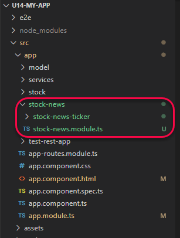

# Unit 14 Feature Module (Working Article)


@import "css/images.css"
@import "css/header_numbering.css"
@import "css/step_numbering.css"


## Review NgModule Metadata

An NgModule is defined by a class decorated with @NgModule(). The @NgModule() decorator is a function that takes a single metadata object, whose properties describe the module. The most important properties are as follows.

`NgModule` 的 Metadata 用來描述模組的特性. 與 Feature Module 特別相關的特性包括:

`declarations` (宣告類別清單) : 宣告屬於此模組的 components, directives, and pipes 等類別(class).

`exports` (匯出類別清單): 是 `declarations` 的子集合, 指定宣告清單中的那些元件是公開的, 可在其他模組的元件樣板(component template)中使用.

`imports` (匯入模組清單) : 要匯入的其他多個模組, 其模組中的類別會在此模組中的元件樣板中使用. 換句話說, `imports` 列出的是此模組的相依模組清單(list of dependent modules). 匯入模組後, 在模組中就可以看到其他模組的公開類別(exported class). 

`providers` (服務器清單): 列出在此模組中要建立的服務器實體(Service instance), 當在此某組的元件中要注入服務器時, Angular 會使用此服務器清單中的服務器實體。

```typescript
import { NgModule } from '@angular/core';
import { BrowserModule } from '@angular/platform-browser';
@NgModule({
  imports:      [ BrowserModule ],   // import the dependent modules
  providers:    [ Logger ],         // Services that can be injected in this module
  declarations: [ AppComponent ],   // Components that belong to this module
  exports:      [ AppComponent ],   // Public components that can be used in the component templates in the other modules.
})
export class YourFeatureModule { }
```
 

Ref: [NgModule Metadata @ Angular](https://angular.io/guide/architecture-modules#ngmodule-metadata)

## Review: 模組(NgModule)與元件(Component)的關係

在 App 架構中, 模組作為元件的其元件提供了編譯環境(compilation context)。TypeScript 在編譯模組內的元件樣版時, 會在模組內尋找元件樣版使用的 directives。若在模組內沒有提供, 則產生編譯錯誤。Ref: [What is a Compilation Context in Angular?  @ Getting Title at 41:27](https://stackoverflow.com/a/50940824/7820390)

舉例來說, 在 Feature Module 的元件樣版中使用 `routerLink` directive 時, Feature Module 必須 import 自己的 `RouterModule`, 而不是使用 `app.module` 的 `routerModule`.

模組中的元件被載入的方式有兩種。第一種是直接使用元件的樣版, 如此, 該模組便會在程式啟動時一併載入。第二種方式是透過路徑導向器(router), 在導向時, 動態載入模組並顯示元件。Ref: [NgModules and components @ Angular](https://angular.io/guide/architecture-modules#ngmodules-and-components)
 
元件和其樣版組成一個 UI 中的一個可視區域, 或稱視域(view)。對於元件本身產生的 view, 將其稱之為 host view. 

一個元件的視域可以包含視域階層(View Hierarchy)結構用以表示整個 UI 頁面, 在視域階層中的元件可以來自於不同的模組。當我們要設計或修改 UI 頁面的可視區域時, 元件就成為可視區域組成的基本的單位。

以下圖為例，`CompA` 及 `A1`、`A2`、`A3` 是同屬一個模組; `B1`、`B2`、`B3` 是同屬另一個模組。 

`CompA` 元件的 View 中嵌入(embed) 了 `A1`、`A2` 及 `B3` 元件的 view; 而元件 `A1` 的 View 中又再嵌入了元件 `B1`, `B2`, 及 `A3` 的 View. 這樣的過程便產生了一個視域階層(View Hierarchy)結構。Ref: [NgModules and components @ Angular](https://angular.io/guide/architecture-modules#ngmodules-and-components)
 


## 特性模組(Feature Module)的用途與分類

特性模組可用來組織 Angular 專案中的程式碼.

將邏輯上功能相關的元件放在特性模組, Angular 專案可被切割成數個小模組, 以利不同團隊維護。


特性模組的類別:
- [領域(Domain)模組](https://angular.io/guide/module-types#domain-ngmodules): 依照商業領域、系統特性或者使用者經驗組織程式碼所建立的模組。
- 路徑導向模組(Routed Module): 為了要增加 App 載入的速度, 把 component 獨立成一個模組, 待導向到此元件時, 才載入此模組. 這種模組稱為 Lazy loading module. 若想要進一步瞭解使用 feature module 切割專案, 參考 [Route-level code splitting in Angular](https://web.dev/route-level-code-splitting-in-angular/)。
- 路徑設置模模(Routing Module): 用來設定元向導向路徑的模組, 以為另一個模組提供路徑配置。通常會在此模組中初始化 `RouterModule`, 再將 `RouterModule` export, 讓其它模組可以使用路由器(Router)。
- 服務模組(Service Module)：專門提供[服務](https://angular.io/guide/architecture-services#introduction-to-services-and-dependency-injection)工具類別(service class)的模組。
- 小工具(widget)模組: 用來包裝單位 component, directive, 或 pipe 的模組, 可其它模組使用。許多第三方的 UI 元件庫都將單個元件包裝成一個 widget module. 
- 分享(shared)模組: 放置可以與其他模組共用的一組 component, directive, 或 pipe 的模組. 

更進一步的資訊, 參考:
- [特性模組 @ Angular](https://angular.tw/guide/feature-modules)
- [Summary of NgModule categories @ Angular](https://angular.io/guide/module-types)


建立特性模組

```
$ ng g module StockNews
CREATE src/app/stock-news/stock-news.module.ts (195 bytes)
```


匯入特性模組到主模組(root module)中

建立 `StockNewsTicker`

```
$ ng g component stock-news/StockNewsTicker
CREATE src/app/stock-news/stock-news-ticker/stock-news-ticker.component.html (32 bytes)
CREATE src/app/stock-news/stock-news-ticker/stock-news-ticker.component.spec.ts (693 bytes)
CREATE src/app/stock-news/stock-news-ticker/stock-news-ticker.component.ts (317 bytes)
CREATE src/app/stock-news/stock-news-ticker/stock-news-ticker.component.css (0 bytes)
UPDATE src/app/stock-news/stock-news.module.ts (311 bytes)
```

匯出 `StockNewsTicker`


產生 component 指定宣告的 module 要使用 `--module` 或者 `-m` 參數, 如果 component 目錄所在的父目錄中有多個 `module` file 時。如果沒有使用, 會產生錯誤:

```
More than one module matches. Use skip-import option to skip importing the component into the closest module.
```

如果 component 目錄所在的父目錄中有多個 `module` file 時, Angular CLI 會將該模組自動指定成元件的宣告模組。

Example: 



在 `stock-news` 模組中產生元件 `StockNewsDetail`:

```
$ ng g component stock-news/StockNewsDetail
CREATE src/app/stock-news/stock-news-detail/stock-news-detail.component.html (32 bytes)
CREATE src/app/stock-news/stock-news-detail/stock-news-detail.component.spec.ts (693 bytes)
CREATE src/app/stock-news/stock-news-detail/stock-news-detail.component.ts (317 bytes)
CREATE src/app/stock-news/stock-news-detail/stock-news-detail.component.css (0 bytes)
UPDATE src/app/stock-news/stock-news.module.ts (529 bytes)
```


為 `stock-news` module 產生一個 routing module

```
ng g module 
```