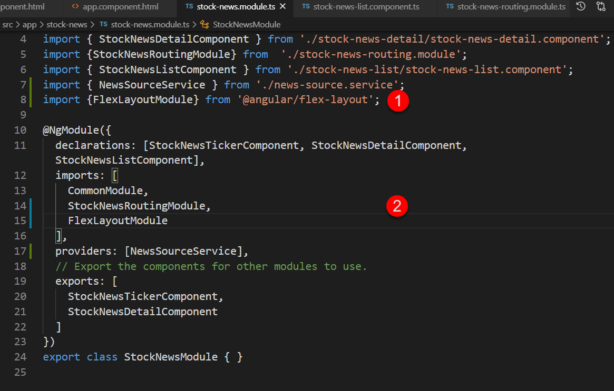

# Unit 15 子路徑 (Child Route)


@import "css/images.css"
@import "css/header_numbering.css"
@import "css/step_numbering.css"


## 子路徑的應用

Angular 允許元件樣版有自己的路徑導向器出口 (router outlet), 換句話說根元件(root component)下的子元件也可以有 router outlet.

應用的例子。應用程式在 `ProductDetail` 的區域可以切換顯示 `ProductDescription` 或者 `SellerInfo`, 如下圖所示:


Fig Source: [Fain, Y. and Mosieev, A., Angular Development with TypeScript 2nd Edition @ Amazon.com](https://www.amazon.com/Angular-Development-Typescript-Yakov-Fain/dp/1617295345)

顯示於 `ProductDetail` 的 router outlet 的路徑會附加在其上層`RootComponent` 的 router outlet 的路徑之後。

舉例來說, 假設顯示產品 123 的 `ProductDetail` 的路徑為 `product/123`;`SellerInfo` 元件的路徑為 `seller/456`。則`SellerInfo` 元件的完整路徑為`product/123/seller/456`。

## 子路徑的使用程序

在父元件樣版中加入 `<router-outlet>` 的標籤. 假若 `FirstComponent` 是我們的父元件, 則該元件的樣版為:

```html
<h2>First Component</h2>

<nav>
  <ul>
    <li><a [routerLink]="['child-a', 0]">Child A</a></li>
    <li><a [routerLink]="['child-b', 1]">Child B</a></li>
  </ul>
</nav>

<!-- 父元件中的 router outlet -->
<router-outlet></router-outlet>
```
Source codes are from: [Nesting Routes @ Angular](https://angular.io/guide/router#nesting-routes)

完成後, 設定父元件下的子路徑。在父元件的 [`Route`](https://angular.io/api/router/Route) 中使用 `children?: Routes` 特性設定子路徑所導向的元件樣版:

```js
const routes: Routes = [
  {
    path: 'first-component',
    component: FirstComponent, // this is the component with the <router-outlet> in the template
    children: [
      {
        path: 'child-a/:id', // child route path
        component: ChildAComponent, // child route component that the router renders
      },
      {
        path: 'child-b/:id',
        component: ChildBComponent, // another child route component that the router renders
      },
    ],
  },
];
```
Source codes are from: [Nesting Routes @ Angular](https://angular.io/guide/router#nesting-routes)

所以, 點選元件視域中的 `Child A` 連結, 結合所在父件的路徑所產生的整路徑為 `first-component/child-a/0`, 該路徑會導向 `ChildAComponent` 元件, 用該元件產生一個視域。點選元件視域中的 `Child B` 連結所產生的完成路徑為 `first-component/child-b/1`, 該路徑會導向 `ChildBComponent` 元件。

## 實作

### 操作案例


### 建立提供新聞快訊的服務器

<span class="step"></span> 建立 `NewsSourceService` 服務器。

在 `StockNewModule` 中加入 `NewsSourceService` 服務器:

```
ng g service stock-news/NewSource
```

指令會在 `StockNewModule` 所在的目錄內新增服務器的檔案:


<span class="step"></span> 建立 `News` 介面。

在此服務器中建立 `News` 介面, 以規範快訊資料的結構:

```js
export interface News {
  title: string,
  body: string
}
```

<span class="step"></span> 建立新聞快訊資料。

加入類別成員欄位 `public newsList: News[];` 到服務器中, 並在建構子內初始化 `newsList` 欄位的資料。 完整的 `NewsSourceService` 服務器程式碼:
```js
import { Injectable } from '@angular/core';

export interface News {
  title: string,
  body: string
}


@Injectable()
export class NewsSourceService {
  // 1. Added member field
  public newsList: News[];

  constructor() {
    // 2. Populate the data in the constructor
    this.newsList = [];
    this.newsList.push({
      title: "Officials face barrage of cyberthreats",
      body: "BACKBONE HACKED: ..."},
      {
        title: "Vietnam’s leaders look to Biden to offset rising China",
        body: "As officials in the Communist..."
      },
      {
        title: "Virus Outbreak: Nearly 3,000 in home isolation",
        body: "‘INCREASED VIGILANCE ..."
      }
    );

   }
}

```


### 顯示新聞快訊標題清單

<span class="step"></span> 注入 `NewsSourceService` 服務器到 `StockNewsListComponent` 元件。

我們要使用 `StockNewsListComponent` 顯示 `NewsSourceService` 服務器所提供的新聞快訊。所以, 需要注入 `NewsSourceService` 服務器, 注入點為該元件的建構子參數:


```js
import { NewsSourceService } from './../news-source.service';
import { Component, OnInit } from '@angular/core';


@Component({
  selector: 'app-stock-news-list',
  templateUrl: './stock-news-list.component.html',
  styleUrls: ['./stock-news-list.component.css']
})
export class StockNewsListComponent implements OnInit {

  // 注入 `NewsSourceService` 服務器 
  constructor(public newSource: NewsSourceService) {
   }

  ngOnInit(): void {
  }

}
```

<span class="step"></span> 使用 Flex-Layout 模組切割版面

`StockNewListComponent` 的樣版分成兩個顯示區域, 左邊顯示快訊標題, 右邊顯示快訊內容, 使用 Flex-Box 分割版面, 左邊和右邊縮放比例相同。

我們使用 Flex-Layout 模組提供的 flex-box directives 切割版面。 

使用底下的指令在專案中安裝 Flex-Layout 模組:

```
npm i -s @angular/flex-layout @angular/cdk
```

安裝完成後, 匯入該模組到 `StockNewsModule` 特性模組中:




<span class="step"></span> 元件樣版設定

完成 Flex-Layout 模組的匯入後, 可設定 `StockNewListComponent` 的樣版版面:
- 在一般的情況下, 以 row 的方式顯示 flex-box 內的 flex-item, 每個 flex-item 佔螢幕寬度的 50%。
- 當螢幕寬度小於 `sm` 時, 改用 column 的方式顯示, 每個 flex-item 的寬度為 100%.


在左邊顯示的 `div` 區塊, 我們使用 `*ngFor` directive 動態的產生新聞快訊的標題。每個標題要加上導向路徑 `detail/:id`, 其中 `:id` 為快訊標題的索引值。

在右邊顯示的 `div` 區塊, 加入 `<router-outlet>`, 做為該元件的子路徑導向的出口。

`StockNewListComponent`元件的樣版如下:
```html
<div fxLayout="row"
     fxLayout.lt-sm="column">
     <!-- 左邊顯示的 `div` 區塊  -->
    <div fxFlex="1 1 50%"
         fxFlex.fxLayout.lt-sm="100%"
         class="newsList">
        <ul>
            <li *ngFor="let news of newSource.newsList; index as idx">
                <a [routerLink]="['detail', idx ]">{{news.title}} </a>
            </li>
        </ul>
    </div>

    <!-- 在右邊顯示的 `div` 區塊  -->
    <div fxFlex="1 1 50%" 
         fxFlex.fxLayout.lt-sm="100%"
         class="newsDetails">
        <router-outlet></router-outlet>
    </div>
</div>
```

有關 Flex-Layout API 進一步參考:
- [fxLayout API @ angular/flex-layout](https://github.com/angular/flex-layout/wiki/fxLayout-API)
- [fxFlex API @ angular/flex-layout](https://github.com/angular/flex-layout/wiki/fxFlex-API)

### 設定快訊標題內容的顯示子路徑

完成前述的設定後, 接著設定 `StockNewsModule` 特性模組內的導向路徑。

<span class="step"></span> 設定點選新聞快訊標題後顯示快訊內容的子路徑。

路徑 `news/list` 會在最上層的 `<router-outlet>` 顯示 `StockNewsListComponent` 元件的樣板。快訊內容是在 `StockNewsListComponent` 內的 `<router-outlet>` 顯示。所以, 在路徑 `news/list` 下使用 `children` 指定該路徑下的子路徑要顯示的元件:

```js
const routes: Routes = [
    {path: 'news/detail/:id', component: StockNewsDetailComponent},
    {path: 'news/list', 
     component: StockNewsListComponent,
     // 子路徑
     children: [{path: "detail/:id", component: StockNewsDetailComponent}]
    }
];
```

因此, `StockNewsDetailComponent` 的完整路徑為 `news/list/detail/:id`, 其中 `:id` 為路徑參數, 以區辨要顯示的是那個快訊標題的內容。

### 顯示快訊的內容

<span class="step"></span> 增加 `content` 成員變數到 `StockNewsDetailComponent`。

增加 `content` 成員變數到 `StockNewsDetailComponent`, 以便在樣版中動態顯示點選的新聞快訊的內容。

<span class="step"></span> 注入 `NewsSourceService` 及 `ActivatedRoute` 服務器到元件中。

元件的建構子參數中注入 `NewsSourceService` 以取得新聞快訊的內容。此外, 也要注入 `ActivatedRoute` 服務器, 以便後續取得路徑參數。

```js
constructor(private newsSourceService: NewsSourceService,
    private activatedRoute: ActivatedRoute) { }
```

<span class="step"></span> 取得路徑參數並以參數決定快訊的內容。

點選快訊標題所產生的導向路徑為 `news/list/detail/:id`, 其中 `:id` 為路徑參數, 代表新聞快訊的編號。


我們將使用 Reactive Programming 的方式取得路徑參數。`ActivatedRoute.paraMap:Observable<ParaMap>` 特性提供 Observable 物件, 讓我們達到前述的目的。

在元件的 `ngOnInit()` 方法中加入以下的程式碼:

```js
this.activatedRoute.paramMap
      .pipe(map(
              // get the id parameter
              (paramMap: ParamMap) => paramMap.get('id')
            ) // end map
      ) // end pipe
      .subscribe(
        (id) => { this.content = this.newsSourceService.newsList[id].body }
      )
```

這裡不能用 `ActivatedRoute.snapshot: ActivatedRouteSnapshot` 特性提供的路徑快照的方式取得路徑參數, 因為元件顯示後, 若只有改變路徑參數, Angular 不會更新快照的內容。因此, 當點選不同的快訊標題只改變 `:id` 路徑參數時, Angular 並不會改變快照的內容, 我們也無法取得更新的路徑參數。
       
完整的程式碼如下:

```js
import { Component, OnInit } from '@angular/core';
import { ActivatedRoute, ParamMap } from '@angular/router';
import { NewsSourceService } from '../news-source.service';
import { map } from 'rxjs/operators';

@Component({
  selector: 'app-stock-news-detail',
  templateUrl: './stock-news-detail.component.html',
  styleUrls: ['./stock-news-detail.component.css']
})
export class StockNewsDetailComponent implements OnInit {

  // member
  public content: string;

  constructor(private newsSourceService: NewsSourceService,
    private activatedRoute: ActivatedRoute) { }

  ngOnInit(): void {
    /* Note: 這裡不能用 "路徑快照" 的方式取得路徑參數 */
    // const newsId = this.activatedRoute.snapshot.paramMap.get("id");
    // console.log('newsId', newsId);
    // this.content = (this.newsSourceService.newsDetails[newsId] as NewsSource).body

    // 使用 Reactive Programming 的方式取得動態的路徑參數
    this.activatedRoute.paramMap
      .pipe(map(
              // get the id parameter
              (paramMap: ParamMap) => paramMap.get('id')
            ) // end map
      ) // end pipe
      .subscribe(
        (id) => { this.content = this.newsSourceService.newsList[id].body }
      )
  }
}
```

<span class="step"></span> 在 `StockNewsDetailComponent` 的樣版中顯示快訊內容。

在 `StockNewsDetailComponent` 的樣版中加入以下的程式碼, 顯示 元件的 `content`特性值:
```html
<p>{{this.content}}</p>
```

<span class="step"></span> 完成。