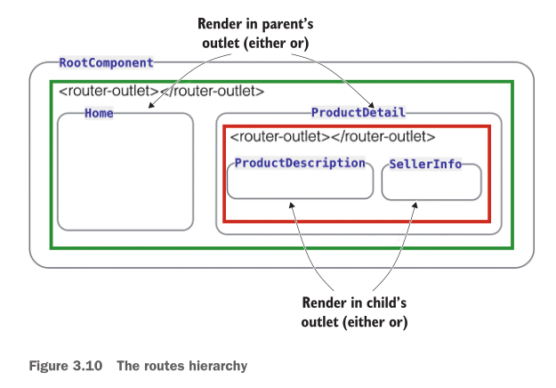
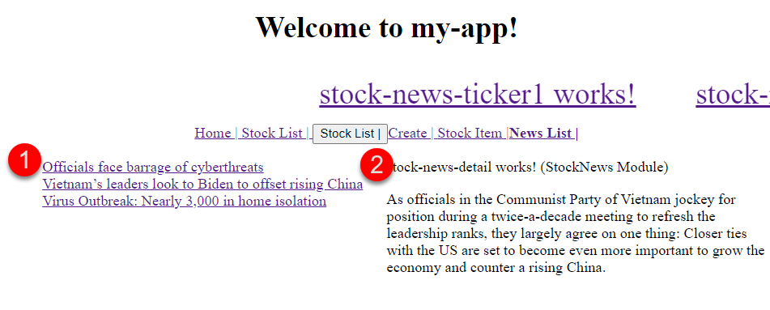
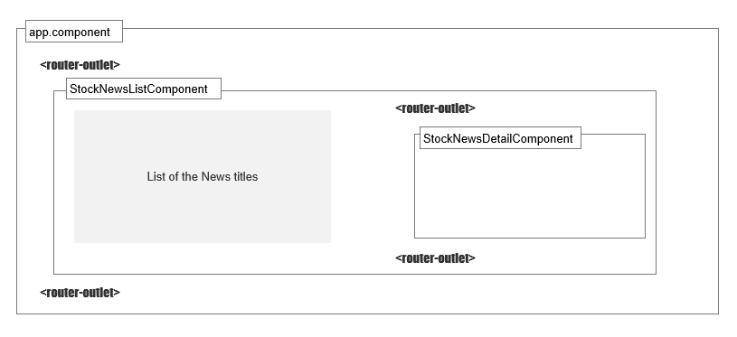
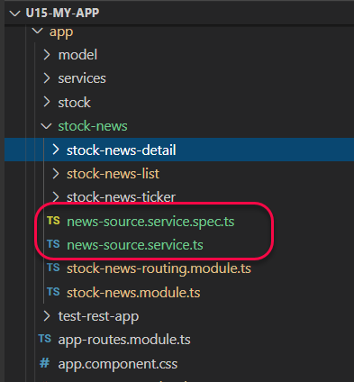

# Unit 15 子路徑 (Child Route)


@import "css/images.css"
@import "css/header_numbering.css"
@import "css/step_numbering.css"


## 子路徑的應用

Angular 允許元件樣版有自己的路徑導向器出口 (router outlet), 換句話說根元件(root component)下的子元件也可以有 router outlet.

應用的例子。在 `ProductDetail` 的區域可以切換顯示 `ProductDescription` 或者 `SellerInfo`.



Fig Source: [Fain, Y. and Mosieev, A., Angular Development with TypeScript 2nd Edition @ Amazon.com](https://www.amazon.com/Angular-Development-Typescript-Yakov-Fain/dp/1617295345)

顯示於 router outlet 元件路徑會附加在上層的 router outlet 之後。

舉例來說, 顯示產品 123 的 `ProductDetail` 的路徑為 `product/123`. 當在 `ProductDetail` 的 router outlet 顯示路徑為 `seller/456`的 `SellerInfo` 元件時, 該元件的完整路徑為 `product/123/seller/456`。

## 子路徑的使用程序

在父元件樣版中加入 `<router-outlet>` 的標籤. 假若 `FirstComponent` 是我們的父元件, 則該元件的樣版為:

```html
<h2>First Component</h2>

<nav>
  <ul>
    <li><a [routerLink]="['child-a', 0]">Child A</a></li>
    <li><a [routerLink]="['child-b', 1]">Child B</a></li>
  </ul>
</nav>

<!-- 父元件中的 router outlet -->
<router-outlet></router-outlet>
```
Source codes are from: [Nesting Routes @ Angular](https://angular.io/guide/router#nesting-routes)

設定父元件的子路徑。在父元件的 [`Route`](https://angular.io/api/router/Route) 中, 使用 `children?: Routes` 特性子路徑所導向的元件樣版:

```js
const routes: Routes = [
  {
    path: 'first-component',
    component: FirstComponent, // this is the component with the <router-outlet> in the template
    children: [
      {
        path: 'child-a/:id', // child route path
        component: ChildAComponent, // child route component that the router renders
      },
      {
        path: 'child-b/:id',
        component: ChildBComponent, // another child route component that the router renders
      },
    ],
  },
];
```
Source codes are from: [Nesting Routes @ Angular](https://angular.io/guide/router#nesting-routes)

所以, 點選元件視域中的 `Child A` 連結所產生的路徑為 `first-component/child-a/0`, 該路徑會導向 `ChildAComponent` 元件, 用該元件產生一個視域。點選元件視域中的 `Child B` 連結所產生的路徑為 `first-component/child-b/1`, 該路徑會導向 `ChildBComponent` 元件。

## 實作 1 

### 操作案例





### 建立提供新聞快訊的服務器

<span class="step"></span> 建立 `NewsSourceService` 服務器。

在 `StockNewModule` 中加入 `NewsSourceService` 服務器:

```
ng g service stock-news/NewSource
```

指令會在 `StockNewModule` 所在的目錄內新增服務器的檔案:



<span class="step"></span> 建立 `News` 介面。

在此服務器中建立 `News` 介面, 以規範快訊資料的結構:

```js
export interface News {
  title: string,
  body: string
}
```

<span class="step"></span> 建立新聞快訊資料。

加入類別成員欄位 `public newsList: News[];` 到服務器中, 並在建構子內初始化 `newsList` 欄位的資料。 完整的 `NewsSourceService` 服務器程式碼:
```js
import { Injectable } from '@angular/core';

export interface News {
  title: string,
  body: string
}


@Injectable()
export class NewsSourceService {
  // 1. Added member field
  public newsList: News[];

  constructor() {
    // 2. Populate the data in the constructor
    this.newsList = [];
    this.newsList.push({
      title: "Officials face barrage of cyberthreats",
      body: "BACKBONE HACKED: ..."},
      {
        title: "Vietnam’s leaders look to Biden to offset rising China",
        body: "As officials in the Communist..."
      },
      {
        title: "Virus Outbreak: Nearly 3,000 in home isolation",
        body: "‘INCREASED VIGILANCE ..."
      }
    );

   }
}

```


### 顯示新聞快訊標題清單

### 設定快訊標題內容的顯示子路徑

設定 點選新聞快訊標題後顯示快訊內容的 子路徑

### 顯示快訊的內容


Install the Angular Flex-Layout library by using the npm
```
npm i -s @angular/flex-layout @angular/cdk
```

Import top-level FlexLayoutModule to `StockNews` module:

Flex-Layout API: [angular/flex-layout](https://github.com/angular/flex-layout/wiki/fxFlex-API)