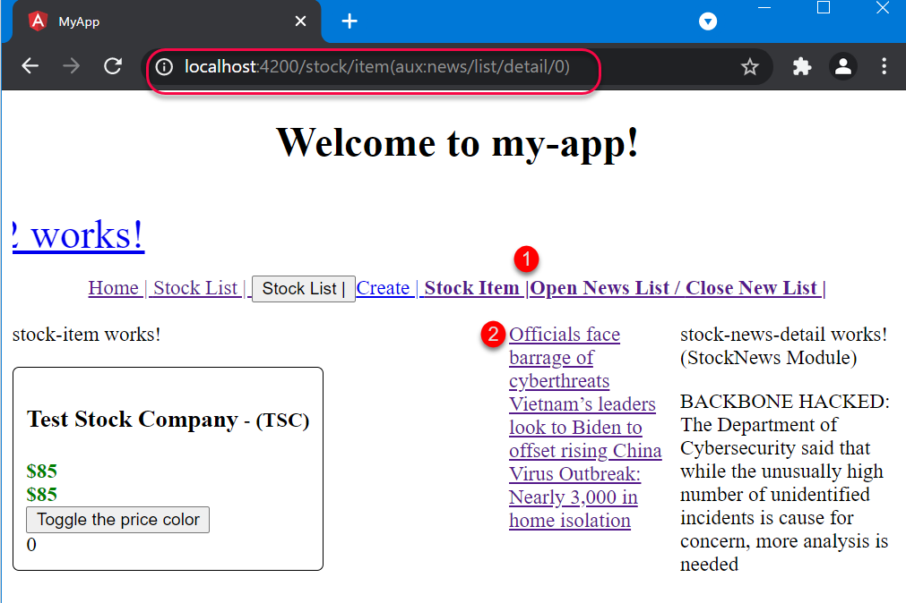

# Unit 16 在一個元件樣版中使用多個命名的 router outlets


@import "css/images.css"
@import "css/header_numbering.css"
@import "css/step_numbering.css"


## 多個命名 router outlet 的應用情境

頁面中劃分成多個可更新的區域。點擊特定錨點或者按鈕後，更新特定區域的內容。

例如, 底下的頁面有兩個 `<router-outlet>`。右邊的 `<router-outlet>` 顯示快訊清單(new list), 左邊的則顯示其它資訊。所以, 我們可以左邊顯示 stock list, 頁面右邊顯示 new list。


## 多個 router outlet 下的設定

### 多個 router outlet 下的路徑表示方式

Angular 會在主要的路徑的結尾使用括號`()`表示目前其它路徑內容。

假設現在有兩個 router-outlet:

```html
<router-outlet></router-let>
<router-outlet name="aux"></router-let>
```
沒有名稱的為預設的 router-outlet, 我們將之稱為 primary outlet. 另一個取名為 `aux` 的 router-outlet, 將之稱為 secondary outlet.

當畫面在 secondary router-outlet 上未顯示內容時（畫面只顯示 primary-outlet 上的內容），此時瀏覽器上顯示的為主要路徑 `/stock/item`:


但是，若在 secondary router-outlet 上顯示內容是，瀏覽器的主要路徑上會附加上刮號，刮號內顯示 secondary router-outlet 的名稱以及在該 outlet 上的路徑，所以瀏覽器的完整路徑為 `/stock/item(aux:news/list)`:


若點選 new list 上的第一個快訊標題，會在該原件的 router-outlet 顯示快訊的內容。此時瀏覽器上的完整路徑為 `/stock/item(aux:news/detail/0)`, 表示在 secondary router-let 上目前顯示的內容為 `news/detail/:id` 路徑下對應的原件 html 內容，在 primary router-outlet 上的為路徑 `/stock/item` 對應的元件的 html 內容。



### router-outlet 的取名

預設的 router-outlet 是不需特別命名，非預設的 router-outlet 便要取名。使用 `<router-outlet>` 的 `name` 屬性為其命名，例如：`<router-outlet name="aux">`:


### router module 的設定

要顯示到非預設的 router-outlet 的 route 要額外使用 `outlet` 屬性，指定該路徑要導向的出口(outlet)及在出口顯示的元件的 HTML 內容。

底下的例子中，路徑 `new/list` 的出口為 `<router-outlet name="aux">` 在出口處顯示的元件為 `StockNewsListComponent`:
```js
import { NgModule } from '@angular/core';
...

const routes: Routes = [
    {path: 'news/detail/:id', component: StockNewsDetailComponent},
    {path: 'news/list', 
     component: StockNewsListComponent,
     // 額外新增的屬性，指定路徑要導向的 outlet
     outlet: 'aux',
     children: [{path: "detail/:id", component: StockNewsDetailComponent}]
    }
];

@NgModule({
  imports: [RouterModule.forChild(routes)],
  exports: [RouterModule]
})
export class StockNewsRoutingModule { }
```

### routerLink directive 的寫法

當要導向到非預設的 router-outlet 時, `routerLink` directive 的寫法和導向預設的 router-outlet 有所差異。


```html
<!-- 導向到預設的 router-outlet -->
<a routerLink="/stock/item" routerLinkActive="active-link">Stock Item |</a>
<!-- 導向到命名的 router-outlet (非預設的或 secondary router-outlet) -->
<!-- 注意: outlets 的路徑要使用相對路徑, 相對在目前的路徑 -->
<!-- 此 outlet 的路徑為 current_path(aux:news/list) -->
<a [routerLink]="[{outlets: {aux: 'news/list' }}]" routerLinkActive="active-link">Open News List / </a>
<!-- Close the new list -->
<a [routerLink]="[{outlets: {aux: null }}]" routerLinkActive="active-link">Close New List |</a>
```

一次的導向，在兩個 router-outlet 同時顯示 2 個元件的 view (HTML)
```js
// create /team/33/(user/11//right:chat)
router.createUrlTree(['/team', 33, {outlets: {primary: 'user/11', right: 'chat'}}]);

// remove the right secondary node
router.createUrlTree(['/team', 33, {outlets: {primary: 'user/11', right: null}}]);
```
Ref: [Usage note in Router.createurltree() @ Angular](https://angular.io/api/router/Router#createUrlTree)


<!-- Issue #7 -->

Ref: https://angular.io/guide/router-tutorial-toh#displaying-multiple-routes-in-named-outlets

[createUrlTree()  @ Angular](https://angular.io/api/router/Router#createurltree)

有不同的路徑建立規則, 含 outlet.