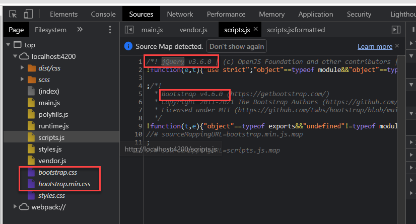
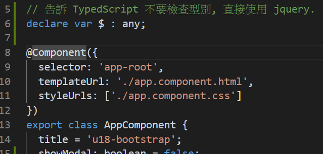
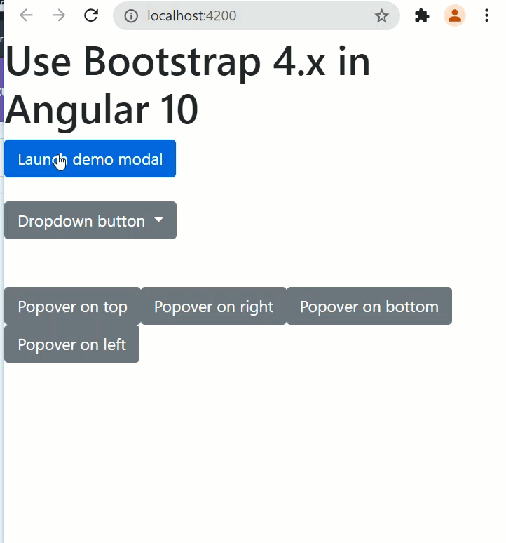

# Unit 18 在 Angular 中使用 Bootstrap CSS framework 及對話框


@import "css/images.css"
@import "css/header_numbering.css"
@import "css/step_numbering.css"

## 專案中加入 Bootstrap CSS framework: CLI 方法

<span class="step"></span> 建立新的 Angular 專案。

<span class="step"></span> 使用 npm 下載需要的程式碼到專案中。

```
npm i bootstrap jquery popper.js --save
```

Outputs:
```
+ popper.js@1.16.1
+ jquery@3.6.0
+ bootstrap@4.6.0
added 3 packages from 5 contributors and audited 1462 packages in 9.609s
found 0 vulnerabilities
```
指令會將上述三個 js library 加入到 專案的 `node_modules` 目錄中。


<span class="step"></span> Import 這些 js scripts 到 Angular 專案, 使用 AngularCLI 打包。

修改 `angular.json` 中的 styles 及 scripts 的屬性:

```
            "styles": [
              "node_modules/bootstrap/dist/css/bootstrap.min.css",
              "src/styles.css"
            ],
            "scripts": [
              "node_modules/jquery/dist/jquery.min.js",
              "node_modules/popper.js/dist/umd/popper.min.js",
              "node_modules/bootstrap/dist/js/bootstrap.min.js"
            ]
```
注意 js 及 css 載入的順序。

此方式是利用 Angular CLI 將 Bootstrap 的 style 及 scripts 打包到 bundle 中。

第二個 `popper.js` 是顯示 [Popovers](https://getbootstrap.com/docs/4.6/components/popovers/) 或者 [Dropdowns](https://getbootstrap.com/docs/4.6/components/dropdowns/) 等元件所需要的 js library。





## 彈跳對話框

在專案中要呼叫 `jquery` 的 `modal()`, 顯示對話框。

<span class="step"></span> 宣告 `jquery` 符號

在 `app.component.ts` 增加全域變數宣告:



程式第 6 行使用 typescript 的語法宣告一個變數 `$`, 不限制型別，參考 [Documentation - Declaration Reference](https://www.typescriptlang.org/docs/handbook/declaration-files/by-example.html#global-variables)。


宣告此全域變數的目的是告訴 typescript 不要檢查 `$` 變數的型別，此變數符號已在 `jquery` 的 script 中定義。Angular 在 App 啟動時已載入 `jquery` script。

Ref:
- [Utilizing Bootstrap .modal() JQuery method in Angular App @ stackoverflow.com](https://stackoverflow.com/a/56814914/7820390)

<span class="step"></span> 在 `app.component.ts` 中新增以下兩個方法:

```js
public openDialog(): void{
    // 使用 jquery.modal() 開啟對話框
    $('#exampleModal').modal();
}


public closeDialog(): void {
  // 使用 jquery.modal() 關閉對話框
    $('#exampleModal').modal('hide');
}
```

`#exampleModal` 是樣式為 `modal` 的 `div` 元素的 id。

Ref: 
- JQuery Modal 的操作, 參考: [Bootstrap JS Modal Reference](https://www.w3schools.com/bootstrap/bootstrap_ref_js_modal.asp)
- [Close Bootstrap Modal Dialog in Angular @ stackblitz.com](https://stackblitz.com/edit/angular-model-bootstrap-close?file=src%2Fapp%2Fapp.component.ts)


<span class="step"></span> 開啟 `app.component.html`, 加入按鈕及對話框 html:

```html
<!-- Button trigger modal -->
<button type="button" class="btn btn-primary" data-toggle="modal" data-target="#exampleModal">
  Launch demo modal
</button>

<!-- Modal -->
<div class="modal fade" id="exampleModal" tabindex="-1" role="dialog" aria-labelledby="exampleModalLabel" aria-hidden="true">
  <div class="modal-dialog" role="document">
    <div class="modal-content">
      <div class="modal-header">
        <h5 class="modal-title" id="exampleModalLabel">Modal title</h5>
        <button type="button" class="close" data-dismiss="modal" aria-label="Close">
          <span aria-hidden="true">&times;</span>
        </button>
      </div>
      <div class="modal-body">
        ...
      </div>
      <div class="modal-footer">
        <button type="button" class="btn btn-secondary" data-dismiss="modal">Close</button>
        <button type="button" class="btn btn-primary">Save changes</button>
      </div>
    </div>
  </div>
</div>

```

上述的程式可從 [Bootstrap 官網](https://getbootstrap.com/docs/4.0/components/modal/#live-demo) 取得。

<span class="step"></span> 將按鈕 click 事件綁定到元件方法。

取得後, 先移除 `data-target` 屬性。之後修改 `Launch demo modal` 按鈕, 綁定 `click` 事件執行 `openDialog()`:

```html
<button type="button" class="btn btn-primary" data-toggle="modal" 
(click)="openDialog()">
  Launch demo modal
</button>
```

另外, 修改 `Save changes` 按鈕, 綁定 `click` 事件執行 `closeDialog()`:

```html
<button type="button" class="btn btn-primary" 
(click)="closeDialog()">Save changes</button>
```

可以在 `<div class="modal-body">` 元素內加入靜態或動態的內容。

<span class="step"></span> 完成。




## Popover

使用 Bootstrap Popover 元件, 除了引入必要的 js libraries 外, 還必須初始化使用 Popover 功能的元素。

在 `app.component` 元件實作 `OnInit` 介面中的 `ngOnInit(): void` 方法, 加入以下的程式碼:

```js
ngOnInit(): void {
    // Init the popover everywhere
    // See: https://getbootstrap.com/docs/4.6/components/popovers/#example-enable-popovers-everywhere
    $(function () {
      $('[data-toggle="popover"]').popover()
    })
}
```

此程式碼會在 Angular 載入完所有頁面的元素後, 選取具有 `data-toggle="popover"` 屬性的所有屬性, 並呼叫每個元素的 `popover()` 做初始化的動作。

