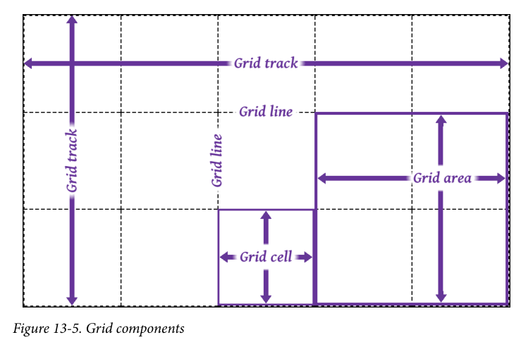
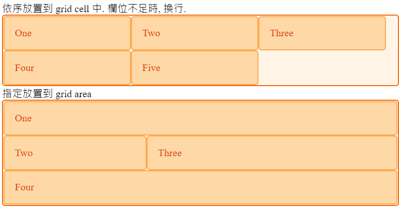
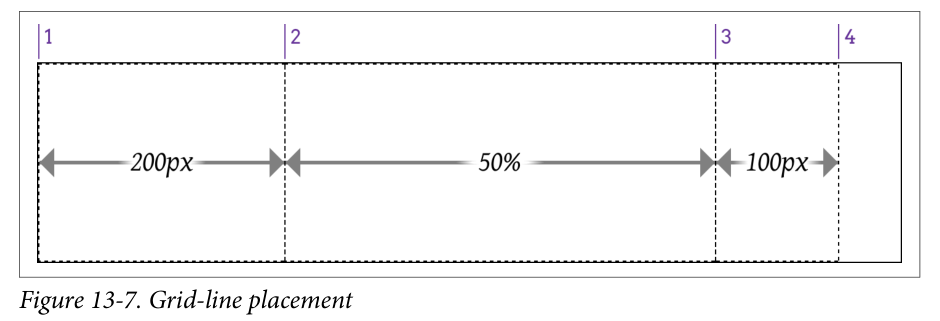
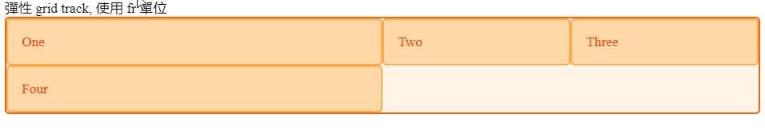
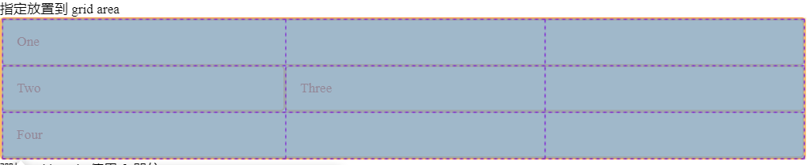
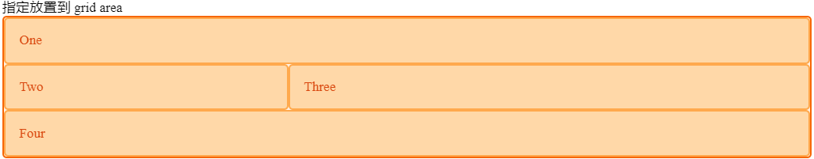
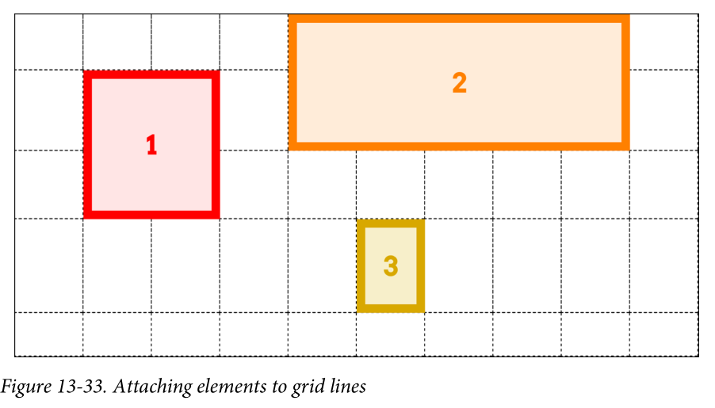

# Unit 19 CSS Gird Layout 簡介


@import "css/images.css"
@import "css/header_numbering.css"
@import "css/step_numbering.css"

## 簡介

Grid Layout 是一般化的二維佈局(layout)系統。

佈置頁面的主要區域、或特定區域下的內容佈區。

## 基礎術語 (Basic Terminology)

grid container
grid item



- grid track
- grid cell
- grid area
- grid line

## 使用程序

1. 建立 grid container
2. 使用行(column)及列(row)切割 grid container 内的區域
    - 亦可用 grid area 切割區域
3. 將 grid item 放到 grid container 内。放置的方式:
   - 依序放到 grid cell 中
   - 指定 grid item 的起始(行, 列)及結束(行, 列)
   - 也可指定 grid area 放置 grid item


例 1: 依序放置到 grid cell 中. 欄位不足時, 換行. 
```css
.grid_layout_columns {
  display: grid;
  grid-template-columns: 200px 200px 200px;
}
```

例 2: 使用  grid area 切割區域; 指定 grid item 放置到 grid area
```css
.grid_layout_areas {
  display: grid;
  grid-template-areas: "title title title"
                       "side main main"
                       "footer footer footer"
                        
}

.header {
  grid-area: title;
}

.side {
  grid-area: side;
}

.main {
  grid-area: main
}

.footer {
  grid-area: footer
}
```



See https://codepen.io/hychen39/pen/RwKpyjX

## Grid Container 內建立垂直及水平 track 

重要的
設定 grid layout 顯示:
- `display: grid`

切割區域內的內容:

`grid-template-row`: 建立水平 track
`grid-template-column`: 建立垂直 track

### 建立垂直 track
#### 方法一:  固定**尺寸**或**百分比**長度單位

固定**尺寸**或**百分比**等長度單位方式指定欄位寛度
```css
.grid_three_columns {
  display: grid;
  grid-template-columns: 200px 50% 100px;}
```



### 方法二: 彈性 grid track

就 container 內現有可用空間依比例切割成數個 track.

`fr`(fraction) 單位: 代表格線容器內可用空間的一小部份

```css
.wrapper {
  display: grid;
  grid-template-columns: 2fr 1fr 1fr;
}
```
可用空間切割成四等份, 第 1 個 track 佔 2 等份, 第 2 及 3 track 各佔 1 等份。




See: https://developer.mozilla.org/zh-TW/docs/Web/CSS/CSS_Grid_Layout/Basic_Concepts_of_Grid_Layout#fr_%E5%96%AE%E4%BD%8D


- 使用 `repeat()` 可重覆建立 track
- 前面的例子可改寫成: 
  
```css
.wrapper {
  display: grid;
  grid-template-columns: 2fr repeat(2, 1fr);
}
```

See: https://developer.mozilla.org/en-US/docs/Web/CSS/CSS_Grid_Layout/Basic_Concepts_of_Grid_Layout#track_listings_with_repeat_notation

### 切割方法三:  grid area

- Grid area 可以橫跨多個 column 及 row
- Grid area 必須是四方形, 無法建立 L 型的 area.

```css
.grid_layout_areas {
  display: grid;
  grid-template-areas: "title title title"
                       "side main main"
                       "footer footer footer"
                        
}
```
- grid container 内 3 個 row 及 3 個 column 切割顯示區域。
- `title` 在第一個 row, 寬度 3 columns
- `side` 在第二個 row, 寬度 1 column
- `main` 在第二個 row, 寬度 2 column
- `footer` 在第三個 row, 寬度 3 column




### 自動新增 grid track

- 當 grid item 放置的位置超出 `grid-template-x` 的設置, Browser 會自動新增 row 或 column
- `grid-auto-rows` 設定自動新增 row 的列高度
- `grid-auto-columns` 設定自動新增 column 的列寛度

## 放置 grid item 到 grid container 中

### 當使用 `grid-template-columns` 及 `grid-template-rows` 分割區域

- 建立 grid 時, 使用 track 分割區域
- 放置 grid item 時, 使用 grid line 指定放置的位置
- Grid line 的編號由 1 開始


- `grid-row-start`, `grid-row-start`: grid item 的啟始與結束 grid row line 編號
- `grid-column-start`, `grid-column-start`: grid item 的啟始與結束 grid column line 編號

Example:

```css
.grid {
  display: grid; width: 50em;
  grid-template-rows: repeat(5, 5em);
  grid-template-columns: repeat(10, 5em);}
.one {
  grid-row-start: 2; grid-row-end: 4;
  grid-column-start: 2; grid-column-end: 4;}
.two {
  grid-row-start: 1; grid-row-end: 3;
  grid-column-start: 5; grid-column-end: 10;}
.three {
  grid-row-start: 4;
  grid-column-start: 6;}
```



Source: Fig 13-33 in [2].

**快速碼(shorthand) `grid-column`及 `grid-row`**

- 有快速碼(shorthand)可以讓上述的程式更簡潔一點
- `grid-column` <=> `grid-column-start` + `grid-column-end`
- `grid-row` <=> `grid-row-start` + `grid-row-end`
- grid item 的預設橫跨(span)的 track 數為 1
  - 當沒有給予結束的 grid line 編號時, 預設為一個 track 的寛度

```css
.grid {
  display: grid; width: 50em;
  grid-template-rows: repeat(5, 5em);
  grid-template-columns: repeat(10, 5em);}
.one {
  /* grid-row-start: 2; grid-row-end: 4; */
  grid-row: 2 / 4;
  /* grid-column-start: 2; grid-column-end: 4;} */
  grid-column: 2 / 4;}
.two {
  /* grid-row-start: 1; grid-row-end: 3; */
  grid-row: 1 / 3;
  /* grid-column-start: 5; grid-column-end: 10; */
  grid-column: 5 / 10;}
.three {
  /* grid-row-start: 4; */
  grid-row: 4
  /* grid-column-start: 6; */
  grid-column: 6
  }
```

**快速碼 `grid-area`**

- 另一個快速碼為 `grid-area`
- 提供開始與結束的行與列的 grid line 編號, 依序為:
  - `grid-row-start`, `grid-column-start`, `grid-row-end`, `grid-column-end`

```css
.grid {
  display: grid; width: 50em;
  grid-template-rows: repeat(5, 5em);
  grid-template-columns: repeat(10, 5em);}
.one {
  /* grid-row-start: 2; grid-row-end: 4;
  grid-column-start: 2; grid-column-end: 4; */
  grid-area: 2 / 2 / 4 / 4;
  }
.two {
  /* grid-row-start: 1; grid-row-end: 3;
  grid-column-start: 5; grid-column-end: 10; */
  grid-area: 1 / 5 / 3 / 10;

  }
.three {
  /* grid-row-start: 4;
  grid-column-start: 6; */
  grid-area: 4 / 6 ;
  }
```


See: https://developer.mozilla.org/en-US/docs/Web/CSS/CSS_Grid_Layout/Line-based_Placement_with_CSS_Grid#using_the_span_keyword

## References
1. https://developer.mozilla.org/en-US/docs/Web/CSS/CSS_Grid_Layout/Basic_Concepts_of_Grid_Layout


2. Eric A. Meyer & Estelle Weyl, 2018. CSS: The Definitive Guide - VISUAL PRESENTATION FOR THE WEB, O'Reilly, 4th Ed.

3. https://developer.mozilla.org/en-US/docs/Web/CSS/CSS_Grid_Layout
  
4. https://css-tricks.com/snippets/css/complete-guide-grid/
