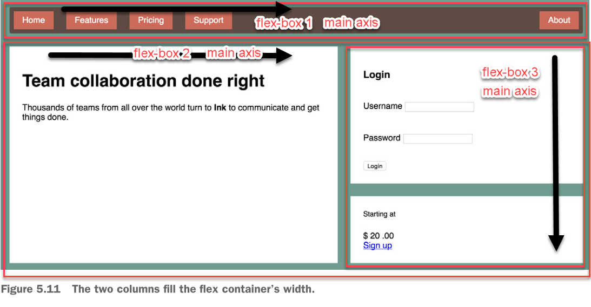
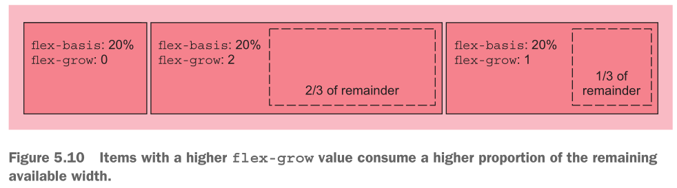
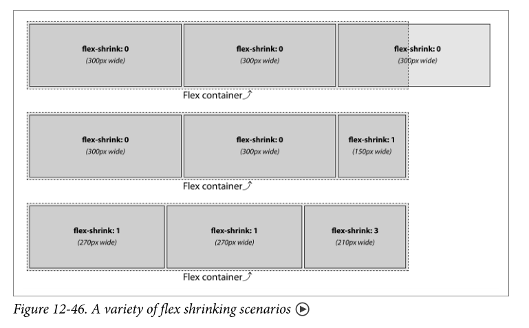
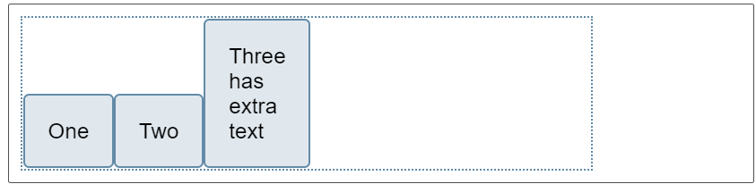
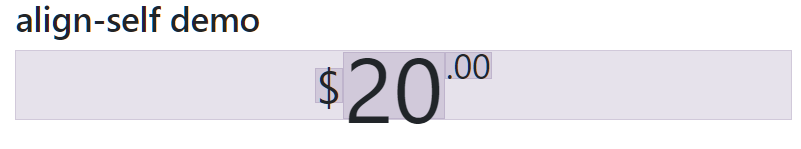

# Unit 20 CSS Flex-box Layout 簡介

@import "css/images.css"
@import "css/header_numbering.css"
@import "css/step_numbering.css"

## 簡介

- Flex-box Layout 是一般化的一維佈局模式(one-dimensional layout model)。

- flex-box 內的 item 的攞放, 可以水平方向放置, 也可依垂直方向放置。
  - 主要流動方向的軸線稱為「主軸線(main axis)」 
  - 與主要流動方向垂直的軸線稱為「切軸軸線(cross axis)」 
  - 主要流動方向可以水平或垂直

<div style="display: flex">


</div>


- 適用時機
  - menu bar 內的項目佈局
  - side bar 內的項目佈局



## 使用程序

1. 建立 flex-box 容器


2. 決定容器的 main axis 的方向, 可以是水平方向, 亦可是垂直方向
3. 決定 flex item 流動的方向

<div style="max-width: 50%">


Figure Source: [1]

</div>

4. 決定 flex item 的大小

<div style="max-width: 50%">


Figure Source: [1]

</div>


5. 決定 flex item 的對齊方式

<div style="max-width: 50%">


Figure Source: [1]

</div>


## 建立 flex-box 容器; 決定流動方向

- `display: flex`: 建立 flex-box 容器. 底下的子元素成為 flex item
- `flex-direction`: 決定 main axis 的方向
  - row, row-reverse
  - column, column-reverse

## 決定 flex item 的大小

flex container 中 flex item 的尺寸**預設行為**:
- 主軸方向可縮小, 但不延展: flex item 在主軸方向的尺寸會自動縮減, 當 flex container 的尺寸變小時。但, flex container 尺寸變大時, 主軸方向的尺寸不變。
- 切軸方向延展填滿: flex item 將被延展(stretch)填滿切軸方向的空間。
- flex item 大小

設定 flex item 大小的 CSS 特性:
- `flex-basis`:  item 的主軸方向的基本尺寸
  - 可用尺寸單位或者比例指定尺寸
  - 元素中的 `width` 有較高優先, 若有的話.
- `flex-grow`: 用來分配剩餘空間的放大權重因子
- `flex-shrink`: 當 flex container 的空間不足時, flex item 要被縮小的權重因子
  - [flex-shrink demo](https://developer.mozilla.org/en-US/docs/Web/CSS/flex-shrink)

### **flex-grow**
最終主軸方向尺寸 = 基本尺寸 + 分配到的額外空間尺寸


Figure source: [2]

### **flex-shrink**

最終主軸方向尺寸 = 基本尺寸 - 分配到的不足空間尺寸


Figure source: [3]

**flex-shrink 的計算方式**
container size: 750px
每個 item 的基本尺寸: 300px
overflow 150px

3 個 flex-item 的 flex-shrink 的總合: 1 + 1 + 3 = 5.
每個單位因子權重的縮小尺寸: 150px/5 = 30px

item 1 及 2 最終尺寸: 300px - 1 * 30px = 270px
item 3 最終尺寸: 300px - 3 * 30px = 210px

### flex 簡寫特性

`flex` 簡寫特性可以一次依序表達 `flex-grow`, `flex-shrink`, `flex-basis`

item 的尺寸預設行為:
- `flex-basis:auto` - 依內容決定大小
- `flex-shrink: 1` - 尺寸可縮小
- `flex-growth: 0` - 但不放大


```css
.item {
  flex: 2 1 auto;
}
```
相當於

```css
.item {
  flex-gro: 2;
  flex-shrink: 1;
  flex-basis: auto;
}
```

**測試區**

[flex-item playground](https://developer.mozilla.org/en-US/docs/Web/CSS/CSS_Flexible_Box_Layout/Basic_Concepts_of_Flexbox)

## 對齊 flex item

在容器內對齊 flex item

- 主軸方向的對齊: `justify-content`
- 切軸方向的對齊: `align-items`
- 允許自動換行時(wrap), 切軸方向的對齊方式:  `align-content`

### justify-content

Q: 有多的 container 空間時, 如何擺放 flex-item, 沿著 main axis 的方向?


**測試區**

[justify-content playground](https://developer.mozilla.org/en-US/docs/Web/CSS/CSS_Flexible_Box_Layout/Aligning_Items_in_a_Flex_Container#aligning_content_on_the_main_axis)

### align-items

Q: cross axis 方向上, flex item 尺寸不一時, 如何對齊?

**align-items: flex-end**:


**測試區**

[align-items playground](https://developer.mozilla.org/en-US/docs/Web/CSS/CSS_Flexible_Box_Layout/Aligning_Items_in_a_Flex_Container#the_cross_axis)

### align-self 對特定的 flex-item 做調整

[align-self playground](https://developer.mozilla.org/en-US/docs/Web/CSS/CSS_Flexible_Box_Layout/Aligning_Items_in_a_Flex_Container#aligning_one_item_with_align-self)



```html
<div class="cost bd-highlight">
    <span class="cost-currency bd-highlight">$</span>
    <span class="cost-dollar bd-highlight">20</span>
    <span class="cost-cent bd-highlight">.00</span>
</div>
```

```css


.cost {
    /* Unitless values: use this number multiplied
by the element's font size */ 
    line-height: .7;

    display: flex;
    justify-content: center;
    align-items: flex-start;
}

.cost-currency {
    font-size: 2rem;
    align-self: center;
}

.cost-dollar {
    font-size: 4rem;
}

.cost-cent {
    font-size: 1.5rem;
}

.bd-highlight {
    background-color: rgba(86,61,124,0.15);
    border: 1px solid rgba(86,61,124,0.15);
}
```


## References

1. https://css-tricks.com/snippets/css/a-guide-to-flexbox/

2. Grant, K.J., 2019. CSS in Depth, Manning.

3. Eric A. Meyer & Estelle Weyl, 2018. CSS: The Definitive Guide - VISUAL PRESENTATION FOR THE WEB, O'Reilly, 4th Ed.

