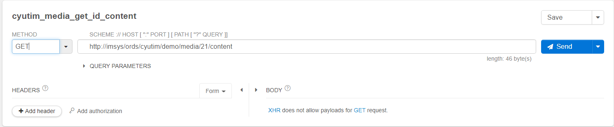
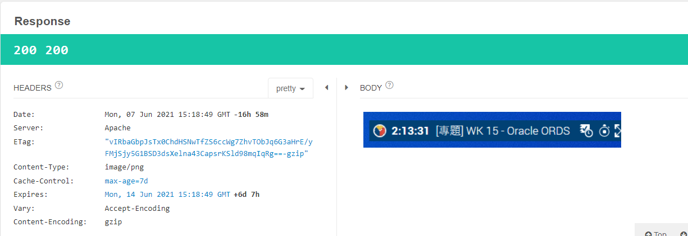

# Unit 21 使用 Oracle ORDS 提供 Restful Service

@import "css/images.css"
@import "css/header_numbering.css"
@import "css/step_numbering.css"

## 簡介

- [Unit 21 使用 Oracle ORDS 提供 Restful Service](#unit-21-使用-oracle-ords-提供-restful-service)
  - [簡介](#簡介)
    - [Restful service 的觀念回顧](#restful-service-的觀念回顧)
    - [What is the Oracle ORDS?](#what-is-the-oracle-ords)
  - [ORACLE REST URL structure](#oracle-rest-url-structure)
    - [結構](#結構)
    - [範例](#範例)
  - [使用 SQLDeveloper 建立 ORDS module 及其 resource](#使用-sqldeveloper-建立-ords-module-及其-resource)
    - [在 Schema 中啟用 ORDS Service](#在-schema-中啟用-ords-service)
    - [使用 Wizard 建立 module and resource template](#使用-wizard-建立-module-and-resource-template)
    - [建立 resource handler: GET](#建立-resource-handler-get)
    - [在 url 中使用 filter clause 限制回傳資料](#在-url-中使用-filter-clause-限制回傳資料)
  - [帶參數的 GET 操作](#帶參數的-get-操作)
    - [Optional Query parameters 的技巧](#optional-query-parameters-的技巧)
  - [使用 POST 新增資料至表格](#使用-post-新增資料至表格)
    - [建立測試表格及資源](#建立測試表格及資源)
  - [使用 PUT 更新](#使用-put-更新)
  - [使用 DELTE 刪除](#使用-delte-刪除)
  - [Upload files](#upload-files)
    - [操作情境](#操作情境)
    - [上傳時的 request 設定](#上傳時的-request-設定)
    - [Resource template 的設定](#resource-template-的設定)
    - [增加並設定 resource template 的 uri pattern](#增加並設定-resource-template-的-uri-pattern)
    - [加入 POST handler 到 resource template 中](#加入-post-handler-到-resource-template-中)
    - [設定 Request header parameters 與 binding Variables 的對應關係.](#設定-request-header-parameters-與-binding-variables-的對應關係)
    - [Post Handler 程式碼](#post-handler-程式碼)
    - [測試](#測試)
  - [Download a file](#download-a-file)
    - [建立  Resource Template](#建立--resource-template)
    - [GET handler 程式撰寫](#get-handler-程式撰寫)
    - [測試](#測試-1)
  - [References](#references)

### Restful service 的觀念回顧

[Unit 10: RESTful Service 使用 JAX-RS 2.0 – Basic Concepts @ hychen39.github.io](https://hychen39.github.io/jsf_teaching/2019/03/11/JSF_Unit10.html)

### What is the Oracle ORDS?

- ORDS = Oracle Rest Data Service
- 為 Table 及 View 提供  Restful service

More Info: [Oracle REST Data Services - REST APIs for Oracle Database @ THAT JEFF SMITH](https://www.thatjeffsmith.com/oracle-rest-data-services-ords/)

 **Architecture**


Src: https://www.oracle.com/technetwork/developer-tools/apex/learnmore/apex-ebs-extension-white-paper-345780.pdf


## ORACLE REST URL structure

### 結構
Oracle ORDS 的 Resource 結構: 從 Schema 到 Resource handler
`schema --(0..n) module --(0..n)resource template--(0..n)resource handler`

ORACLE REST URL 結構:
`POST http://<HOST>/ords/<schema>/<module_prefix>/<resource_uri>`

-  schema: DB Schema 的名稱
-  module_prifix: modules 的 URI 前置(URI prefix)符號
-  resource_uri: resource template 的 URI Pattern


### 範例


  
- `oracle.example.hr` module 的 uri prifix 為 `/hr/`, 此 module 所在的 schema 為 `cyutim`
- employees resource template 的 URI pattern 為 `employees/`
- employees resource template 下有一個處理 `GET` http 方法的 handler

此 resource 的 url 為: `http://<HOST>/ords/cyutim/hr/employees`

handler 內的程式碼:
```sql{class=line-numbers}
select empno "$uri", rn, empno, ename, job, hiredate, mgr, sal, comm, deptno
  from (
       select emp.*
            , row_number() over (order by empno) rn
         from emp
       ) tmp;
```
ORDS 會將 `$` 開頭的欄位(例如, `$uri` 欄位)內容展開成為 URL。

使用 Talent API Tester 測試的結果: 


Request and Response:


## 使用 SQLDeveloper 建立 ORDS module 及其 resource

### 在 Schema 中啟用 ORDS Service

執行以下程式:

```sql{class=line-numbers}
begin
    ords.enable_schema;
end;
/
```

Ref: [Before You Begin: REST Enabled SQL Service Requirements](https://docs.oracle.com/database/apex-18.1/HTMDB/rest-enabled-sql-requirements.htm#HTMDB-GUID-EFF2C573-8F07-4FA2-831D-A07371026853)

### 使用 Wizard 建立 module and resource template 

以下將:
- Create the module `demo` with the uri prefix `/demo`  in the schema `cyutim`.
- Create the resource `customers` with the uri patterm `/customers`

Path to invoke the Wizard: 
- REST Data Service > Module > Right Click Menu > New Module


Specify the module:


Specify the template:


Restful Summary:


The result:


### 建立 resource handler: GET

Path: REST Data Services > Modules > demo > customers > Mouse Right Click Menu > Add Handler > Get


Set the source type for the handler of GET method:


Source Type:
- Collection Query: Executes a SQL query and transforms the result set into a JSON representation. Available when the HTTP method is GET.

Ref: [Using Oracle Database Actions for Oracle Cloud](https://docs.oracle.com/en/database/oracle/sql-developer-web/sdwad/creating-restful-services.html#GUID-1F2C44F8-CE37-4A7C-82C0-FA012F6CE4DD)


完成後, 撰寫 Handler 內的程式碼:


點選 (T)Details 查看完整的 URL:


點選上方圖片中的 Disk 圖示, 儲存程式碼. 

之後, `customer` resource template 下會出現一個 `GET` 方法的 handler:


測試 URL: http://imsys/ords/cyutim/demo/customers


完成的 Response 內容:

```json{class=line-numbers}
{
    "items": [
        {
            "customer_id": 1,
            "cust_first_name": "John",
            "cust_last_name": "Dulles",
            "cust_street_address1": "45020 Aviation Drive",
            "cust_street_address2": null,
            "cust_city": "Sterling",
            "cust_state": "VA",
            "cust_postal_code": "20166",
            "cust_email": "john.dulles@email.com",
            "phone_number1": "703-555-2143",
            "phone_number2": "703-555-8967",
            "url": "http://www.johndulles.com",
            "credit_limit": 1000,
            "tags": null
        },...
    ],
    "hasMore": false,
    "limit": 25,
    "offset": 0,
    "count": 7,
    "links": [
        {
            "rel": "self",
            "href": "http://host/ords/cyutim/demo/customers"
        },
        {
            "rel": "describedby",
            "href": "http://host/ords/cyutim/metadata-catalog/demo/item"
        },
        {
            "rel": "first",
            "href": "http://host/ords/cyutim/demo/customers"
        }
    ]
}
```

### 在 url 中使用 filter clause 限制回傳資料

回傳 `customer_id` 大於或等於 3 之後的顧客資料:

```
http://imsys/ords/cyutim/demo/customers?q={"customer_id":{"$gte":3}}
```
使用 Query Parameters 傳入"限制條件物件"。

Ref: https://docs.oracle.com/database/ords-17/AELIG/developing-REST-applications.htm#AELIG90103


## 帶參數的 GET 操作

User Case: 查詢顧客編號 1 的資料

建立 Resource template with the URI Pattern: `customer/:id`
- 其中 `:id` 為查詢參數, 在 SQL 中使用相同名稱的 binding variable 取得傳入的參數.

Specify the template:


Restful Summary:


此 Template 的 `GET` method handler 的程式碼:

```sql{class=line-numbers}
select * from demo_customers cust
    where cust.customer_id = :id;
```

回傳結果:
```json{class=line-numbers}
{
    "items": [
        {
            "customer_id": 1,
            "cust_first_name": "John",
            "cust_last_name": "Dulles",
            "cust_street_address1": "45020 Aviation Drive",
            "cust_street_address2": null,
            "cust_city": "Sterling",
            "cust_state": "VA",
            "cust_postal_code": "20166",
            "cust_email": "john.dulles@email.com",
            "phone_number1": "703-555-2143",
            "phone_number2": "703-555-8967",
            "url": "http://www.johndulles.com",
            "credit_limit": 1000,
            "tags": null
        }
    ],
    "hasMore": false,
    "limit": 25,
    "offset": 0,
    "count": 1,
    "links": [
        {
            "rel": "self",
            "href": "http://163.17.9.165/ords/cyutim/demo/customer/1"
        },
        {
            "rel": "describedby",
            "href": "http://163.17.9.165/ords/cyutim/metadata-catalog/demo/customer/item"
        },
        {
            "rel": "first",
            "href": "http://163.17.9.165/ords/cyutim/demo/customer/1"
        }
    ]
}
```

### Optional Query parameters 的技巧

```sql{class=line-numbers}
select * from emp e 
    where e.job = :job 
        and e.deptno = :deptno   -- required parameter
        and e.mgr = NVL (:mgr, e.mgr)  -- optional parameter
        and e.sal = NVL (:sal, e.sal)   -- optional parameter
```

URI pattern: 
- 只有 required parameter
`http://localhost/ords/ordstest/test/emp/SALESMAN/30`
- 加上兩個 optional parameters
`http://localhost/ords/ordstest/test/emp/SALESMAN/30?mgr=7698&sal=1500.`


## 使用 POST 新增資料至表格

### 建立測試表格及資源

建立測試表格
```sql
create table demo_cust (id number, 
        name varchar2(50), 
        updated TIMESTAMP default systimestamp);
```

建立 resource template with URI pattern `cust`。

建立 POST handler:


Use Case: 資料以 JSON 的格式放在 http body 中, 要儲存到 DB 中
- URI pattern: /cust
- http method: POST

則 POST handler 程式執行程序如下:
1. 取得 http body (Payload), 其型態為 BLOB
2. 將 body 的型態轉換成 CLOB, 以便 parse payload 內的 JSON 內容
3. Parse payload 內的 JSON 內容, 取得各欄位
4. Insert into table
5. 回覆 response

POST handler 的程式碼:

@import "./src_codes/post_handler.sql" {class=line-numbers}

執行結果:


使用 `:body` 的注意事項:
- The `:body` bind variable can be accessed, or de-referenced, only once. Subsequent accesses return a NULL value. 
- So, you must first assign the `:body` bind variable to the local L_PO variable before using it in the two JSON_Table operations.

- The `:body` bind variable is a BLOB datatype and you can assign it only to a BLOB variable.

Ref: [3.2.6.2.1.1 Usage of the :body Bind Variable @ Developing Oracle REST Data Services Applications](https://docs.oracle.com/database/ords-17/AELIG/developing-REST-applications.htm#GUID-4A7F4425-61DF-4290-AED0-05DC2EF77158)


Implicit Parameters in ORDS 參考: 
[Implicit Parameters @ Installation, Configuration, and Development Guide](https://docs.oracle.com/en/database/oracle/oracle-rest-data-services/18.3/aelig/implicit-parameters.html#GUID-E7716042-B012-4E44-9F4C-F8D3A1EDE01C)

## 使用 PUT 更新

Handler 的處理程序

Use case: Request 內有更新的一筆記錄, 需要更新到 database
- URI pattern: `cust/`
- HTTP Method: PUT
- Payload: Complete record to be updated in the JSON format

程序:
1. 取得 Request Body
2. 取得 Body 內的 JSON 的內容.
3. 將 JSON 內容轉成 Record
4. 補足其 record 中的欄位
5. Update by using the record
6. 回傳 response

程式碼

@import "./src_codes/put_handler.sql" {class=line-numbers}


## 使用 DELTE 刪除

Use case: Request 內有要刪除的記錄的 primary key.

URI Pattern: `customer/:id`
HTTP Method: DELETE

程序:

1. Delete with the binding variable `:id`
2. 回傳 response

程式碼
@import "./src_codes/delete_handler.sql" {class=line-numbers}


## Upload files

Main Ref: [Building a Web Service for Uploading and Downloading Files: The Video!](https://www.thatjeffsmith.com/archive/2018/11/building-a-web-service-for-uploading-and-downloading-files-the-video/)


### 操作情境

上傳:
- file_name 欄位
- file_type 欄位
- 圖片或檔案

之後, 回覆圖片存取的 URL

### 上傳時的 request 設定
- 欄位要放在 request header 
- 圖片或檔案要放在 request body


### Resource template 的設定

Steps:

1. 增加並設定 resource template 的 uri pattern
2. 加入 POST handler 到 resource template 中
3. 設定 Request header parameters 與 binding Variables 的對應關係.
4. 撰寫 POST handler 的程式碼

### 增加並設定 resource template 的 uri pattern


### 加入 POST handler 到 resource template 中


### 設定 Request header parameters 與 binding Variables 的對應關係.

Request 的 http header 的兩個(自定)參數:
- `file_name`, 對應 bind variable `file_name`
- `file_type`, 對應 bind variable `file_typw`

上述參數的資料型態皆為 string, Access Method 為 IN.

Response 的 http header 的參數:
- `X-ORDS-STATUS-CODE`: 為 ORDS 使用的參數, 用來表示回應狀態, 對應到 bind variable `status`.
- `location`: 對應到 http header 中的 `Location` 參數. 當回應狀態碼(status code) 為 201 時, Location 參數表示新建立資源的 URL [6]. 


Client 上傳的檔案或圖片儲存在 http body 中.

目前 Reseful service 不支援 multipart/form-data 上傳, 因為資安的問題. 參考 [7]

備註: 
1. 應先撰寫完成 Post Handler 程式碼之後再來設定 Request Parameters 與 Binding Variable 間的對應關係.
2. 對於 response status 可以使用自動 binding variable  `:status_code`, 其會自動對應到 `X-ORDS-STATUS-CODE` 參數, 就可以省略此 binding variable 的宣告.
3. `:file_type` binding variable 可以不用. 直接使用自動 binding variable  `:content_type` 可取得請求的 content type. 

### Post Handler 程式碼

```sql{class=line-numbers}
declare
    l_image_id number :=0;  
    l_url varchar2(300);
    l_body blob;
    l_err_msg VARCHAR2(300);
begin
    -- uploaded file is placed in the body.
    -- Restful service does not support the multipart/form-data protocal
    l_body := :body;
    
    -- :body is defined by ORDS
    -- :file_name, :file_type are defined in the parameter panel.
    insert into demo_media
             values  ( DEMO_MEDIA_SEQ.nextval , :file_name, :file_type, l_body)
             RETURN id into l_image_id;
    commit;

    -- http status code that is defined in the parameter panel.
    -- Inform the client that a new resource is generated.
    :status := 201; 

    -- Set the Location parameter in the http header of the response. 
    -- Example of the returned location:
    --  	http://imsys/ords/cyutim/demo/21
    :location := './' || l_image_id; 

exception
    -- 例外處理
    WHEN OTHERS then
        l_err_msg := sqlerrm;
        -- 將錯誤訊息存入 demo_debug table 中.
        insert into demo_debug 
            VALUES (demo_debug_seq.nextval, l_err_msg, current_timestamp, l_body);
    commit;
end;
```

### 測試

Request:


Response:


## Download a file 

### 建立  Resource Template

uri: `media/:id/content`


### GET handler 程式撰寫

SQL 的 column 第一個為 http header 中的 content-type, 第 2 個 column 為放在 response body 中回傳的檔案或圖片.
```
select content_type, content
  from demo_MEDIA
 where ID = :id;
```
更多資訊參考 [8].


### 測試





## References
1. [Developing Oracle REST Data Services Applications](https://docs.oracle.com/database/ords-17/AELIG/developing-REST-applications.htm#AELIG90011)
2. [Lab 4: Insert, Update, and Delete Data Using RESTful Services @ Oracle.com](https://www.oracle.com/webfolder/technetwork/tutorials/obe/db/ords/r30/Insert_Update_Delete/Insert_Update_Delete.html)
3. [ORDS 101 Video and Slides @ ThatJeffSmith](https://www.thatjeffsmith.com/archive/2020/05/ords-101-video-and-slides/)
4. [Building a Web Service for Uploading and Downloading Files: The Video! @ ThatJeffSmigh](https://www.thatjeffsmith.com/archive/2018/11/building-a-web-service-for-uploading-and-downloading-files-the-video/)
5. [REST Data Services Developers Guide](https://www.oracle.com/application-development/technologies/rest-data-services/listener-dev-guide.html#about_uris)
6. [HTTP headers | Location - GeeksforGeeks](https://www.geeksforgeeks.org/http-headers-location/)
7. [has ORDS supported multipart form data Request](https://community.oracle.com/tech/developers/discussion/4132424/has-ords-supported-multipart-form-data-request)
8. [Downloading/Streaming Content with ORDS (File Downloads!)](https://www.thatjeffsmith.com/archive/2021/03/downloading-streaming-content-with-ords-file-downloads/)