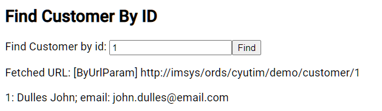
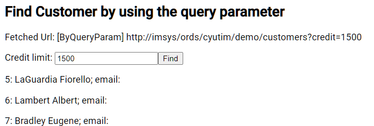
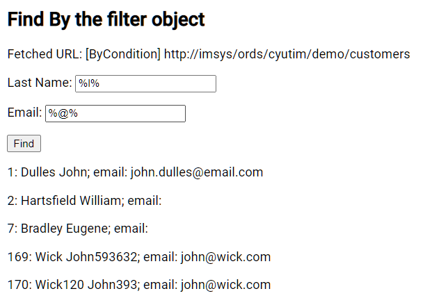
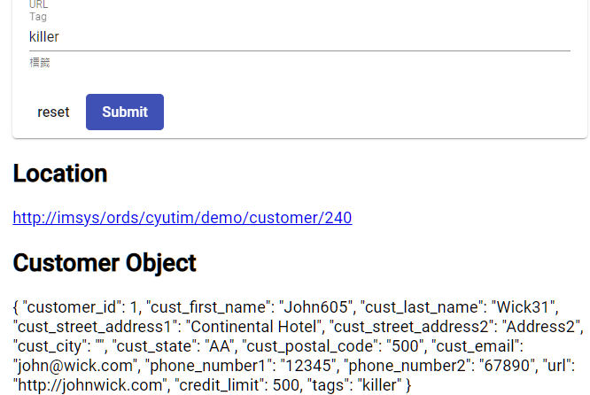
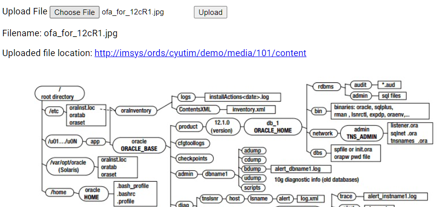
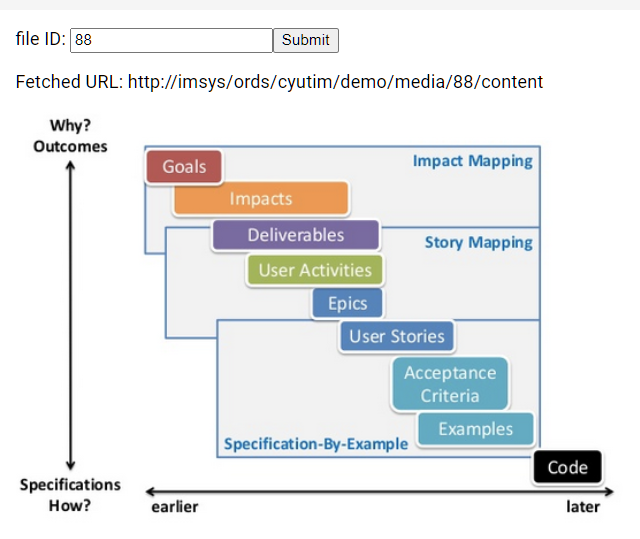

# Unit 22 使用 HttpClient 取得及上傳文字及圖片

@import "css/images.css"
@import "css/header_numbering.css"
@import "css/step_numbering.css"


## 取得文字資料

### 回傳資料格式定義

ORDS 回傳資料的介面定義:

```js
export interface ORDSResponse<T> {
  items: T [];
  hasMore: boolean;
  limit: number;
  offset: number;
  count: number;
  links: object [];
}
```


### 取得特定編號的顧客

Resource URL: `http://imsys/ords/cyutim/demo/customer/{id}`

回覆資料: `ORDSResponse<T>`

#### 客戶端程式

```typescript {class=line-numbers}
public getCustomerById(resourceUri: string, id: number): Observable<Customer> {
    // #1 建立 resource 的 URL
    const fullResourceUrl = this.getModuleUri() + resourceUri + '/' + id;
    
    return this.httpClient.get(fullResourceUrl).pipe(
        //#2
      map((body: ORDSResponse<Customer>) => body.items[0]),
      tap(console.log)
    );
```
說明:
1. 查詢的參數放在 url 中. 此類型參數稱為 URL parameter
2. 查詢的結果存放在 `ORDSResponse<T>.items` 中, 利用 `map()`  operator 取出並回傳。



### 使用 Query parameters 查詢

Resource URL: `http://imsys/ords/cyutim/demo/customer?credit=xxx`

請求:
- Query Parameter: `?credit=xxx`
  
回覆資料: `ORDSResponse<T>`

#### Server 端程式

ORDS 中的 get handler 將 `credit` query parameter 對應成 binding variable. 

```sql {class=line-numbers}
SELECT * from 
    (select c.* ,
            ROW_NUMBER() OVER (ORDER BY customer_id asc)
    from demo_customers c
    where c.credit_limit = nvl(:credit, c.credit_limit)
    )
```

#### 客戶端程式

```js 
/**
   * 使用 Query Parameter 進行查詢. Query Parameter 必須在 SQL 程式中有對應的 bind variable.
   * @param resourceUri
   * @param paramName Query Parameter 名稱, 如 credit
   * @param paramValue Value of the query parameter., 如 credit=1500
   */
  public findCustomerByQueryParameters(resourceUri: string, paramName: string, paramValue: string): Observable<Customer[]> {
        const fullResourceURL = this.getModuleUri() + resourceUri;
    
    // #1 
    const queryParams: HttpParams = new HttpParams().set(paramName, paramValue);

    // #2
    return this.httpClient.get(fullResourceURL, {params: queryParams})
      .pipe(map( (response: ORDSResponse<Customer>) => response.items));

  }
```

說明:
1. 建立查詢參數 `queryParam`
2. 將查詢參數當成 `option` 傳入 `httpClient.get()` 中。



### 使用 FilterObject 進行查詢

Resource URL: `http://imsys/ords/cyutim/demo/customers`

請求: 
- query parameter: `?q=filterObject`
  
回覆資料: `ORDSResponse<T>`

#### Server 端程式

ORDS 的 GET handle 不需要有任的 bind variables. 

ORDS 會處理 Filter Object, 將之轉換成 where 條件。

#### 客戶端程式

```typescript
/**
   * 使用 cust_last_name 及 cust_email 兩個欄位過濾查詢結果.
   * 兩個條件 OR.
   *
   * @param resourceUri Resource URI
   * @param lastnameQueryValue 部份的 last name 字串, 使用 like op 查詢
   * @param emailQueryValue 部份的 email 字串, 使用 like op 查詢
   */

  public findCustomersByLastnameEmail(resourceUri: string, lastnameQueryValue: string, emailQueryValue: string): Observable<Customer[]> {
    // #1
    const filterObject = `{"CUST_LAST_NAME": {"$or": [
      {"$like": "${lastnameQueryValue}"},
      {"CUST_EMAIL": {"$like": "${emailQueryValue}"}}]}
}`;
    // #2
    const queryParam: HttpParams = new HttpParams().set('q', filterObject);
    // #3
    const fullResourceURL = `${this.getModuleUri()}${resourceUri}`;
    // #4
    return this.httpClient.get(fullResourceURL, {params: queryParam})
      .pipe(map( (response: ORDSResponse<Customer>) => response.items ));
  }

```

說明:
1. 建立 Filter Object. 產生的過濾條件:
```
CUST_LAST_NAME LIKE '[lastnameQuery]' AND CUST_EMAIL LIKE '[emailQueryValue]'
```
2. 建立 Query Parameter `q` 
3. 產生 Resource URL 
4. 執行查詢並回傳 `Observable<Customer[]>`




## 上傳文字資料

上傳 `Customer` 物件到資料庫。

### 資料格式

Customer 物件的定義:

```js {class=line-numbers}
/**
 * Map to the demo_customers table in the cyutim schema in the imsys database.
 */
export class Customer {
  // tslint:disable-next-line:variable-name
  constructor(public customer_id?: number,
              // tslint:disable:variable-name
              public cust_first_name ?: string,
              public cust_last_name ?: string,
              public cust_street_address1 ?: string,
              public cust_street_address2 ?: string,
              public cust_city ?: string,
              public cust_state ?: string,
              public cust_postal_code ?: string,
              public cust_email ?: string,
              public phone_number1 ?: string,
              public phone_number2 ?: string,
              public url ?: string,
              public credit_limit ?: number,
              public tags ?: string
  ) {
  }
```

注意, 欄位名稱和資料庫的欄位名稱一致, 方便對映處理。

### 資源 URL及請求與回覆間的協定

Resource URL: Resource URL: `http://imsys/ords/cyutim/demo/customer`

請求的 header body 放置要新增的 JSON 格式的 Customer Object。

回應的 header 中有 `location` 參數, 提供新增的 Customer 的 URL, 供後續存取。

### Server 端程式

ORDS 的 Handler 的程式:
```sql {class=line-numbers}
--  PL/SQL Handler Code Used for a POST Request
-- hychen39@gmail.com
-- 2021/05/29

declare
l_body_blob blob;
l_body_clob clob;
l_content_type varchar2(200);

l_id number;
l_name varchar2(50);
l_err_msg VARCHAR2(300);

begin
-- Get the request body from the implicit binding variable :body
 l_body_blob := :body;

-- Get the content type
 l_content_type := :content_type;

-- Convert the body's data type from blob to clob
l_body_clob := UTL_RAW.cast_to_varchar2(l_body_blob);

if l_body_clob is null then
    -- 回覆給 Client 的訊息
    htp.print('l_body_clob is EMPTY');
    return; 
end if;

-- Call the handler in the package
-- 建立 Customer 的 package procedure.
demo_customers_rest.customer_post_handler(
    p_body=>l_body_clob /*clob*/,p_customer_id=> l_id /*varchar2*/
);

commit;

-- 回覆狀態碼.
 :status_code := 201;

-- 放在在 Response Header 的參數
--- './' means the current module url.
 :location := './' || '/customer/' || l_id;
-- htp.prn('{"id": ' || l_id || '}');

-- Exception handling
EXCEPTION
    when others then
     l_err_msg := sqlerrm;
     -- 回覆 client 有關 Server 端的錯誤訊息.
     htp.prn(l_err_msg);  
end;
```

### 客戶端程式

Service Method 
```js {class=line-numbers}
/**
   * Post a new customer to database.
   * @param resourceUri
   * @param newCust
   */
  public createCustomer(resourceUri: string, newCust: Customer): Observable<string> {
    // #1 Assemble the full url for the resource template
    const fullUrl = this.getModuleUri() + resourceUri;
   
    // #2 convert object to json text
    const customerJson = JSON.stringify(newCust);
   
   // #3 post to server and return the location in the response
    return this.httpClient.post(fullUrl, customerJson,
      { //#4
        observe: 'response' as const,
        responseType: 'json' as const
      }).pipe(
        // #5
        map((response, index) => response.headers.get('location')),
        // #6
        catchError((err: HttpErrorResponse) => {
          // #7 回覆 error 表示串流錯誤, 讓 Observer 能夠呼叫其 error function 處理例外.
          return throwError(err.error.text as string);
        }));
  }
```

說明:
1. 組合成完整的 URL。
2. 轉換 Customer 物件成為 JSON 格式字串。
3. 呼叫 `httpClient.post()`。
4. 呼叫選項指定取得 http response (包含 header 及 body); 內容格式為 JSON 格式。
5. 取得位於 response header 內的 location 參數的值, 回傳 `Observable<string>`。
6. 處理 Http response 錯誤, 取得 Server 端回傳的錯誤訊息, 回傳 `Observable<string>`。




## 上傳圖片


### 資源 URL及請求與回覆間的協定

Resource URL: `http://imsys/ords/cyutim/demo/media`

請求 Header 參數
- file_name: string, 檔案名稱
- file_type: string, 檔案的型態, 例如: image/png

請求 Body 
- 上傳的檔案或圖片

回覆 Header 參數
- location: string, 上傳的檔案或圖片的 URL 


### Server 端程式

```sql {class=line-numbers}
declare
    l_image_id number :=0;  
    l_url varchar2(300);
    l_body blob;
    l_err_msg VARCHAR2(300);
begin
    -- uploaded file is placed in the body.
    -- Restful service does not support the multipart/form-data protocol
    l_body := :body;

    -- :file_name, :file_type are defined in the parameter panel.
    insert into demo_media
             values  ( DEMO_MEDIA_SEQ.nextval , :file_name, :file_type, l_body)
             RETURN id into l_image_id;
    commit;

    -- 回覆客戶端狀態碼
    -- http status code that is defined in the parameter panel.
    :status := 201; 

    -- 回覆客戶端狀 location 參數
    -- Set the Location parameter in the http request
    -- './' represents the module uri
    -- The URL for the resource URL template media/:id/content
    :location := './media/' || l_image_id || '/content'; 

exception
    WHEN OTHERS then
        l_err_msg := sqlerrm;
        -- 回覆客戶端例外訊息
        htp.print(l_err_msg);
end;
```


### 客戶端程式

```js {class=line-numbers}
  /**
   * Upload the file and return the URL location in the response header.
   * @param resourceUri
   * @param fileToUpload
   */
  public uploadFile(resourceUri: string, fileToUpload: File): Observable<string> {
    // #1
    const fullResourceURL = this.getModuleUri() + resourceUri;

    // #2
    // prepare the request header
    // 注意: set() 是 immutable function, 回傳 A clone of the HTTP headers
    const httpHeaders = new HttpHeaders()
      .set('file_name', fileToUpload.name)
      .set('file_type', fileToUpload.type);

    // #3
    return this.httpClient.post(
      fullResourceURL,
      // #4
      fileToUpload,
      // #5
      {headers: httpHeaders, observe: 'response' as const})
      // #6
      .pipe(map((response, index) => response.headers.get('location'))
    );
  }
```

說明:
1. 組合成 full url
2. 建立 request header, 放入 file_name 及 file_type
3. 呼叫 `httpClient.post()`
4. 要上傳的檔案, 型態為 Web API 中的 [File 介面型態](https://developer.mozilla.org/zh-TW/docs/Web/API/File)
5. 呼叫 post() 傳入的選項
6. 取得 Response Header 中的 `location` 參數



## 取得圖片

### 資源 URL及請求與回覆間的協定

Resource URL: `http://imsys/ords/cyutim/demo/media/:id/content`

請求: 
- 圖片 id 放在 URL parameter

回覆
- 檔案或圖片放在 http body 


### Server 端程式

```sql {class=line-numbers}
-- SQL 的 column 第一個為 http header 中的 content-type, 
--  第 2 個 column 為放在 response body 中回傳的檔案或圖片.
select content_type, content
  from demo_MEDIA
 where ID = :id
```

### 客戶端程式

```js {class=line-numbers}
/** Fetch file or image from Server.
   * Ref: https://stackoverflow.com/a/45630579/7820390
   * @param resourceUri
   */
  public fetchFile(resourceUri: string){
    const fullURL = this.getModuleUri() + resourceUri;
    //#1
    return this.httpClient.get(fullURL, {responseType: 'blob' as const});
  }
```
說明:
1. 呼叫 `httpClient.get()`. 在呼叫選項中, 指定回傳的資料型態為 BLOB, HttpClient 會自動的取出 Http Response Body 中的內容。




